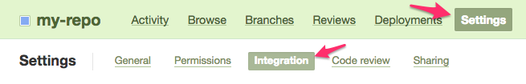
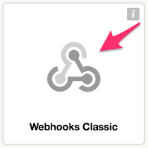

.. _repository-hosting-beanstalk:

======================
Beanstalk Repositories
======================

Review Board supports posting and reviewing code on :rbintegration:`Beanstalk
<beanstalk>` repositories.

The following types of Beanstalk repositories are supported:

* Git
* Subversion

To simplify posting changes to Review Board, we recommend using RBTools_. This
ensures that the diffs are in the correct format, and makes managing review
requests much easier.

.. _RBTools: https://www.reviewboard.org/downloads/rbtools/

Adding the Repository
=====================

To configure a Beanstalk repository, first proceed to :ref:`add the repository
<adding-repositories>` and select :guilabel:`Beanstalk` from the
:guilabel:`Hosting type` field.

Step 1: Link Your Beanstalk Account
-----------------------------------

You will need to link an account on Beanstalk to Review Board, so that Review
Board can access content from the repository. If you've already linked an
account with sufficient access to the repository, you can use that instead.

If you're linking for the first time, you'll need to make sure you have your
username and password handy.

Fill out the following fields:

:guilabel:`Account username`:
    The username used to log into your Beanstalk account. This is *not* your
    e-mail address.

:guilabel:`Account password`:
    Instead of your standard password, you'll want to generate an access
    token and provide it in this field.

    To generate an access token, log into your Beanstalk account and click
    your name in the top-right. Click :guilabel:`Access Tokens` and then click
    :guilabel:`Generate a token`. The resulting token can be used for your
    password on Review Board. We recommend giving your token a label for
    future reference.

The account will be linked when the repository is saved. If there are errors
authenticating the user or retrieving an access token, you will be prompted to
fix them.

Step 2: Provide Repository Information
--------------------------------------

Next, you'll need to fill out the following fields:

:guilabel:`Repository type`:
    The type of repository you're adding. This can be either "Git" or
    "Subversion".

:guilabel:`Beanstalk account domain`:
    Your account domain (the one you specify when logging into Beanstalk). If
    you're not sure, check your Beanstalk URL. It's the ``mydomain`` in
    :samp:`{mydomain}.beanstalkapp.com`.

:guilabel:`Repository name`:
    The name of your repository, as shown in your list of repositories.

Step 3: Choose a Bug Tracker
----------------------------

You can specify a bug tracker on another service. Beanstalk, at the time of
this writing, does not provide one, but you can choose one on another service
or provide a custom URL to your own bug tracker.

:ref:`Learn more about bug tracker configuration <repository-bug-tracker>`.

Step 4: Manage Access Control
-----------------------------

You can now choose who should have access to this repository (both posting
against it and viewing review requests posted against it). This is separate
from Beanstalk's own access controls.

:ref:`Learn more about access control <repository-access-control>`.

Step 5: Save the Repository
---------------------------

At this point, you should be able to save the repository. If saving succeeds,
you're done! You can start posting changes for review.

Configuring Repository Hooks
============================

Review Board can close review requests automatically when pushing commits to
Beanstalk. This is done by configuring a WebHook and pointing it to your
Review Board server, and then referencing the review request in your commit
message (which is done for you when using :ref:`rbt land <rbt-land>`).

Let's go over how to set this up.

.. note::

   Your Review Board server will need to be accessible over the Internet for
   this to work. Beanstalk will be performing HTTP/HTTPS requests to your
   server to notify Review Board of new commits.

Add the WebHook
---------------

First, log into your Beanstalk account and click on the repository you're
configuring. Then click :guilabel:`Settings -> Integration`. Then click
:guilabel:`WebHooks Classic`.

You'll be prompted to enter the URL for your WebHook. You're going to want to
enter the URL to your server using a path in the form of
:samp:`/repos/{repository_id}/beanstalk/hooks/post-receive/`, where
``repository_id`` is the numeric ID of the repository in Review Board (which
you can find in the URL for the repository's configuration page). For example,
this might look like:

.. code-block:: text

    https://reviewboard.example.com/repos/4/beanstalk/post-receive/

Save the hook, and you should be set!

Tag Your Commit Messages
------------------------

To close a review request for a given commit, you'll need to add some special
text to your commit message that references the review request. This can be in
the form of :samp:`Reviewed at {review_request_url}` or :samp:`Review request
#{id}`. This must be on its own line, but can appear anywhere in the commit
message.

For example:

.. code-block:: text

    Reviewed at https://reviewboard.example.com/r/123/

Or:

.. code-block:: text

    Review request #123

If you use :ref:`rbt land <rbt-land>`, this will be automatically added for
you when landing your changes.
