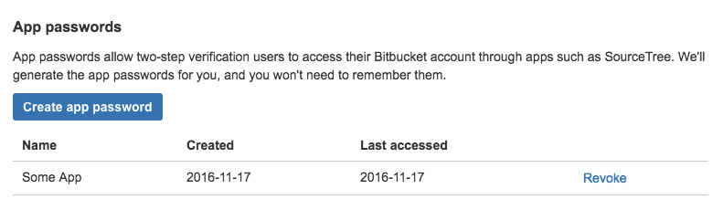
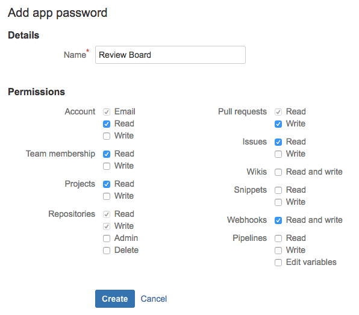
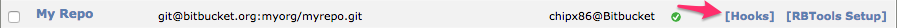

.. _repository-hosting-bitbucket:

======================
Bitbucket Repositories
======================

Review Board supports posting and reviewing code on :rbintegration:`Bitbucket
<bitbucket>` repositories.

The following types of Bitbucket repositories are supported:

* Git
* Mercurial

To simplify posting changes to Review Board, we recommend using RBTools_. This
ensures that the diffs are in the correct format, and makes managing review
requests much easier.

.. _RBTools: https://www.reviewboard.org/downloads/rbtools/

Adding the Repository
=====================

To configure a Bitbucket repository, first proceed to :ref:`add the repository
<adding-repositories>` and select :guilabel:`Bitbucket` from the
:guilabel:`Hosting type` field.

Step 1: Link Your Bitbucket Account
-----------------------------------

You will need to link an account on Bitbucket to Review Board, so that Review
Board can access content from the repository. If you've already linked an
account with sufficient access to the repository, you can use that instead.
Otherwise, you will need to supply credentials in the :guilabel:`Account
username` and :guilabel:`Account password` fields.

For the :guilabel:`Account username` field, use your configured Bitbucket
username (found in your `Bitbucket account settings`_) and *not* your
Bitbucket/Atlassian e-mail address. The latter will not work.

You can use your standard Bitbucket/Atlassian password for the
:guilabel:`Account password` field, or you can use a Bitbucket app password
password. We recommend using an app password for enhanced security. This is
also **required** if you have two-factor authentication enabled for your
Bitbucket account (which we also recommend).

To create an app password, visit your `Bitbucket app passwords`_ page and
click :guilabel:`Create app password`.

Configure your app password as follows:

Click :guilabel:`Create`. You'll receive an app password. Supply this in the
:guilabel:`Account password` field in Review Board.

The account will be linked when the repository is saved. If there are errors
authenticating the user or retrieving an access token, you will be prompted to
fix them.

.. _Bitbucket account settings: https://bitbucket.org/account/admin/
.. _Bitbucket app passwords: https://bitbucket.org/account/admin/app-passwords

Step 2: Provide Repository Information
--------------------------------------

Next, you'll need to specify the type of repository in the
:guilabel:`Repository type` field. This can be either "Mercurial" or "Git".

You'll then choose the repository plan. This is one of the following choices:

**Personal:**
    The repository is owned by the linked user account. You'll need to provide
    the repository name, but nothing else.

**Other User:**
    The repository is owned by another user account. You'll need to provide
    the username of the user and the repository name.

    Note that your user will need to have access to this repository.

    This option was added in Review Board 2.5.8. If you're using a previous
    version, you can select "Team" instead and provide the user's username in
    place of the team name.

**Team:**
    The repository is owned by a Bitbucket team. You'll need to provide the
    team name and repository name.

    Note that your user will need to have access to this team and repository.

For the :guilabel:`Repository name` field, use the name as shown in the URL.
For example, if your repository URL is
``https://bitbucket.org/myteam/myrepo/``, your repository name would be
``myrepo``.

Step 3: Choose a Bug Tracker
----------------------------

If you're using the issue tracking feature on this repository, you can simply
check the :guilabel:`Use hosting service's bug tracker` checkbox. All bug IDs
will link to the appropriate issues for your repository.

If you're using a separate bug tracker, or a separate repository on Bitbucket,
you can leave the checkbox unchecked and choose a bug tracker from the list.

:ref:`Learn more about bug tracker configuration <repository-bug-tracker>`.

Step 4: Manage Access Control
-----------------------------

You can now choose who should have access to this repository (both posting
against it and viewing review requests posted against it). This is separate
from Bitbucket's own access controls.

:ref:`Learn more about access control <repository-access-control>`.

Step 5: Save the Repository
---------------------------

At this point, you should be able to save the repository. If saving succeeds,
you're done! You can start posting changes for review.

.. _repository-hosting-bitbucket-config-webhooks:

Configuring Repository Hooks
============================

Review Board can close review requests automatically when pushing commits to
Bitbucket. This is done by configuring a WebHook and pointing it to your
Review Board server, and then referencing the review request in your commit
message (which is done for you when using :ref:`rbt land <rbt-land>`).

Let's go over how to set this up.

.. note::

   Your Review Board server will need to be accessible over the Internet for
   this to work. Bitbucket will be performing HTTP/HTTPS requests to your
   server to notify Review Board of new commits.

Add the WebHook
---------------

On Review Board, view the list of repositories and locate the repository you
want to configure hooks for. Beside the repository name, you'll see a
:guilabel:`Hooks` link. Click that and you'll see instructions for configuring
the hook.

At the bottom of the instructions is a link for creating the WebHook. Click
that and follow the instructions on the Bitbucket site.

Tag Your Commit Messages
------------------------

To close a review request for a given commit, you'll need to add some special
text to your commit message that references the review request. This can be in
the form of :samp:`Reviewed at {review_request_url}` or :samp:`Review request
#{id}`. This must be on its own line, but can appear anywhere in the commit
message.

For example:

.. code-block:: text

    Reviewed at https://reviewboard.example.com/r/123/

Or:

.. code-block:: text

    Review request #123

If you use :ref:`rbt land <rbt-land>`, this will be automatically added for
you when landing your changes.
