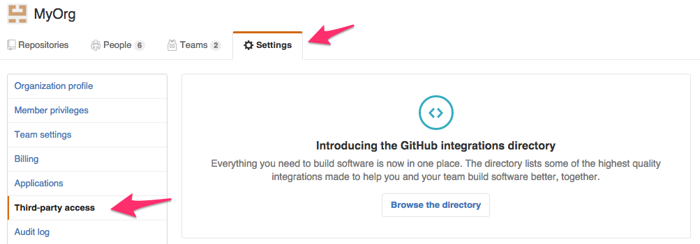
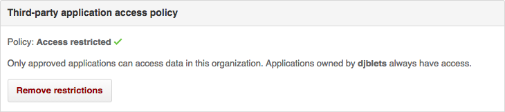
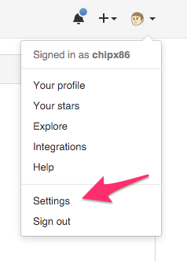
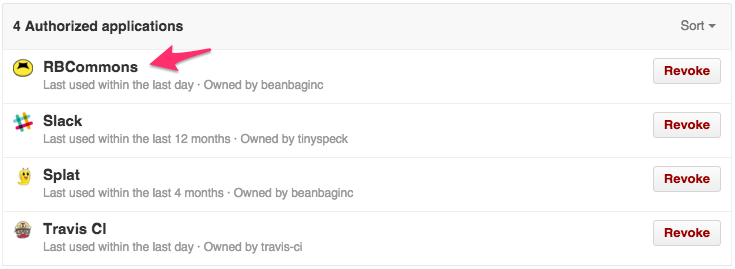
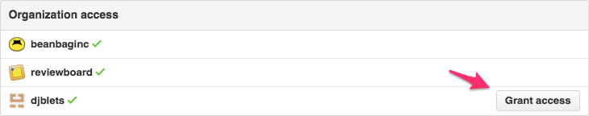
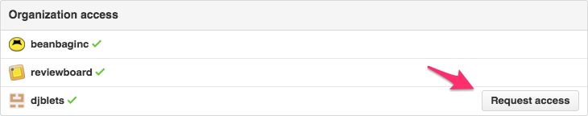

.. _repository-hosting-github:

===================
GitHub Repositories
===================

Review Board supports posting and reviewing code on :rbintegration:`GitHub
<github>` repositories, using public or private personal repositories or
organization-owned repositories.

Existing commits in a repository can be browsed and put up for review. Pull
requests, however, are not currently supported (though planned for a future
release).

To simplify posting changes to Review Board, we recommend using RBTools_. This
ensures that the diffs are in the correct format, and makes managing review
requests much easier. See :ref:`Using RBTools with Git <rbt-post-git>` for
more information.

.. _RBTools: https://www.reviewboard.org/downloads/rbtools/

Adding the Repository
=====================

To configure a GitHub repository, first proceed to :ref:`add the repository
<adding-repositories>` and select :guilabel:`GitHub` from the
:guilabel:`Hosting type` field.

Step 1: Link Your GitHub Account
--------------------------------

You will need to link an account on GitHub to Review Board, so that Review
Board can access content from the repository. If you've already linked an
account with sufficient access to the repository, you can use that instead.

If you're linking for the first time, you'll need to make sure you have your
username and Personal Access Token handy.

.. admonition:: Linking requirements changed in Review Board 3.0.18

   Older versions accepted a standard GitHub account password, which would be
   used to automatically create an access token on your behalf. Since this
   capability is `deprecated in GitHub
   <https://developer.github.com/changes/2020-02-14-deprecating-oauth-auth-endpoint/>`_,
   Review Board 3.0.18 and higher require that you create this token yourself.
   You'll be guided through this below.

   If you are running an older version and cannot link an account, you will
   need to upgrade Review Board.

Fill out the following fields:

:guilabel:`GitHub Username`:
    The username used to log into your GitHub account. This is *not* your
    e-mail address.

:guilabel:`Personal Access Token`:
    A GitHub Personal Access Token, created in your GitHub account under
    `Settings -> Developer Settings -> Personal Access Tokens
    <https://github.com/settings/tokens>`_.
    When creating a new token, give it a descriptive name and enable the
    following scopes:

    * ``admin:repo_hook``
    * ``repo``
    * ``user``

    See `GitHub's guide on Personal Access Tokens
    <https://help.github.com/en/github/authenticating-to-github/creating-a-personal-access-token-for-the-command-line>`_.

The account will be linked when the repository is saved. If there are errors
authenticating the user or retrieving an access token, you will be prompted to
fix them.

Step 2: Provide Repository Information
--------------------------------------

Next, you'll need to fill out the following fields:

:guilabel:`Repository plan`:
    This specifies the type of the repository, whether it's public/private or
    personal/team. You'll have one of the following choices:

    * **Public:** The repository is owned by the linked user account, and is
      publicly-accessible to any user.

    * **Public Organization:** The repository is owned by an organization, and
      is publicly accessible to any user.

    * **Private:** The repository is owned by the linked user account, and is
      accessible only to the linked user and other GitHub users who were
      granted permission.

    * **Private Organization:** The repository is owned by an organization,
      and is accessible only to the linked user and other GitHub users who
      were granted permission.

    .. note::

       The public/private options have no bearing on who can access review
       requests on this repository in Review Board. See
       :ref:`repository-hosting-github-access-control`.

:guilabel:`Organization name`:
    If you're using an organization-based plan, you will need to specify the
    organization name in the :guilabel:`Organization name` field. This is the
    same value you would find in the URL. For example, if your repository was
    ``https://github.com/myorg/myrepo/``, your organization name would be
    ``myorg``.

:guilabel:`Repository name`:
    You'll then need to specify the name of your repository in the
    :guilabel:`Repository name` field. This is the same value you would find
    in the URL. In the above example, your repository name would be
    ``myrepo``.

Step 3: Choose a Bug Tracker
----------------------------

If you're using the issue tracking feature on this repository, you can simply
check the :guilabel:`Use hosting service's bug tracker` checkbox. All bug IDs
will link to the appropriate issues for your repository.

If you're using a separate bug tracker, or a separate repository on GitHub,
you can leave the checkbox unchecked and choose a bug tracker from the list.

:ref:`Learn more about bug tracker configuration <repository-bug-tracker>`.

.. _repository-hosting-github-access-control:

Step 4: Manage Access Control
-----------------------------

You can now choose who should have access to this repository (both posting
against it and viewing review requests posted against it). This is separate
from GitHub's own access controls.

:ref:`Learn more about access control <repository-access-control>`.

Step 5: Save the Repository
---------------------------

At this point, you should be able to save the repository. If saving succeeds,
you're done! You can start posting changes for review.

.. note::

   You may see an error that the repository could not be found. This can
   happen if your GitHub organization requires access to be granted per-app,
   which is the default for modern organizations.

   See :ref:`repository-hosting-github-grant-org-access` to fix this, and then
   save the repository again.

.. _RBCommons: https://rbcommons.com/

Configuring Repository Hooks
============================

Review Board can close review requests automatically when pushing commits to
GitHub. This is done by configuring a WebHook and pointing it to your
Review Board server, and then referencing the review request in your commit
message (which is done for you when using :ref:`rbt land <rbt-land>`).

Let's go over how to set this up.

.. note::

   Your Review Board server will need to be accessible over the Internet for
   this to work. GitHub will be performing HTTP/HTTPS requests to your server
   to notify Review Board of new commits.

Add the WebHook
---------------

On Review Board, view the list of repositories and locate the repository you
want to configure hooks for. Beside the repository name, you'll see a
:guilabel:`Hooks` link. Click that and you'll see instructions for configuring
the hook.

The instructions will contain a link taking you to the page on GitHub for
adding a new WebHook, along with all the information you need in order to add
the hook. Simply follow the instructions and you'll be ready to go.

Tag Your Commit Messages
------------------------

To close a review request for a given commit, you'll need to add some special
text to your commit message that references the review request. This can be in
the form of :samp:`Reviewed at {review_request_url}` or :samp:`Review request
#{id}`. This must be on its own line, but can appear anywhere in the commit
message.

For example:

.. code-block:: text

    Reviewed at https://reviewboard.example.com/r/123/

Or:

.. code-block:: text

    Review request #123

If you use :ref:`rbt land <rbt-land>`, this will be automatically added for
you when landing your changes.

.. _repository-hosting-github-grant-org-access:

Granting Organization Access
============================

In order to keep your code secure, GitHub organizations are often set to
require access explicitly granted by an organization administrator. This is
the case by default with newer organizations, and many older ones have this on
as well.

If you've tried to link one of your GitHub organization's repositories and
received an error message stating that the repository could not be found, it
may simply mean that the server doesn't yet have the permission to access it.

In this guide, we'll help grant access.

Step 1: Verify Your Access Settings
-----------------------------------

You'll need to check whether your organization restricts new third-party
applications.

Have a GitHub organization administrator navigate to your organization page
(:samp:`https://gthub.com/{orgname}`) using their admin account. Click
:guilabel:`Settings` and then click :guilabel:`Third-party access` on the
left.

From here, you'll be able to see the current access policy and any approved
applications.

If :guilabel:`Policy` says :guilabel:`Access restricted`, then continue on with
this guide.

However, if it says :guilabel:`No restrictions`, then you don't need to worry
about this guide, and should double-check the information you entered into the
repository form instead (if it gave you an error about not being able to find
your repository).

Keep this page handy. You'll need to come back to it.

Step 2: Request or Grant Access
-------------------------------

Make sure you're logged in as the user whose account was linked to Review
Board when configuring the repository. Go to your settings page (click your
avatar in the top-right of any page on GitHub, and then click
:guilabel:`Settings`). Then click :guilabel:`Applications` on the left.

"RBCommons" (or the name of your custom application) should appear in this
list under :guilabel:`Authorized Applications`. Click on it.

From here, you'll see a list of organizations you belong to that have access
to your application, and any that need access to be granted. Your organization
should appear in this list along with a button for requesting or granting
access.

If you're an organization admin...
~~~~~~~~~~~~~~~~~~~~~~~~~~~~~~~~~~

Click :guilabel:`Grant access` from here. You're done! Go back and save your
repository again, and you should be all set up.

If you're not an organization admin...
~~~~~~~~~~~~~~~~~~~~~~~~~~~~~~~~~~~~~~

Click :guilabel:`Request access` and follow the instructions. You'll then need
to continue with step 3.

Step 3: Approve Requested Access
--------------------------------

If you clicked :guilabel:`Request access` above, you'll now need an
organization admin to approve it (by clicking :guilabel:`Grant Access` above).
The administrator from Step 1 should reload the page they were on in that
step. RBCommons (or your custom application) should now be in the list. Simply
approve the application from there, and you should be good to go.

Then, simply save the repository again. You're done!
