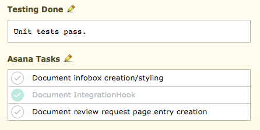

.. _integrations-asana:

=================
Asana Integration
=================

.. versionadded:: 3.0.4

Asana_ is a task tracking tool for teams of all sizes, used to help
organize, schedule, and communicate priorities for software releases, user
on-boarding, goals, and more.

Review Board integrates with Asana, adding a review request field for
associating related tasks with a change, and letting you see when those tasks
are completed. You can have as many integrations as you want, allowing
the field to only be shown for certain groups or repositories on Review Board
or for them to map to different Asana workspaces.

.. _Asana: https://asana.com/

Configuring Asana
=================

To configure an integration with Asana:

1. Click :guilabel:`Add a new configuration` for Asana on the
   :guilabel:`Integrations` page in the :ref:`Administration UI
   <administration-ui>`.

   .. image:: images/asana-add-integration.png

   .. image:: images/asana-config.png

2. Give the configuration a descriptive name. This can be anything you choose,
   and is only important if you plan to have multiple configurations.

3. Select the conditions under which the Asana task field should appear for
   this integration. This lets you limit this configuration for specific
   repositories or review groups, if needed. To always show the field, select
   :guilabel:`Always match`.

4. Enter your Asana user's personal access token. This allows Review Board to
   communicate with Asana on your behalf. To create a token, click
   :guilabel:`My Profile Settings` in the upper-right on Asana and then click
   :guilabel:`Apps -> Manage Developer Apps -> Create New Personal Access
   Token`.

   .. image:: images/asana-profile-settings.png

   .. image:: images/asana-manage-app.png

5. Select the Asana workspace to use for tasks.

Adding Tasks to Review Requests
===============================

When Asana is enabled, an :guilabel:`Asana Tasks` field will be shown below
:guilabel:`Testing Done`. Editing this field (by clicking the pencil icon)
will let you search for and add tasks related to your review request.  Once
you've specified the tasks you want, click :guilabel:`OK` to save the field.

Any added tasks will be shown in the field, along with their completed state.
Clicking a task will take you to the task on Asana where you can manage it.

