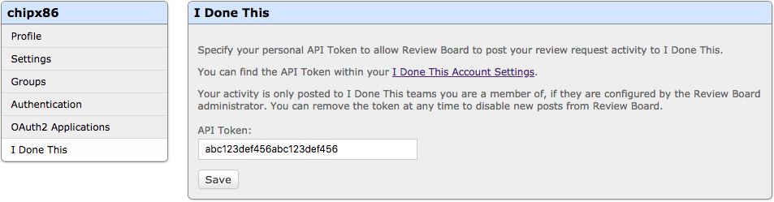

.. _integrations-idonethis:

=======================
I Done This Integration
=======================

.. versionadded:: 3.0.4

`I Done This`_ is a status reporting service that's used by teams to help keep
track of team members' progress and goals for the day.

Review Board integrates with I Done This, offering flexible rules for
reporting status when creating or updating review requests or participating in
reviews.

.. _I Done This: https://idonethis.com/

Configuring I Done This
=======================

To configure an integration with I Done This, you need to create a
configuration for the integration and then have each user configure their own
I Done This API token. The integration won't post status updates on behalf of
users who haven't configured their tokens.

1. Click :guilabel:`Add a new configuration` for I Done This on the
   :guilabel:`Integrations` page in the :ref:`Administration UI
   <administration-ui>`.

   .. image:: images/idonethis-add-integration.png

   .. image:: images/idonethis-config.png

2. Give the configuration a descriptive name. This can be anything you choose,
   and is only important if you plan to have multiple configurations.

3. Select the conditions under which status updates should be reported to I
   Done This. Conditions allow you to limit reporting to certain groups or
   repositories, or other criteria that you choose. To always report status
   updates, select :guilabel:`Always match`.

4. Enter your I Done This Team ID. You can find this in the URL when logged in
   to your team. For instance, if your URL is
   ``https://beta.idonethis.com/t/123456abcdef``, your Team ID would be
   ``123456abcdef``.

At this point, I Done This should be configured. Now it's up to users to
configure their API tokens.

.. _integrations-idonethis-api-tokens:

Adding User API Tokens
======================

In order to report status updates to I Done This, users need to add their own
API Tokens in their :ref:`My Account <account-settings>` page. A new
:guilabel:`I Done This` section will appear in their list of settings, with
instructions on specifying the token.

Tokens can be found on the `Account Settings`_ page on I Done This. Simply
copy and paste that token into the field on the My Account page to enable
posting.  The token can be removed to disable posting.

.. _Account Settings: https://beta.idonethis.com/u/settings
