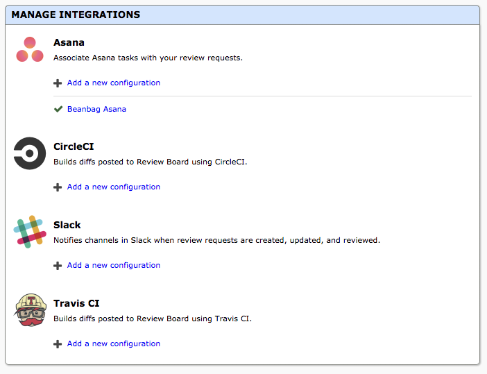

.. _integrations:

============
Integrations
============

.. versionadded:: 3.0

Review Board can integrate with various third-party services to connect your
workflow. Several integrations are built into Review Board, and others can be
provided via extensions.

Managing Integrations
=====================

The :guilabel:`Integrations` page in the :ref:`Administration UI
<administration-ui>` lists the available integrations. Each integration may
have multiple "configurations" that run based on a set of conditions. This
allows you to do things like have messages sent to different channels on a chat
service based on the groups involved.

To create a new configuration for an integration, click :guilabel:`Add a new
configuration`.

Built-in Integrations
=====================

There are several integrations which are bundled with Review Board:

* :ref:`CircleCI <integrations-circle-ci>`
* :ref:`Slack <integrations-slack>`
* :ref:`Travis CI <integrations-travis-ci>`

Additional integrations may be provided by extensions.

.. toctree::
   :maxdepth: 1
   :hidden:

   circle-ci
   slack
   travis-ci
