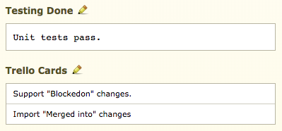

.. _integrations-trello:

==================
Trello Integration
==================

.. versionadded:: 3.0.4

Trello_ is a task and project management tool for teams of all sizes. Unlike
many task trackers, Trello represents tasks as cards placed into columns on a
board, helping to visually organize information, what state tasks are in, and
the flow of tasks.

Review Board integrates with Trello, adding a review request field for
associating related cards with a change. You can have as many integrations as
you want, allowing the field to only be shown for certain groups or
repositories on Review Board or for them to map to different Trello teams.

.. _Trello: https://trello.com/

Configuring Trello
==================

To configure an integration with Trello:

1. Click :guilabel:`Add a new configuration` for Trello on the
   :guilabel:`Integrations` page in the :ref:`Administration UI
   <administration-ui>`.

   .. image:: images/trello-add-integration.png

   .. image:: images/trello-config.png

2. Give the configuration a descriptive name. This can be anything you choose,
   and is only important if you plan to have multiple configurations.

3. Select the conditions under which the Trello cards field should appear for
   this integration. This lets you limit this configuration for specific
   repositories or review groups, if needed. To always show the field, select
   :guilabel:`Always match`.

4. Enter your Trello API key and API token. You can find the API key by
   visiting the `Trello Developer API Key`_ page. In the same section as your
   key, you'll find a link to generate a token. Place both in their respective
   fields in your Review Board configuration.

   .. image:: images/trello-keys.png

.. _Trello Developer API Key: https://trello.com/app-key

Adding Cards to Review Requests
===============================

When Trello is enabled, a :guilabel:`Trello Cards` field will be shown below
:guilabel:`Testing Done`. Editing this field (by clicking the pencil icon)
will let you search for and add cards related to your review request. Once
you've specified the cards you want, click :guilabel:`OK` to save the field.

The names of added cards will be shown in the field. Clicking a name will take
you to the details for that card in Trello.

