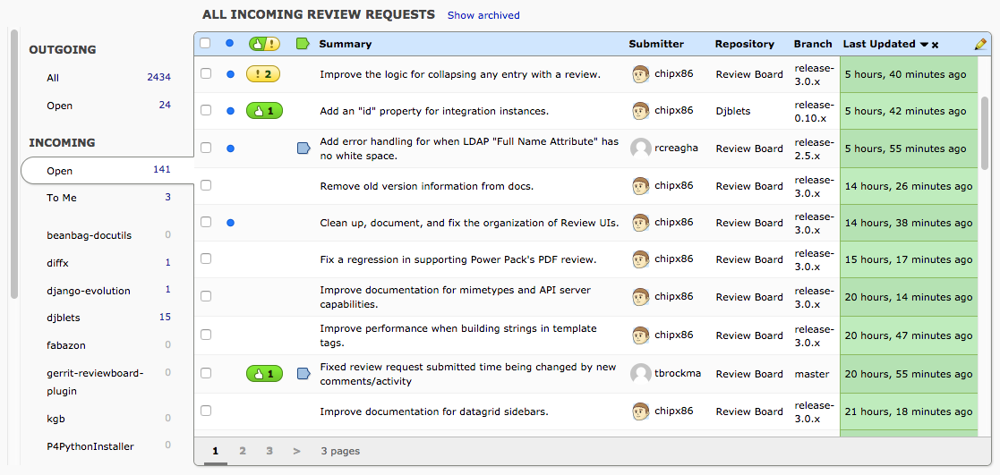
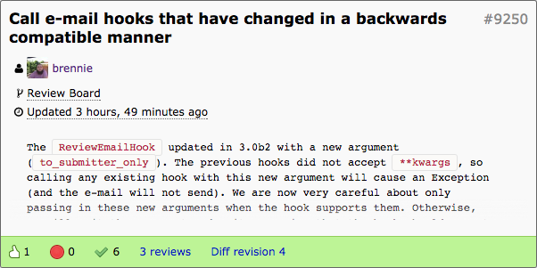
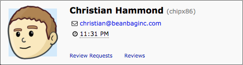
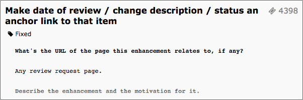

=========
Dashboard
=========

Overview
========

The dashboard is your primary method of accessing review requests. It
displays detailed information on review requests at a glance, and allows
filtering review requests.

After logging in to Review Board, you'll be taken to your dashboard. You can
always get back to it by clicking :guilabel:`My Dashboard` on the navigation
banner near the top of the page.

Navigation Sidebar
==================

The dashboard provides a navigation sidebar with the following items:

* :guilabel:`Outgoing`

  * :guilabel:`All`
  * :guilabel:`Open`

* :guilabel:`Incoming`

  * :guilabel:`Open`
  * :guilabel:`To Me`
  * :guilabel:`Starred`

It also lists each group you belong to, and each group you're watching.
Each item also lists the number of review requests in that view.
You can click on an item to be taken to that view of the dashboard.

Outgoing: All
-------------

This view shows every review request you have created, including those that
are discarded or submitted. It works like the :ref:`outgoing-open` but with
your complete history.

.. _outgoing-open:

Outgoing: Open
--------------

This view shows all review requests that you have filed that are open or are
still drafts.

Incoming: Open
--------------

This is the default view. This view shows all review requests that have been
either directly assigned to you or indirectly through a group you belong to.

This can be filtered down by selecting :guilabel:`To Me` or one of the
group names under :guilabel:`Incoming Reviews`.

Incoming: To Me
---------------

This view shows all review requests that have been directly assigned to you.

Incoming: Groups
----------------

Each group that you are a member of will have an entry in the sidebar. Clicking
on the group name will show only review requests assigned to that group.

.. _incoming-starred:

Incoming: Starred
-----------------

This view shows every review request that you have starred. This is useful for
keeping track of review requests you are interested in that were not directly
assigned to you.

Review Requests List
====================

The main area of the dashboard lists the review requests belonging to that
particular view. This is a detailed, sortable, customizable list.

Clicking on any review request in the list will take you to that particular
review request, while clicking on an owner's name will take you to the list of
review requests submitted by that user. Clicking on a bug link will go to the
associated bug report (assuming a bug tracker has been connected).

There are also a few infoboxes that appear when hovering over certain cells
that can provide additional information beyond what's normally shown in the
Dashboard.

.. _review-request-infobox:

Review Request Infobox
----------------------

Hovering over a review request will show additional details about that review
request in a little infobox on the side. This includes the summary,
description, types of open issues, numbers of reviews, the latest diff
revision, and more.

While open, you can hover over the infobox to see even more information.

* Hovering over the repository will show details on the commit and branch (if
  set).

* Hovering over the timestamp will show when the change was created and last
  updated.

* Hovering over the description will let you scroll to read more about the
  change.

There are also links for taking you to the reviews, the diff, and the user's
page.

.. _user-infobox:

User Infobox
------------

Hovering over any username will show information on the user, such as their
full name, e-mail address, and the local time where they work (based the
timezone they have set).

The bottom of the infobox provides handy links for viewing the user's review
requests and published reviews.

Extensions can also :ref:`add custom information <user-infobox-hook>` to the
infobox, providing details that might be specific to the organization.

.. _bug-infobox:

Bug Infobox
-----------

When using a compatible bug tracker and enabling the "Bugs" column (see
:ref:`dashboard-add-remove-columns`), Review Board can show details from any
referenced bug. This will include the bug number, the current state of the
bug, and the bug description.

Note that this functionality isn't available for all bug trackers yet. You
will need to use GitHub, Jira, Splat, or a compatible version of Bugzilla.

Customizing Your Dashboard
==========================

Changing the Sorting
--------------------

The review request list can be sorted by clicking on a column header. Clicking
once will sort the column in ascending order, and clicking a second time will
sort that column in descending order. The column will have a little up or
down arrow indicating the sorting order. You can click the :guilabel:`X` next
to clear sorting for that column.

.. image:: column-sorting.png

The dashboard provides two-level sorting. You can primarily sort by one column
but in the case of multiple entries for a particular owner, timestamp, etc.,
you can have secondary sorting on another column. This is set by simply
clicking one column (which will be the secondary column) and then clicking
another column (which will be the primary).

The primary column is indicated by a black up/down arrow, and the secondary
column is indicated by a lighter grey up/down arrow.

Sorting options are saved across sessions.

Reordering Columns
------------------

Columns in the dashboard can be reordered by clicking and dragging the column.
The columns will reorder as you're dragging to show you the new layout, and
when you release the mouse cursor the order will be saved.

.. _dashboard-add-remove-columns:

Adding/Removing Columns
-----------------------

Different users have different things they want to see in the dashboard. You
can change which columns are shown and which aren't by clicking the
pencil icon to the right of the columns. A pop-up menu will appear
showing which columns are shown and which aren't.

The following are available columns you can choose from:

======================= =======================================================
Column
======================= =======================================================
Branch                  Shows the branch information listed on the review
                        request.
Bugs                    Shows the bug IDs listed on the review request.
Diff Size               Shows a count of the removed and added lines of code in
                        the latest revision of the diff.
Diff Updated            Shows the timestamp of the last diff update. This is
                        color-coded to indicate the age.
Diff Updated (Relative) Shows the timestamp of the last diff update, relative to
                        the current time. This is color-coded to indicate the
                        age.
Last Updated            Shows the timestamp of the last update to the review
                        request. This is color-coded to indicate the age.
Last Updated (Relative) Shows the timestamp of the last update to the review
                        request, relative to the current time. This is
                        color-coded to indicate the age.
My Comments             Shows a green comment flag if you have any unpublished
                        comments on the review request, or a blue comment flag
                        if you have published comments. This allows you to
                        quickly see which review request you've addressed.
New Updates             Shows a message bubble icon for any review requests that
                        have been updated or have had discussion since you last
                        looked at it. This does not apply to review requests
                        that you have not opened before.
Number of Reviews       Shows how many reviews have been done on the review
                        request.
Owner                   Shows the username of the owner of the review request.
Posted Time             Shows the timestamp of when the review request was first
                        posted. This is color-coded to indicate the age.
Posted Time (Relative)  Shows the timestamp of when the review request was first
                        posted, relative to the current time. This is
                        color-coded to indicate the age.
Repository              Shows the repository that the review request is for.
Review Request ID       Shows the ID number of the review request.
Select Rows             Shows a checkbox that allows you to select the row. When
                        one or more review requests are selected, the sidebar
                        will contain bulk modification commands.
Ship It!/Issue Counts   If there are open issues, this shows a count of the open
                        issues in a yellow bubble. If there are no open issues,
                        this shows a count of reviews where the reviewer has
                        marked "Ship It!"
Starred                 Shows a star indicator that can be toggled. When toggled
                        on, the review request is starred, meaning that it will
                        show up in the "Starred" section of the dashboard, and
                        you will be CC'd on any discussion. Toggling the star
                        off will remove you from the CC list.
Summary                 Shows the summary text of the review request.
Target Groups           Shows a list of the assigned groups for the review
                        request.
Target People           Shows a list of the assigned people for the review
                        request.
To Me                   Shows a chevron for review requests which directly list
                        you in the "people" field.
======================= =======================================================

Customizing with Extensions
---------------------------

If you want additional information available in the Dashboard, you can
:ref:`write an extension <writing-extensions>` that adds
:ref:`custom columns <dashboard-columns-hook>`, which can show any kind of
data you may want for a review request. These might make use of existing data
in Review Board or in-house data collected by your extension.

Extensions can also provide :ref:`new sidebar items
<dashboard-sidebar-items-hook>`, which can link to a custom view of the
Dashboard or a separate page entirely.

Bulk Actions
============

When the :guilabel:`Select Rows` column is visible (see
:ref:`dashboard-add-remove-columns`), review requests can be selected to
perform some bulk actions. After selecting one or more rows, some of the
following items will become available:

* :guilabel:`Close Discarded`
* :guilabel:`Close Submitted`
* :guilabel:`Archive`
* :guilabel:`Unarchive`
* :guilabel:`Mute`
* :guilabel:`Unmute`

.. _star-archive-and-mute:

Star, Archive and Mute
======================

In an active team, the dashboard can often get cluttered with many open review
requests. This can make it difficult to keep track of what you have left to
work on.

There are three visibility controls for review requests: star, archive, and
mute. These can be manipulated both on the dashboard (through the star column
and the bulk actions), as well as on the review request page (through the
visibility controls at the top-left of the review request box).

**Starring** a review request will cause it to show up in the
:ref:`incoming-starred` section of the dashboard, and will make sure that
you're copied on any e-mail notifications related to the review request. This
is a good way to keep track of things which might be related to your work but
not directly assigned to you, or to mark particularly important review
requests.

**Archiving** a review request will cause it to be hidden from the incoming
views of the dashboard until there is new activity. This is similar to the way
that e-mail clients archive threads. If you're experiencing dashboard overload,
archiving can quickly streamline your view to show only the review requests
that still require your attention.

**Muting** a review request works like archiving, except it will never
re-appear on your dashboard until you explicitly unmute it. You will also not
be included on any e-mail notifications for muted review requests. This is good
for tuning out your office mate.

On the incoming dashboard views, the :guilabel:`Show archived` link at the top
will toggle on all of the archived and muted review requests, allowing you to
find them again. This setting is sticky when clicked, and can be reversed by
clicking :guilabel:`Hide archived`.
