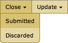
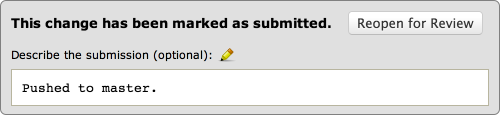

.. _closing-review-requests:

=======================
Closing Review Requests
=======================

When a review request has been thoroughly reviewed, or the task has been
abandoned, the review request can be closed.

There are two ways to close the review request: Closing as "submitted" or
as "discarded." Both options are available under the :guilabel:`Close`
menu on the review request's action bar.

A submitted review request is one where the change has been committed to the
repository and no longer needs further reviews.

A discarded review request is one that has been abandoned and will no longer
be updated or reviewed.

Close Descriptions
------------------

Once you've closed a review request, you can enter a more thorough description
describing the commit or the reason you closed the review request.

For example, if you submitted the review request, you might specify the
revision it was committed as. If you discarded, you might explain why.

The gray submitted or discarded banners have a field for the description.
You can enter the text here and click :guilabel:`OK`. The description will
be saved immediately, and other users will be able to see it.

This field supports rich text using the :term:`Markdown` language. See
:ref:`using-markdown` for more information.

