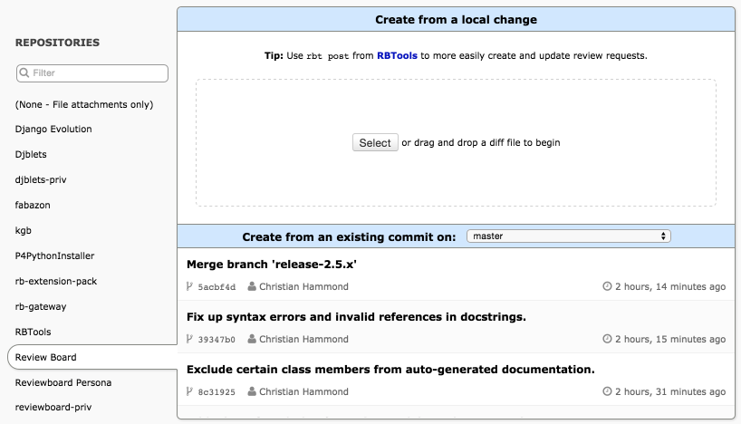

.. _creating-review-requests:

========================
Creating Review Requests
========================

There are two main ways of creating a new review request: through the web UI
and through :ref:`rbt post <rbtools:rbt-post>`. We recommend the latter, as it
does a lot of work for you, and is actually required for some version control
systems, such as Perforce.

Using ``rbt post`` to Create Review Requests
============================================

:ref:`RBTools <rbtools:rbt>` is a set of command-line tools that can be
installed on each client system. There are many tools in the RBTools package,
but the most important one is :ref:`rbt post <rbtools:rbt-post>`, which will
look into your development directory and post changes to Review Board.

Using RBTools is the recommended way of posting changes, and for some version
control systems or hosting services, may be the only supported way (due to the
built-in diff tools generating files with insufficient information). For more
information, see the :ref:`RBTools documentation <rbtools:rbt>`.

.. _new-review-request-page:

Using the Web UI to Create Review Requests
==========================================

To post a review request through the web UI, click
:guilabel:`New Review Request` in the upper-left of a page. This will take
you to a page where you can create your review request.

On this page, you are presented with a variety of options for creating a new
review request. On the left-hand side is a list of all the repositories
configured on the server.

The first step in creating a new review request is to select one of these.
Because some large Review Board servers may have dozens of configured
repositories, you can search for the one you want by clicking the magnifying
glass.

.. _review-requests-for-diffs:

Pre-commit Review Requests
--------------------------

When doing :term:`pre-commit review`, your review request will represent a
pending change which is not yet present in a central repository (for example, a
working copy in Subversion or a local branch in Git that has not yet been
pushed).

If you're not using :program:`rbt post`, you'll need to create a diff file by
hand to upload the change to Review Board.

The diff you provide needs to be in :term:`unified diff` format, and must
have revision information embedded in the file. CVS, Subversion, Git,
Mercurial and Bazaar provide this information. If you use Perforce,
though, you'll need to use :ref:`rbt post <rbtools:rbt-post>` instead of the
web UI. Note that this means you can't just use a standard diff generated by
the :command:`diff` tool. You'll need to consult your version control system's
documentation for information on generating diffs.

Once you've created your diff, select a repository. You can then either
drag-and-drop your diff file onto the top section under :guilabel:`New Review
Request for Pending Change` or browse for it using the :guilabel:`Select`
button.

In most cases, once you've selected your diff file, the review request will be
created. For some types of repositories, you may be prompted for additional
information.

**Perforce repositories:**

* :guilabel:`Change Number`:

  The changeset number representing the change the diff is generated from.

**Subversion repositories:**

* :guilabel:`Base Directory`:

  The relative path of the directory you were in when you generated the diff,
  based on the repository. For example, if you locally have a checkout of
  :file:`trunk/reviewboard` named :file:`reviewboard`, and that was the
  directory you were in when you made the diff, then the base diff path would
  be ``/trunk/reviewboard``.

  This may also depend on how Review Board was configured. Consult your
  administrator if you have problems.

Post-commit Review Requests
---------------------------

The web UI now allows you to create review requests for :term:`post-commit
review`.

.. note:: This feature is not available for all types of repositories. If you
          do not see the ":guilabel:`Create from an existing commit`" section
          of the page, you must use :command:`rbt post` to post committed
          changes.

Once you select a supported repository, the bottom half of the "New Review
Request" page will have a table labeled :guilabel:`New Review Request for
Committed Change`. By default, commits are shown for a default branch (like
"trunk" in Subversion or "master" in Git). In the header is a drop-down box
which allows you to switch branches.

Below the header is a list of commits on the selected branch, starting with the
most recent. As you scroll down, that list will update automatically with older
changes. To create a post-commit review request, just click on one of the
commits. Review Board will download the diff and change description and prepare
a new review request. From there, just assign reviewers and publish.

If a committed change already has a review request, this will be denoted with
an icon. In this case, clicking on the commit will jump to the existing review
request rather than creating a new one.

Review Requests for File Attachments Only
-----------------------------------------

If you're intending to post a review request only for reviewing file
attachments, select :guilabel:`(None - File attachments only)` on the left-hand
side. You'll then be presented with a button to create a blank review request.
You will not be able to add any diffs to this review request, but after
creating it, you will be able to add attachments.

No other fields will need to be provided when using this option.

Finishing the Review Request
============================

Once you've posted your initial diff through the web UI or
:ref:`rbt post <rbtools:rbt-post>`, you'll have a draft of your review request
posted. Nobody but you will be able to see the review request until you
publish it.

Before you publish the review request, you'll need to fill out the summary,
description and reviewers. Some of these fields may be filled in depending
on your repository type, the tool you used to post the review request, and
any defaults your administrator has set up for the reviewers (see
:ref:`managing-default-reviewers` if you're the administrator).

File attachments can be added with the :menuselection:`Update --> Add File` menu
item or by dragging and dropping files onto the page in the browser.

You can preview your diff by clicking :guilabel:`View Diff` in the review
request action bar (in the top-right of the review request). Uploading a new
diff (either using the :menuselection:`Update --> Update Diff` menu item or with
:ref:`rbt post <rbtools:rbt-post>`) before publishing will replace the diff.

When you're finished, click :guilabel:`Publish Review Request` in the green
draft banner above the review request. You can also choose to discard the
review request by clicking :guilabel:`Discard`.

Depending on your particular setup, publishing a review request may send
an e-mail out to the reviewers, letting them know your change is ready to
review.
