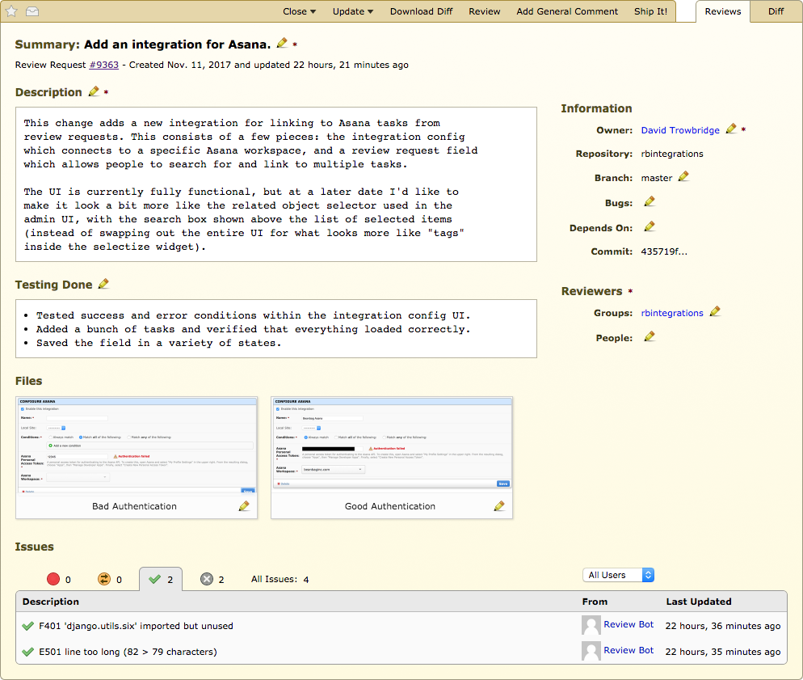

.. _review-request-fields:

==============
Editing Fields
==============

Updating review requests is very much like :ref:`creating review requests
<creating-review-requests>`. Once you have a review request out there, you can
upload a new diff, add new file attachments, or modify the fields. Any changes
you make will be seen by you only until you :ref:`publish the changes
<publishing-review-requests>`.

Changing Fields
===============

Most fields on a review request can be changed, with the exception of
:guilabel:`Commit` and :guilabel:`Repository`.

To change a field, either click on the field (in the case of
:guilabel:`Description` and :guilabel:`Testing Done`) or click on the pencil
icon. A text box will appear allowing you to modify the value.

To save a field, press the :kbd:`Enter` key or click :guilabel:`OK`. To revert
your changes, press the :kbd:`Escape` key or click :guilabel:`Cancel`.

.. _review-request-field-owner:

Owner
-----

The :guilabel:`Owner` field represents the current owner of the review
request. This is the person responsible for updating the review request and
responding to review feedback.

If the original owner is no longer responsible for the change (for instance,
they've left the team or the company), they (or an administrator) can
re-assign the review request to another user by editing this field and
choosing the new owner.

.. versionchanged:: 3.0
   Prior to Review Board 3.0, this field was called "Submitter" and was not
   editable.

Summary
-------

The :guilabel:`Summary` field is a short, one-line description of the
change. It's what people will see in their dashboard and in e-mail subject
headers. You should aim to keep this short and as descriptive as possible.

Description
-----------

The :guilabel:`Description` field describes the change that will be reviewed.
This is intended to provide enough information for reviewers to know what the
change is about before they go to review it.

This field supports rich text using the :term:`Markdown` language. See
:ref:`using-markdown` for more information.

Testing Done
------------

The :guilabel:`Testing Done` field describes how this change has been tested.
This should cover any and all testing scenarios that have been done, in order
to help reviewers feel more confident about the stability and design of the
change.

This field supports rich text using the :term:`Markdown` language. See
:ref:`using-markdown` for more information.

Branch
------

The :guilabel:`Branch` field describes which branch your change applies to.
This is a very free-form field and can contain any text.

Some examples may be:

* ``trunk``
* ``master``
* ``my-feature``
* ``release-2.0``
* ``hotfix-branch -> release-2.0 -> main``

In the latter case, this could be used to show the series of branches that
the change would be merged down to, starting at the branch where the change
originated.

Bugs
----

The :guilabel:`Bugs` field is a comma-separated list of bug IDs that
the change addresses. If the repository is configured with a bug tracker,
the bug IDs will link to the reports on the bug tracker.

Depends On
----------

The :guilabel:`Depends On` field is a comma-separated list of review request
IDs which are used to indicate dependencies between changes. The IDs will link
to the other review requests, allowing reviewers to take that information into
account when reading the changes.

Groups
------

The :guilabel:`Groups` field is a comma-separated list of all review groups
that should review the change.

When entering a group, Review Board will attempt to auto-complete the group.
It will match against either the group's ID, or the group's name. While
auto-completing, a drop-down of possible groups will be displayed, showing both
the ID and name.

Review Board doesn't enforce that the groups must review the change before
it can be submitted. This is a policy that is left up to each organization.

People
------

The :guilabel:`People` field is a comma-separated list of all the people
that should review the change.

When entering a person, Review Board will attempt to auto-complete the
person's information. It will match against either the person's username, or the
person's first or last name. While auto-completing, a drop-down of possible
people will be displayed, showing both the username and full name.

Review Board doesn't enforce that the people listed must review the change
before it can be submitted. This is a policy that is left up to each
organization.

Custom Fields
=============

The default set of fields may not be enough for some organizations, or some of
those fields may not be wanted. By :ref:`writing an extension
<writing-extensions>`, the list of fields on a review request can be changed.

See :ref:`extension-review-request-fields` for details on how to extend the
list of fields on a review request.
