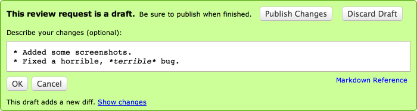

.. _publishing-review-requests:

==========================
Publishing Review Requests
==========================

When you first create a review request, it will not be visible to anyone until
it is published. Click :guilabel:`Publish` in the green bar at the top to make
the review request public.

Depending on your particular setup, publishing a review request may send
an e-mail out to the reviewers, letting them know your change is ready to
be reviewed.

==================
Publishing Updates
==================

As soon as you make any change to a review request, a draft banner will appear
above the review request asking you to optionally describe your changes. This
is handy when you've actually uploaded a new diff and want to say what changed
in that diff.

When you're finished, click :guilabel:`Publish Changes`. If you decided you
didn't want to make those changes, you can click :guilabel:`Discard Draft`
instead.

Depending on your particular setup, publishing a draft may send an e-mail out
to the reviewers, letting them know your change is ready to be reviewed again.

The :guilabel:`Describe your changes` field supports rich text using the
:term:`Markdown` language. See :ref:`using-markdown` for more information.

If the update to your review request is minimal (such as making small fixes to
the fields), you may not want to notify everyone involved. In this case,
unchecking :guilabel:`Send E-Mail` will disable e-mail notification.
