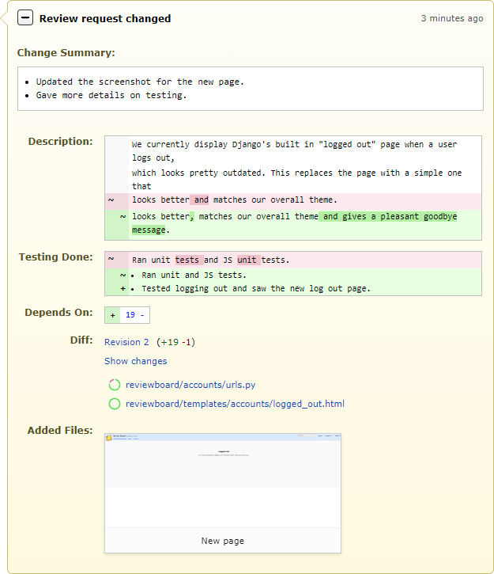

.. _publishing-review-requests:

==========================
Publishing Review Requests
==========================

When you first create a review request, it will not be visible to anyone until
it is published. Click :guilabel:`Publish` in the green bar at the top to make
the review request public.

Depending on your particular setup, publishing a review request may send
an e-mail out to the reviewers, letting them know your change is ready to
be reviewed.

.. _publishing-review-request-updates:

==================
Publishing Updates
==================

As soon as you make any change to a review request, a draft banner will appear
above the review request asking you to optionally describe your changes. This
is handy when you've actually uploaded a new diff and want to say what changed
in that diff. The :guilabel:`Describe your changes` field supports rich text
using the :term:`Markdown` language. See :ref:`using-markdown` for more
information.

.. image:: review-request-update-banner.png

When you're finished, click :guilabel:`Publish`. If you decided you
didn't want to make those changes, you can click :guilabel:`Discard`
instead.

Depending on your particular setup, publishing a draft may send an e-mail out
to the reviewers, letting them know your change is ready to be reviewed again.

If the update to your review request is minimal (such as making small fixes to
the fields), you may not want to notify everyone involved. In this case,
unchecking :guilabel:`Send E-Mail` will disable e-mail notification.

.. _review-request-changed-overview:

===============================
Review Request Changed Overview
===============================

After publishing the draft, a :guilabel:`Review request changed` overview will
appear at the bottom of the page, which gives a summary of what changed in
that revision of the review request.

         Summary field, a diff view of the changes in the Description and
         Testing Done, and Depends On fields, links to the new diff revision
         and its files, and an Added Files section containing a new file.
   :sources: 2x review-request-changed@2x.png
