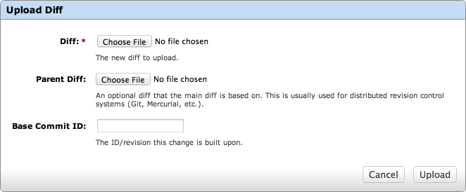

===============
Uploading Diffs
===============

A review request's diff can be updated by clicking :guilabel:`Upload Diff`
or :guilabel:`Update Diff` on the action bar. It will present a dialog much
like the New Review Request page.

See :ref:`review-requests-for-diffs` for more information on the fields.

.. note:: When updating the diff on a review request, you need to upload a
          full diff between the upstream code (what's present in the
	  repository) and your change. You can't just upload a diff of the
	  changes since the previous diff.

.. note:: It's usually best to use :ref:`rbt post <rbtools:rbt-post>` or
          another tool to update a diff, instead of uploading using this
	  dialog. This will help guarantee a valid diff, and works around
	  problems in some diff formats.
