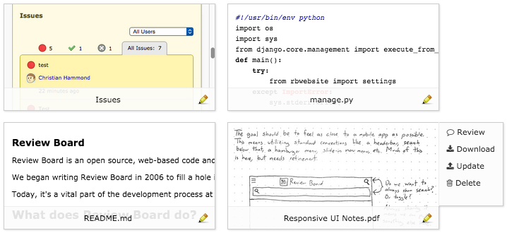
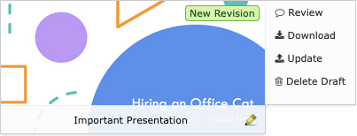
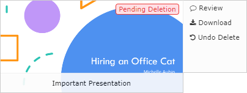

.. _uploading-files:

==========================
Uploading File Attachments
==========================

Any type of file can be added to a review request. Log files, binaries, test
data, audio, or anything else. This is especially helpful for files that are
part of a change but can't be represented in diffs, as well as things like
attaching a screenshot of changes that affect user interfaces.

Many types of files, including text and images, can be displayed on Review
Board and reviewed by clicking on the areas where you want to add comments.
This works just like the review process for source code. Simply click the
thumbnail or click :guilabel:`Review` to begin reviewing the file.

Not all types of files have this support. For those files, clicking
:guilabel:`Add Comment` will let you leave a comment that applies to the whole
file.

See :ref:`reviewing-file-attachments` for more information.

There are two ways to upload a file attachment:

1. Click :menuselection:`Update --> Add File` on the action bar, browse for the
   file to upload, and optionally enter a caption for the file.

2. Drag the file from your file manager into the review request.

   When dragging over the browser window, a black overlay will appear,
   showing you where to drop the file to upload it.

   When you drop the file, the overlay will disappear and the file will
   upload.

   You can drag and upload multiple files at a time.

   Note that this requires a modern HTML5-capable browser, such as
   Google Chrome or Firefox 3.6+.

Updating File Attachments
-------------------------

File attachments have an associated history similar to source code if they
are updated throughout the life of a review request. You'll be able to view
and compare old revisions of a file attachment even after it's been updated
with a new version.

To update a file attachment:

1. In the file attachment thumbnail for the respective file on the review
   request page, click :guilabel:`Update`.

2. Browse for the new version of the file to upload, and optionally change
   the caption for the file.

The new version of the file attachment will be visible to others once the
review request draft is published. Until then, you may discard any draft
changes to a file attachment by clicking :guilabel:`Delete Draft`.

         the top right corner of its thumbnail stating that it is a draft
         of a new revision. There is a menu of buttons beside the thumbnail,
         with options for reviewing, downloading, updating, and deleting
         the draft.
   :width: 403
   :height: 154
   :sources: 2x file-attachments-delete-draft@2x.png

See :ref:`reviewing-file-attachments` for more information on how file
attachments with multiple revisions are reviewed.

Deleting File Attachments
-------------------------

File attachments can be deleted from a review request by clicking
:guilabel:`Delete`. Once the review request draft is published, the file
attachment will be removed from the main review request box. However it and
any of its revisions will still be visible from the
:ref:`Review request changed overview <review-request-changed-overview>`.

The deletion cannot be undone after publishing the review request draft.
Before publishing the draft, you may undo the deletion by clicking
:guilabel:`Undo Delete`.

         the top right corner of its thumbnail stating that it is
         pending deletion. There is a menu of buttons beside the thumbnail,
         with options for reviewing, downloading, and undoing the delete.
   :width: 404
   :height: 154
   :sources: 2x file-attachments-undo-delete@2x.png
