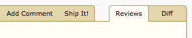
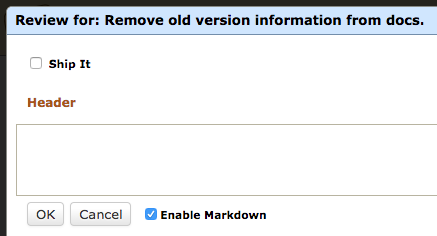
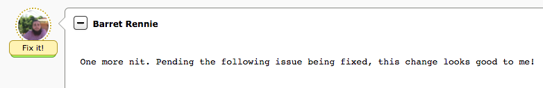

.. _approving-changes:

============================
Approving Changes (Ship It!)
============================

To give your approval for a change, you want to file a review with a "Ship
It!" This is a way of telling the owner of the change that you're happy with
how it looks.

It's up to your organization to decide how these are used. Some organizations
may have policy about how many are required before a change can land, or who
must approve a change. By default, review requests are considered approved if
there's at least one Ship It! and no open issues, but this can be customized
by writing an extension that implements :ref:`custom approval logic
<review-request-approval-hook>`.

There are a couple ways of filing a Ship It! review.

.. _quick-ship-it:
.. _ship-it-only-reviews:

Filing "Ship It!"-Only Reviews
==============================

The quickest way to file a Ship It! review is to click :guilabel:`Ship It!` on
the review request's action bar. This will confirm that you want to publish
the review, and will then immediately create and publish a review simply
saying "Ship It!". If you're happy with the change and have nothing else to
add, this is a good, quick way to give your approval.

.. _review-dialog-ship-it:

Marking "Ship It!" in the Review Dialog
=======================================

You might want to add a bit more to your review along with your "Ship It!".
Maybe you want to give some praise for an awesome change. You can do this by
opening the review dialog and clicking the :guilabel:`Ship It!` checkbox.

This will give you the opportunity to fill out the :guilabel:`Header` field
with a general summary. It's a good opportunity to say something encouraging.
Note that unlike with :ref:`"Ship It!"-only reviews <ship-it-only-reviews>`,
this will not default to saying "Ship It!".

It's also a good opportunity to add some :ref:`General Comments
<general-comments>` or edit any existing comments you've filed, if you're
posting a :ref:`Fix It, then Ship It! <fix-it-then-ship-it>` review.

.. _fix-it-then-ship-it:

"Fix It, Then Ship It!"
=======================

.. versionadded:: 2.5

You can also mark a review as "Ship It!" *and* file issues at the same time.
When you do this, your published review will be in a "Fix It, then Ship It!"
state, indicating that there's still some work to be done but it otherwise is
approved.

This is best done only if the remaining issues are trivial (such as a simple
typo or indentation fix).

When the owner of the change resolves the last issue filed on your review, it
will immediately transition to a "Ship It!" state.

.. _revoking-ship-it:

Revoking Your "Ship It!"
========================

.. versionadded:: 3.0

If you filed a "Ship It!" review and want to undo it, simply hover the mouse
over the "Ship It!" label and click the :guilabel:`X` button. The page will
confirm that you want to revoke your Ship It! and that this cannot be undone.
Once confirmed, the Ship It! label will go away.

.. image:: revoke-ship-it.png

You might want to do this if you realize you forgot to review some part of the
change, wanted a second look, or the change has grown so much since your
review that your Ship It! no longer applies.

A "Ship It!" on a "Fix it, then Ship it!" review can also be removed by first
hovering over the "Fix it!" label. The green "Ship it!" label will slide down
and you'll be able to click the :guilabel:`X` to revoke it.
