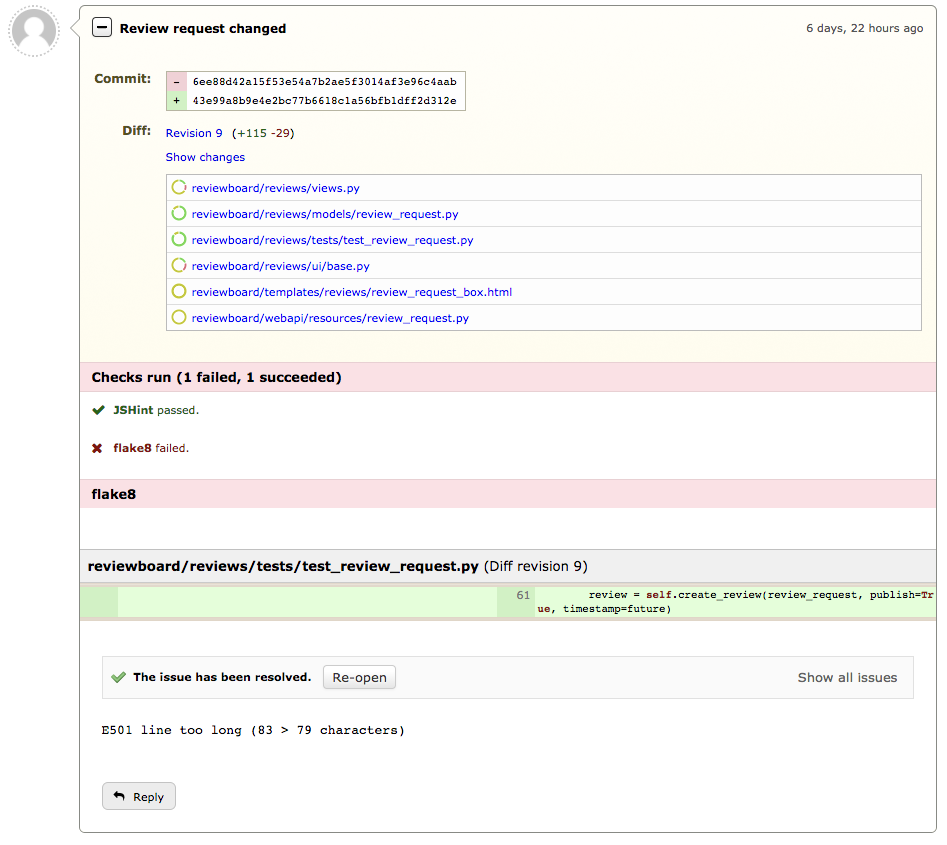

.. _automated-code-review:

=====================
Automated Code Review
=====================

.. versionadded:: 3.0

Review Board provides some tools for doing automated review when code changes
are published. By integrating static analysis tools, style checkers, and
:term:`CI` builds into your review process, you can free up your developers to
concentrate on the larger, more important issues.

.. _status-updates:

How Automated Code Reviews Appear
=================================

Automated code reviews are presented using a status update on the review
request. These are presented in a box either directly below the
:ref:`review request box <review-requests-overview>`, or inside the
:guilabel:`Review request changed` boxes, depending on whether the status
update is for the initial revision of a diff or subsequently added revisions.

Each status update can have a name, a state (such as running, failed, or
succeeded), and optionally link to an external log. These can also be
associated with a review listing issues which need to be fixed, which will
appear inline in the :guilabel:`Checks run` section.

If you're interested in developing your own tools which can post status
updates, see the :ref:`API documentation <webapi2.0-status-update-resources>`.

Automated Code Review Tools
===========================

There are several tools which can help with automated code review. Some of
these are bundled with Review Board, and some are available through external or
third-party tools.

.. TODO: This is a great place to include future docs for Review Bot.

* :ref:`integrations-circle-ci`
* :ref:`integrations-travis-ci`
