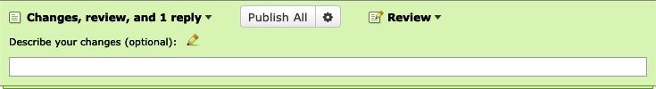

.. _review-banner:

=================
The Review Banner
=================

At the top of the window, you'll see a banner to manage the review process. To
start, this contains a :guilabel:`Review` menu with several options:

.. image:: review-menu.png

Clicking :guilabel:`Create a new review` will create a new, blank review draft.

Clicking :guilabel:`Add a general comment` will create a new :ref:`General
Comment <general-comments>` about the review request, not linked to any code
or file attachments.

Clicking :guilabel:`Ship It!` will immediately publish a new review,
:ref:`indicating your approval <approving-changes>` of the change.

Review Drafts
-------------

Just like with review requests, when you first start adding a new review or
replying to an existing review, your comments are saved in a draft state. When
a review or reply is a draft, it is only visible to you.

When you have a draft review, the review banner will change color to green and
offer additional options.

In the :guilabel:`Review` menu, the :guilabel:`Edit your review` option will
display the :ref:`Review Dialog <review-dialog>`, allowing you to make changes
to the review content.

Clicking :guilabel:`Publish` will publish your draft. There are also
:ref:`additional options <publishing-reviews>` available for how the change is
published.

Clicking :guilabel:`Discard` will immediately discard your draft.

If you have multiple drafts (such as a review request update, a review, and
replies), the banner will allow you to manage and edit all the drafts. See
:ref:`Managing Drafts <managing-drafts>` for more detail.

