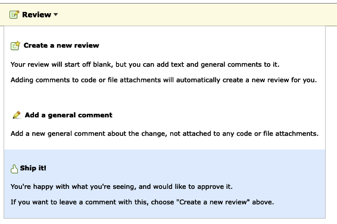
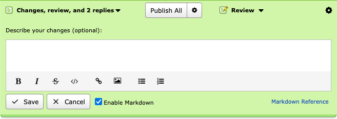
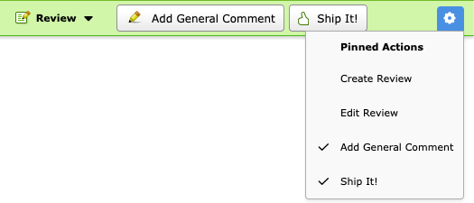

.. _review-banner:

=================
The Review Banner
=================

The Review Banner is always shown at the top of the review request page,
diff viewer, and file attachments. It's where you'll create, edit, and publish
reviews.

.. _review-banner-menu:

Review Menu
===========

The :guilabel:`Review` menu is always shown on the banner, giving you options
for working with your review:

Clicking :guilabel:`Create a new review` will create a new, blank review draft.

Clicking :guilabel:`Add a general comment` will create a new :ref:`General
Comment <general-comments>` about the review request, not linked to any code
or file attachments.

Clicking :guilabel:`Ship It!` will immediately publish a new review,
:ref:`indicating your approval <approving-changes>` of the change.

.. _review-banner-drafts:

Review Drafts
=============

Just like with review requests, when you first start adding a new review or
replying to an existing review, your comments are saved in a draft state. When
a review or reply is a draft, it is only visible to you.

When you have a draft review, the review banner will change color to green and
offer additional options.

         "Publish" button with a gear for settings, a "Discard" button, and
         a "Review" drop-down menu.
   :width: 552
   :height: 44
   :sources: 2x review-banner-draft@2x.png

In the :guilabel:`Review` menu, the :guilabel:`Edit your review` option will
display the :ref:`Review Dialog <review-dialog>`, allowing you to make changes
to the review content.

Clicking :guilabel:`Publish` will publish your draft. There are also
:ref:`additional options <publishing-reviews>` available for how the change is
published.

Clicking :guilabel:`Discard` will immediately discard your draft.

If you have multiple drafts (such as a review request update, a review, and
replies), the banner will allow you to manage and edit all the drafts. See
:ref:`Managing Drafts <managing-drafts>` for more detail.

         a "Publish All" button with a gear for settings, a "Discard"
         button, a "Review" drop-down menu, a gear for choosing Quick Access
         actions. A "Describe your changes" label follows with a Markdown
         text field and "Save" and "Cancel" buttons, an "Enable Markdown"
         option, and a link to a Markdown reference.
   :width: 657
   :height: 232
   :sources: 2x review-banner-grouped@2x.png

.. _review-banner-quick-access-actions:

Quick Access Actions
====================

.. versionadded:: 8.0

Quick Access actions let you pin your most frequently-used review actions
directly to the banner for one-click access.

         Quick Access buttons to the right of the "Review" menu. The gear
         menu for pinning actions is open, showing a "Pinned Actions"
         header followed by "Create Review" and "Edit Review" (which are
         both unpinned) and "Add General Comment" and "Ship It!" (which are
         both pinned).
   :width: 525
   :height: 225
   :sources: 2x review-banner-quick-access@2x.png

The following actions can be pinned:

* :guilabel:`Create Review`

  Creates a new, blank review draft. You can then add text and general
  comments to it. Adding comments to code or file attachments will also
  automatically create a new review.

* :guilabel:`Edit Review`

  Opens the review dialog to edit your comments and publish your review.

* :guilabel:`Add General Comment`

  Adds a new :ref:`general comment <general-comments>` about the change, not
  attached to any code or file attachments.

* :guilabel:`Ship It!`

  Immediately publishes a new review :ref:`indicating your approval
  <approving-changes>` of the change.

To choose which actions are pinned, click the settings icon in the banner to
open the :guilabel:`Pinned Actions` menu. Check or uncheck each action you
want to show or hide. Your choices are saved automatically and persist across
sessions.

.. tip::

   :ref:`Extensions <writing-extensions>` can add custom Quick Access actions
   that your users can pin to their banner.

   See :ref:`extension-actions` to learn how to write your own actions.
