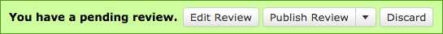

.. _review-draft-banner:

===================
Review Draft Banner
===================

Any time you have an unfinished draft of a review, you will see a green
draft review banner docked to the top of your browser window on any
pages associated with that review request. This will help you to remember
that you still have a review pending, and lets you quickly interact with it.

The banner has the following buttons:

Clicking :guilabel:`Edit Review` will display the
:ref:`review dialog <review-dialog>`, allowing you to make changes to your
review.

Clicking :guilabel:`Publish Review` will immediately
:ref:`publish your review <publishing-reviews>`. There are also additional
options that affect how the change is published.

Clicking :guilabel:`Discard Review` will immediately discard your review.
