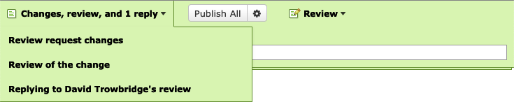

.. _managing-drafts:

==============================
Managing and Publishing Drafts
==============================

Review Board uses a draft mechanism for all editable items: the review request,
reviews, and replies to reviews. This means you may have several things in a
draft state all at once.

When anything is in a draft state, the review banner at the top of the window
will change to a green color and give you options for changing or publishing
the drafts that exist.

.. versionchanged:: 6.0
   Prior to Review Board 6.0, each draft had its own banners and had to be
   published separately. If you're using an older version, please consult the
   version of the user manual corresponding to your system.

When multiple drafts are present, the banner has a mode switcher that allows
you to switch between a grouped mode and individual drafts. By default, the
banner will be in grouped mode and control all active drafts. If you want to
instead focus on only one, you can select it from the drop-down menu.

.. _publishing-reviews:

Publishing Drafts
-----------------

When the banner is in the grouped mode, you have the following options for
publishing:

* To publish all active drafts, click :guilabel:`Publish All`. If enabled, this
  will send a single e-mail notification containing all of your content.
* To publish only a single draft, select the one you want to publish from the
  drop-down, and click :guilabel:`Publish`.
* To discard a draft, select the one you want to discard from the drop-down and
  click :guilabel:`Discard`.

After publishing a review, it will show up in the review request page with all
the comments you've written. Anybody can reply to your comments to discuss your
feedback.

If the server administrator has enabled e-mail support, the owner of the review
request and all assigned reviewers will be e-mailed a copy of your new review.
Notifications may also be sent to any :ref:`chat services <integrations>` you
have configured.

Once you have published a review, you can't go back and edit it (but you can
later :ref:`revoke a Ship It! <revoking-ship-it>` if you marked it as such).

Publish Options
---------------

The :guilabel:`Publish` button additionally has a drop-down of options, shown
by hovering over the gear icon.

You can also select :guilabel:`Archive after publishing` to automatically mark
the review request as :ref:`archived <star-archive-and-mute>` after your review
is published.

If your server has e-mail notifications enabled, you can turn them off by
unselecting :guilabel:`Send E-Mail`. This is most useful if you're publishing
small tweaks, and don't want to create unnecessary noise in people's inboxes.
