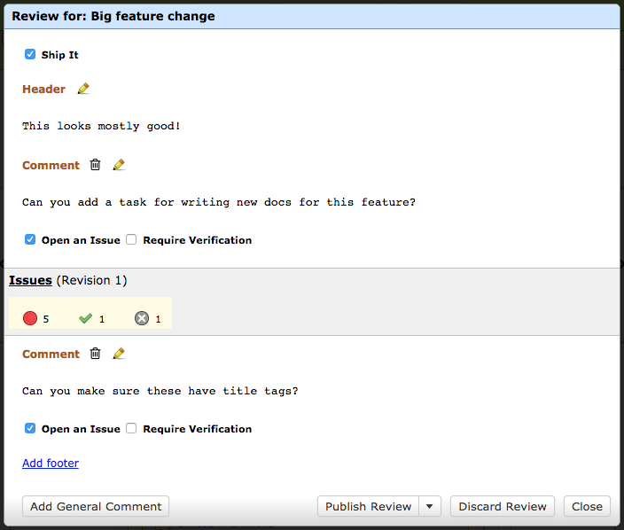
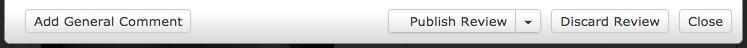
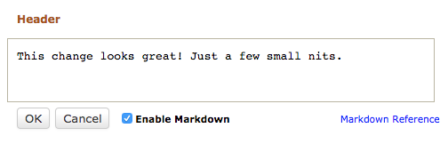
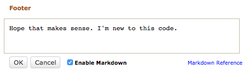
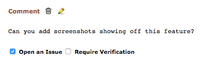

============================
Creating and Editing Reviews
============================

Creating Reviews
================

Adding comments on diffs or file attachments will immediately create a new
review if one doesn't already exist. Once a review is created, a :ref:`review
draft banner <review-draft-banner>` will show on the page.

Blank reviews can also be created without having to first add a comment.
This can be useful if you have a generic comment about the change, rather
than one specific to diffs or other files.

To create a new, blank review, click :guilabel:`Review` on the review
request actions bar.

.. _review-dialog:

Editing Reviews
===============

Clicking the :guilabel:`Review` button on the review request action bar, or
clicking :guilabel:`Edit Review` on the review draft banner will display the
review dialog, showing the entire contents of your draft review.

In this dialog, you can add a summary for your review,
:ref:`approve it <approving-changes>` for shipping, manage comments, and write
text to appear at the top and bottom of your review. Toggling a checkbox or
pressing :guilabel:`OK` on a text field will instantly save those changes, so
you don't have to worry about losing your work if you close the page.

The bottom of the dialog have the following buttons:

:guilabel:`Add General Comment` will :ref:`add a general comment
<review-dialog-add-general-comments>`, which is not bound to any diff or file,
to the review.

:guilabel:`Publish Review` will save any comments you have made on your review
and immediately :ref:`publish your review <publishing-reviews>`. See the
documentation there on publishing options.

:guilabel:`Discard Review` will immediately discard your draft review,
deleting all new comments you've made on that draft. *This cannot be undone!*

:guilabel:`Close` will close the review dialog.

.. _review-dialog-header:

Writing a Header
----------------

The top of the dialog contains a :guilabel:`Header` field, which is a
free-form text field that lets you write some text that will appear before any
comments in your review. This is a good place to provide a summary of your
review or to provide general feedback (maybe something encouraging). This
field supports :ref:`Markdown <using-markdown>` text.

Unlike a comment, you won't be able to :ref:`file an issue <issue-tracking>`
with your header text. However, like a comment, people will be able to reply
to it. If you want a comment not tied to a diff or file that allows for issue
tracking, you'll want to create a :ref:`general comment <general-comments>`.

.. _review-dialog-footer:

Writing a Footer
----------------

Much like a header, your review can have a footer that will follow after all
the comments. This field is only available if you have one or more comments in
your review. This is a good place to have a conclusion that you want people to
read after they've gone through all your comments.

.. _review-dialog-comments:

Editing Comments
----------------

After the :ref:`header <review-dialog-header>`, the review dialog will list
all the comments you've filed on the review request. These will cover
:ref:`general comments <general-comments>`, :ref:`comments on diffs
<reviewing-diffs>`, and :ref:`comments on file attachments
<reviewing-file-attachments>`.

Existing comments can be edited by clicking the comment text or pencil icon,
entering new text, and clicking :guilabel:`OK`.

You can also change the :ref:`issue tracking options <issue-tracking>` here.
These changes will be instantly saved.

.. _review-dialog-delete-comments:

Deleting Comments
-----------------

.. versionadded:: 3.0

If you realize a comment doesn't make sense on the review, you can delete it
by clicking the trash can icon and confirming that you want to remove the
comment. The comment will then be permanently removed from the review.

.. _review-dialog-add-general-comments:

Adding General Comments
-----------------------

.. versionadded:: 3.0

:ref:`General comments <general-comments>` can be added directly in the Review
Dialog by clicking :guilabel:`Add General Comment` at the bottom-left of the
dialog. This will create a new comment entry, which you can fill out and save
by clicking :guilabel:`OK`.

The list of general comments will appear at the top of the review, much like
the :ref:`review's header <review-dialog-header>`. Unlike the header, you can
have as many general comments as you want, and they all support :ref:`issue
tracking <issue-tracking>`.

Note that these are *not* intended for reviewing actual code or files. They're
comments that apply to the review or task as a whole.

Adding Diff/File Attachment Comments
------------------------------------

Comments on diffs and file attachments are shown in the review dialog, but
cannot be added within the dialog. To leave comments on those, see
:ref:`reviewing-diffs` and :ref:`reviewing-file-attachments`.
