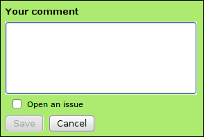
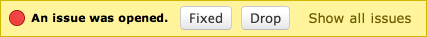
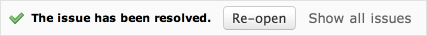
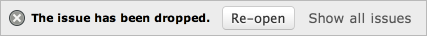
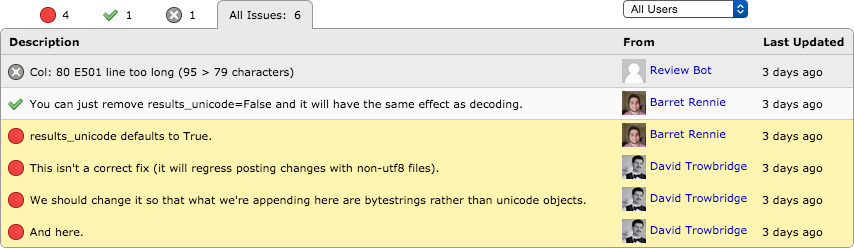

.. _issue-tracking:

==============
Issue Tracking
==============

When reviewing code or other files, some comments are more critical than
others. The reviewer may just have a question or suggest something optional,
but they may also have a critical issue that must be resolved before the
change can be submitted.

Issue tracking enables reviewers to specify that their comment refers to
a defect in the code or file that must be resolved. The owner of the review
request will be able to see that issues were filed, and can resolve or discard
them one-by-one. This is a faster alternative to replying to each comment
with "Fixed."

Opening Issues
==============

Comment dialogs contain an :guilabel:`Open an issue` checkbox. Comments with
this checkbox checked will be filed as an open issue.

This checkbox is available when :ref:`reviewing diffs <reviewing-diffs>`,
:ref:`images <reviewing-images>`, and other kinds of
:ref:`file attachments <reviewing-file-attachments>`.

By default, :guilabel:`Open an issue` is checked for new comments.

The checkbox can also be toggled by pressing :kbd:`Alt-I`.

Responding to Issues
====================

The owner of the review request will see extra buttons on the issue banners
below the comment in the reviews for any issues that are opened. These
buttons allow for quickly marking issues as either resolved or discarded.

Clicking :guilabel:`Fixed` will mark that particular issue as fixed,
letting other reviewers see that you've taken care of the issue.

Clicking :guilabel:`Drop` will drop that issue. This signals to the
reviewers that either their comment didn't make sense for one reason or
another, or that there's a disagreement about the issue. Generally, this
should be followed up with a comment.

Issues that are unintentionally closed one way or another can be re-opened
by clicking :guilabel:`Re-open`.

Summary Table
=============

On the reviews page below the description is a table which lists all of the
issues found in reviews.

Clicking the :guilabel:`Status` drop-down will allow you to choose between
:guilabel:`Open`, :guilabel:`Dropped`, :guilabel:`Resolved`, or
:guilabel:`All issues`. Clicking the :guilabel:`From` drop-down will allow
you to filter the list by individual reviewers. Clicking on a row will jump
to the comment.

.. _issue-verification:

Issue Verification
==================

If an issue is particularly important, you can select :guilabel:`Require
Verification` when creating the comment. This will make it so the owner of the
review request cannot directly mark the issue as fixed or dropped. Instead, the
issue will be set to an intermediate state, waiting for verification. The
reviewer (or an administrator) can then verify whether the issue should be
closed or reopen it.

Because this adds an extra step to the process, we recommend only requiring
verification for extremely important issues that should truly block the change.
Unless you have specific high requirements for your industry, using it on every
issue is likely to slow down the code review process too much.
