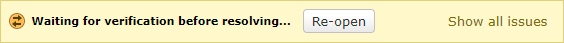

.. _issue-tracking:

==============
Issue Tracking
==============

When reviewing code or other files, some comments are more critical than
others. The reviewer may just have a question or suggest something optional,
but they may also have a critical issue that must be resolved before the
change can be submitted.

Issue tracking allows reviewers to specify that their comment refers to
a defect in the code or file that must be resolved.

The owner of the review request will be able to see that issues were filed,
and can resolve or discard them one-by-one. This is a faster alternative to
replying to each comment with "Fixed."

Opening Issues
==============

Comment dialogs contain an :guilabel:`Open an issue` checkbox. Comments with
this checkbox checked will be filed as an open issue.

.. image:: comment-box.png
   :alt: A screenshot of the Comment Dialog, showing an example comment being
         typed that includes Markdown formatting and a JavaScript code sample
         being recommended. There are two checked checkboxes: "Open an Issue"
         and "Enable Markdown". There's one unchecked checkbox: "Require
         Verification".
   :width: 454
   :height: 354
   :sources: 2x comment-box@2x.png

This checkbox is available when :ref:`reviewing diffs <reviewing-diffs>`,
:ref:`images <reviewing-images>`, and other kinds of
:ref:`file attachments <reviewing-file-attachments>`.

By default, :guilabel:`Open an issue` is checked for new comments.

The checkbox can also be toggled by pressing :kbd:`Alt-I`.

Responding to Issues
====================

The owner of the review request will see extra buttons on the issue banners
below the comment in the reviews for any issues that are opened. These
buttons allow for quickly marking issues as either resolved or discarded.

.. image:: open-issue.png

* :guilabel:`Fixed` will mark that particular issue as fixed.

  This lets other reviewers see that you've taken care of the issue.

* :guilabel:`Drop` will drop that issue.

  This tells reviewers that either their comment didn't make sense
  for one reason or another, or that there's a disagreement about the issue.
  Generally, this should be followed up with a comment.

.. image:: resolved-issue.png

.. image:: dropped-issue.png

* :guilabel:`Re-open` will re-open an issue that was previously closed.

Issues can be closed or re-opened by either the owner of the review request or
the reviewer who filed the issue.

.. _issue-summary-table:

Issue Summary Table
===================

On the reviews page below the description is a table which lists all of the
issues found in reviews.

.. image:: issue-summary.png

Clicking the :guilabel:`Status` drop-down will allow you to choose between:

* :guilabel:`Open`
* :guilabel:`Dropped`
* :guilabel:`Resolved`
* :guilabel:`All issues`

Clicking the :guilabel:`From` drop-down will allow you to filter the list by
individual reviewers.

Clicking on a row will jump to the comment.

.. _issue-verification:

Issue Verification
==================

If an issue is particularly important, you can enable Issue Verification.
This can be done by toggling :guilabel:`Require Verification` when creating
a comment.

This will prevent owners of a review request from closing an issue until the
reviewer (or an administrator) has approved the resolution. Instead, the issue
will state it's waiting for verification.

         with buttons for re-opening the issue and for showing all issues.
   :width: 613
   :height: 44
   :sources: 2x issue-verification@2x.png

Because this adds an extra step to the process, we recommend only requiring
verification for extremely important issues that should truly block the
change. Unless you have specific high requirements for your industry, using it
on every issue is likely to slow down the code review process too much.
