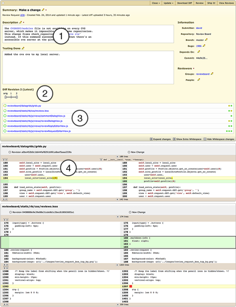

.. _reviewing-diffs:

===============
Reviewing Diffs
===============

Using the Diff Viewer
=====================

Diffs can be reviewed in the Review Board diff viewer by clicking
:guilabel:`View Diff` on the review request action bar.

Parts of the Diff Viewer
------------------------

When you load the Diff Viewer, the page is divided into several parts:

1. The review request box (for reference).
2. The current diff revision and revision selector (if more than one revision
   of the diff has been uploaded).
3. The file listing.
4. The side-by-side diff for each file.

Depending on the number of files modified, the diff viewer may be split across
multiple pages. You can jump to the pages using the paginator above or below
the diffs.

The File Index
--------------

The file index is a list of all the files which are shown on the current page.
There are several parts to this display:

* On the left is a graph which shows the ratio of added/changed/deleted lines.
  The thickness of this graph indicates what percentage of the file has been
  altered.
* The name of the file. This can be clicked to jump directly to the diff for
  that file.
* Whether the file was renamed, and the old filename if so.
* Indications for deleted or binary files.
* A list of clickable chunk dots, color-coded to represent add/change/delete.

.. image:: diff-file-index.png

Viewing Other Diff Revisions
----------------------------

Every public revision of a diff that was posted is available for review. The
diff revision selector allows you to look at previous versions of the change.
To browse old revisions, set the handle on the left to :guilabel:`orig`
(meaning the original version of the file) and the handle on the right to the
revision you want to look at.

This is sometimes useful when you're in the middle of a review of a particular
diff, go away for a bit, and then come back to discover that a new diff
revision has been uploaded. In this case, a warning box will appear telling
you that you have additional comments on an older revision, with a helpful
link to jump back to that revision.

.. image:: diff-revision-selector.png

The diff viewer also allows you to do comparisons between diff revisions
(called :term:`interdiffs`). In other words, it lets you see what changes the
developer has made since the previous version of the diff you looked at, which
is very useful for large changes which require several iterations of review.

To view an interdiff between two diff revisions, set the two handles to the
revisions you want to compare.

.. note:: Due to the way that the diff viewer works, if a newer diff is based
          on a newer revision of a file, you may see other changes made to
          that file between those revisions that has nothing to do with the
          review itself.

          If you're a developer posting code and you want to sync your
          source tree, it's best to try to keep as many revisions of your change
          based on the same revision of the source tree as possible, in order to
          minimize the impact of this on your reviewers.

Viewing Deleted Files
---------------------

.. versionadded:: 3.0

By default, the diff viewer doesn't show the content of any files deleted in a
diff, as this code often doesn't need to be reviewed. Instead, you'll see a
simple message stating that the file was deleted.

.. image:: diff-show-deleted.png

For those times that you *do* need to see more, you can click :guilabel:`Show
content` to load in the content of the deleted file.

.. image:: diff-show-deleted-contents.png

Deleted files can be commented on and will appear in reviews. It's important
to note though that deleted files that contain comments are not automatically
expanded in the diff viewer.

Diff Viewer Features
====================

Side-by-side Diffs
------------------

Diffs are displayed using a side-by-side format. This means that the old
version of the file is displayed on the left, and the new version of the file
is displayed on the right. The differences between the two versions are
highlighted using colors: green for added lines, red for removed lines, and
yellow for changed lines.

Moved Line Indicators
---------------------

If you move one or more lines of code within a file, instead of just showing
those lines as deleted from one location and added to another, Review Board
will detect that the lines have been moved and show an indicator. These
indicators can be clicked to jump to the other end of the move.

.. image:: moved-lines.png

Indentation Change Indicators
-----------------------------

Historically, Review Board would show lines that differed only in their
indentation as being equal. This is nice in most cases, but can hide important
information, especially in languages like Python where the indentation is
crucial to the meaning of the code.

Review Board will now show indentation changes with small indicators at the
beginning of the line. Dedents will be shown on the left-hand side of the diff,
and indents will be shown on the right.

.. image:: diff-indentation.png

Intra-line Change Highlighting
------------------------------

Edits which change only one or two characters in a long line can be difficult
to read, so when the original and new lines are very similar, Review Board will
highlight which characters changed. This is shown with a slightly darker yellow
background.

Commenting on Lines
===================

To comment on a line on a diff, simply click the line number. A
comment dialog will appear giving you a text entry for writing your
comment. When you're done, you can click
:guilabel:`Save` to save the comment.

Furthermore you can assign a comment to multiple code lines. This
option is especially useful to provide additional code context to
discussions as all commented code will appear on the review request
page.

To create a multiple line comment click and drag on the beginning line
number down the column until you've selected all the lines needed for your
comment.

.. image:: comment-box.png

Comments support rich text using the :term:`Markdown` language. See
:ref:`using-markdown` for more information.

The diff comment dialog supports issue tracking. See the section on
:ref:`issue-tracking` for more information.

After saving a comment, a green comment flag will appear next to the first
line in your selection, indicating that you have an unpublished comment. Click
the line number or comment flag to pop open the comment box for your existing
comment again.

Reading Existing Comments
=========================

Any existing comments will show up as blue clickable comment flags along the
left-hand side of the diff viewer. Each comment flag corresponds to a line
containing a comment.

If you move the mouse cursor over the comment flag, a tooltip will appear
showing a summary of the comments made.

If you click on the comment flag or the line number, the comment dialog
will appear, along with a blue side panel on the left showing those existing
comments. You can still write new comments in the green area of the comment
box.

.. image:: full-comment-box.png

.. note:: It's important to note that this is **not** the place to reply to
          those comments. When you add a comment from the diff viewer, it's
          creating a new top-level review (akin to a new thread). If you want
          to reply to existing comments, you can do so from the
          :ref:`Reviews <review-replying>` page. The :guilabel:`Reply` link
          here is a shortcut to jump directly to the relevant comment on the
          Reviews page.

          The view here is meant to be used only as a reference to see if
          other people have already said what you plan to say.

Keyboard Shortcuts
==================

There are many keyboard shortcuts for navigating around the diff viewer:

* Previous file:
  :kbd:`a`, :kbd:`A`, :kbd:`K`, :kbd:`P`:, :kbd:`<`, or :kbd:`m`
* Next file:
  :kbd:`f`, :kbd:`F`, :kbd:`J`, :kbd:`N`, :kbd:`>`
* Previous change:
  :kbd:`s`, :kbd:`S`, :kbd:`k`, :kbd:`p`, :kbd:`,`
* Next change:
  :kbd:`d`, :kbd:`D`, :kbd:`j`, :kbd:`n`, :kbd:`.`
* Previous comment:
  :kbd:`[`, :kbd:`x`
* Next comment:
  :kbd:`]`, :kbd:`c`
* Add comment to selected block:
  :kbd:`r`, :kbd:`R`
