.. _reviewing-diffs:

===============
Reviewing Diffs
===============

Any review request that introduces changes to code will have a
:guilabel:`Diff` tab at the top-right of the review request page that provides
access to the diff viewer. This is where developers will spend a lot of their
time, and to help save you time we've provided a lot of functionality to give
you a better view of the code, and to help you navigate around.

Navigating Diffs
================

File Listing
------------

The file index lists all the files which are shown on the current page. There
are several parts to this display:

* On the left is a graph which shows the ratio of added/changed/deleted lines.
  The thickness of this graph indicates what percentage of the file has been
  altered.
* The name of the file. This can be clicked to jump directly to the diff for
  that file.
* Whether the file was renamed, and the old filename if so.
* Indications for deleted or binary files.
* A list of clickable chunk dots, color-coded to represent add/change/delete.

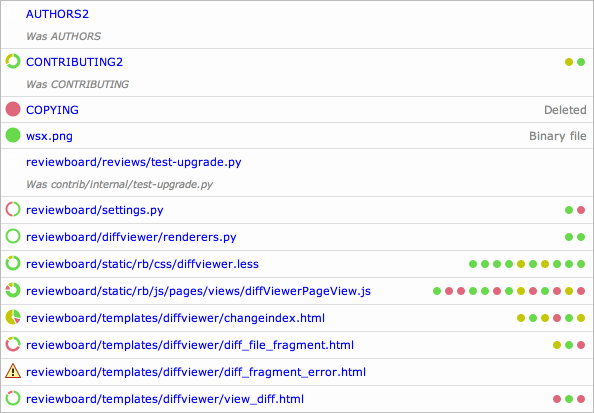

Depending on the number of files modified, the diff viewer may be split across
multiple pages. You can jump to the pages using the paginator above or below
the diffs.

Viewing Other Diff Revisions
----------------------------

Every public revision of a diff that was posted is available for review. The
diff revision selector allows you to look at previous versions of the change.
To browse old revisions, set the handle on the left to :guilabel:`orig`
(meaning the original version of the file) and the handle on the right to the
revision you want to look at.

This is sometimes useful when you're in the middle of a review of a particular
diff, go away for a bit, and then come back to discover that a new diff
revision has been uploaded. In this case, a warning box will appear telling
you that you have additional comments on an older revision, with a helpful
link to jump back to that revision.

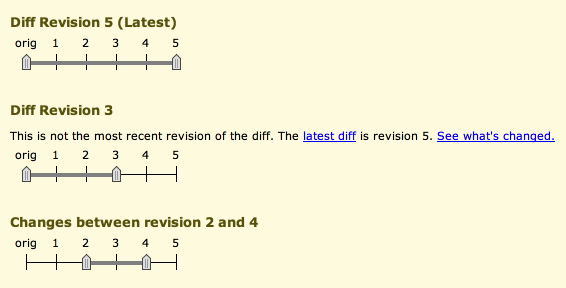

The diff viewer also allows you to do comparisons between diff revisions
(called :term:`interdiffs`). In other words, it lets you see what changes the
developer has made since the previous version of the diff you looked at, which
is very useful for large changes which require several iterations of review.

To view an interdiff between two diff revisions, set the two handles to the
revisions you want to compare.

.. note:: Due to the way that the diff viewer works, if a newer diff is based
          on a newer revision of a file, you may see other changes made to
          that file between those revisions that has nothing to do with the
          review itself.

          If you're a developer posting code and you want to sync your
          source tree, it's best to try to keep as many revisions of your change
          based on the same revision of the source tree as possible, in order to
          minimize the impact of this on your reviewers.

Keyboard Shortcuts
------------------

There are many keyboard shortcuts for navigating around the diff viewer. We
provide alternate keys for all navigation options in order to accommodate
different keyboard layouts.

* Go to the previous file:
  :kbd:`a` :kbd:`A` :kbd:`K` :kbd:`P` :kbd:`<` :kbd:`m`
* Go to the next file:
  :kbd:`f` :kbd:`F` :kbd:`J` :kbd:`N` :kbd:`>`
* Go to the previous change:
  :kbd:`s` :kbd:`S` :kbd:`k` :kbd:`p` :kbd:`,`
* Go to the next change:
  :kbd:`d` :kbd:`D` :kbd:`j` :kbd:`n` :kbd:`.`
* Go to the previous comment:
  :kbd:`[` :kbd:`x`
* Go to the next comment:
  :kbd:`]` :kbd:`c`
* Add a new comment to selected block:
  :kbd:`r` :kbd:`R`

Reading Diffs
=============

Diffs are displayed using a side-by-side format. This means that the old
version of the file is displayed on the left, and the new version of the file
is displayed on the right. The differences between the two versions are
highlighted using colors:

* Green for added lines
* Red for removed lines
* Yellow for changed lines

These are pretty standard across most diff viewing products, but Review
Board's diff viewer expands on this with other special indicators showing how
code has evolved.

Moved Line Indicators
---------------------

If you move one or more lines of code within a file, instead of just showing
those lines as deleted from one location and added to another, Review Board
will detect that the lines have been moved and show an indicator. These
indicators can be clicked to jump to the other end of the move.

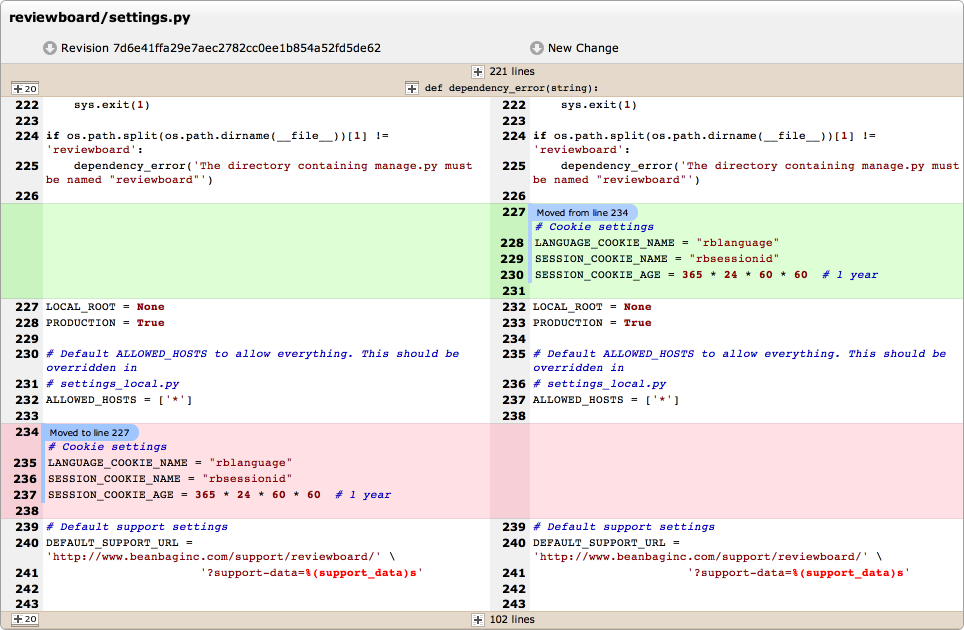

Indentation Change Indicators
-----------------------------

Historically, Review Board would show lines that differed only in their
indentation as being equal. This is nice in most cases, but can hide important
information, especially in languages like Python where the indentation is
crucial to the meaning of the code.

Review Board will now show indentation changes with small indicators at the
beginning of the line. Dedents will be shown on the left-hand side of the diff,
and indents will be shown on the right.

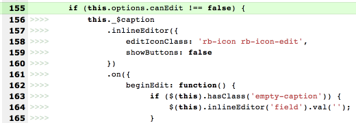

Highlighted Changes in Replaced Lines
-------------------------------------

Edits which change only one or two characters in a long line can be difficult
to read, so when the original and new lines are very similar, Review Board will
highlight which characters changed. This is shown with a slightly darker yellow
background.

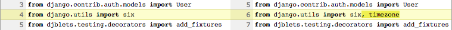

Seeing More of a File
=====================

Expanding Lines of Context
--------------------------

The diff viewer shows a few unchanged lines around any modified lines in a
file, helping you to see some context to the changes, but sometimes that's not
enough. Instead of opening the original file in an editor or a browser to see
more, you can expand the number of lines of context with a simple click.

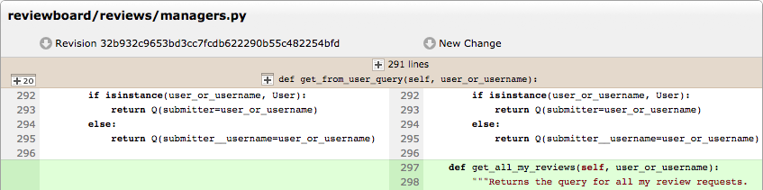

These headers appear above any group of modified lines, and at the bottom of
the diff viewer (if not otherwise showing the last lines in the file).

Clicking |expand-20-lines-icon| above the line numbers on the left will expand
20 lines at a time.

Clicking |expand-all-lines-icon| at the top of the header will expand all the
lines hidden by that header.

Clicking |expand-header-icon| beside the function or class shown will expand
all the lines up to the line shown beside the icon.

Expanded context can be re-collapsed by clicking the floating collapse icon
shown.

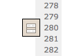

.. _diffviewer-deleted-files:

Viewing Deleted File Content
----------------------------

.. versionadded:: 3.0

By default, the diff viewer doesn't show the content of any files deleted in a
diff, as this code often doesn't need to be reviewed. Instead, you'll see a
simple message stating that the file was deleted.

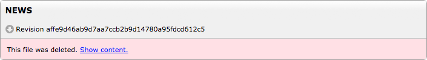

For those times that you *do* need to see more, you can click :guilabel:`Show
content` to load in the content of the deleted file.

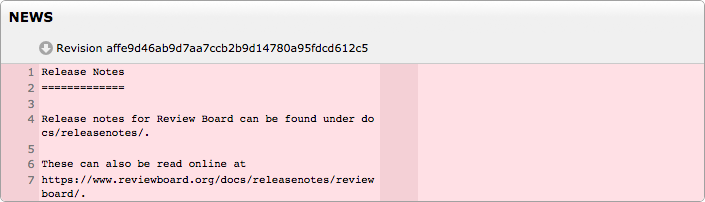

Deleted files can be commented on and will appear in reviews. It's important
to note though that deleted files that contain comments are not automatically
expanded in the diff viewer.

Downloading File Content
------------------------

The entirety of the file on either side of the diff can be downloaded by
clicking the |download-icon| icon beside the revision in the diff header. This
can be useful if you just want to pull down the entire file and view it in
your editor.

Working with Comments
=====================

The diff viewer supports leaving comments that pertain to lines of code. Each
comment can span multiple lines, providing a lot of flexibility in what the
author of a comment may want to show. Commented lines are shown in the review
along with the comment text.

Lines of code that have been commented on are indicated by a bar floating to
the left of the line numbers. Commented lines that are part of published
reviews are shown with a blue bar, while lines that are part of your draft
review are shown with a green bar.

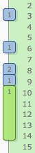

Comments support rich text using :ref:`Markdown <using-markdown>` and provide
:ref:`issue tracking <issue-tracking>` capabilities.

Commenting on Lines
-------------------

Creating a comment is easy. To comment on a single line, simply click the line
number. A comment dialog will appear giving you a text entry for writing your
comment. When you're done, you can click :guilabel:`Save` to save the comment.

To leave a comment across multiple lines, click-and-drag down multiple line
numbers. Each will highlight and be made a part of your comment.

.. image:: comment-box.png

After saving a comment, you can re-edit it by clicking the green comment bar,
or by editing it in the :ref:`review dialog <review-dialog>`.

Reading Published Comments
--------------------------

While reviewing code, you may have something to say about a line of code, but
want to check first that someone else hasn't already said it. Before leaving a
comment, check if there's a blue comment bar alongside the code. If there is,
you can mouse over and read snippets of the discussion in a tooltip, or click
the bar to read more.

Clicking the bar will display the comment dialog with a side pane showing any
other comments for that line, along with links for viewing or replying to the
full comment on the review request page.

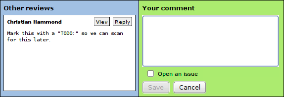

If you have something new to say as part of your own review, you can write a
new comment in the comment dialog.

.. note:: It's important to note that this is **not** the place to reply to
          those comments. When you add a comment from the diff viewer, it's
          creating a new top-level review (akin to a new thread). If you want
          to reply to existing comments, you can do so from the
          :ref:`Reviews <review-replying>` page. The :guilabel:`Reply` link
          here is a shortcut to jump directly to the relevant comment on the
          Reviews page.

          The view here is meant to be used only as a reference to see if
          other people have already said what you plan to say.

.. _diffviewer-filter-files:

Filtering the File List
=======================

.. versionadded:: 3.0.4

The diff viewer defaults to showing all the files modified in a diff, which is
typically fine for most reviewers. However, you can limit the files shown
through a special ``?filenames=`` argument in the URL. This takes a
comma-separated list of filenames or :ref:`patterns
<diffviewer-filename-patterns>` that specify what you want to see. For
example::

    https://reviews.example.com/r/123/diff/1/?filenames=*.txt,src/*

This is considered an advanced feature targetting extension authors and those
comfortable modifying and sharing URLs. There's no UI today to enable the
filtering within the diff viewer.

.. _diffviewer-filename-patterns:

Filename Patterns
-----------------

Filename filtering allows for specifying patterns that match files and paths
in the diff. This works like Unix shell-style wildcards.

The following patterns can be included:

=========== ============================================================
Pattern     Description
=========== ============================================================
``*``       Matches any number of characters
``?``       Matches a single character
``[abc]``   Matches one of any of the characters in-between the brackets
``[!abc]``  Matches one of any character not in-between the brackets
=========== ============================================================

If you need to match an actual ``?`` or ``*``, list it like ``[?]`` or
``[*]``.

Patterns are case-insensitive, so a pattern for ``*.txt`` will match ` file
named ``README.TXT``.

Here's a few examples for constructing patterns:

* ``*.txt`` -- Matches any files with a ``.txt`` extension in any path
* ``src/*`` -- Matches anything inside the ``src/`` directory, including within
  subdirectories
* ``*/README`` -- Matches a ``README`` file in any subdirectory in the tree
