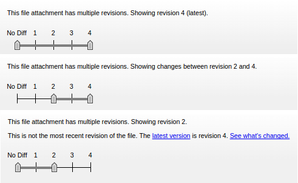
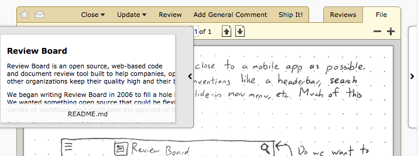

.. _reviewing-file-attachments:

==========================
Reviewing File Attachments
==========================

File attachments can be reviewed using Review Board. Some file types, such as
images, have special interfaces for doing reviews. For image files, see
:ref:`Reviewing Images <reviewing-images>`. For Markdown files, see
:ref:`Reviewing Markdown Files <reviewing-markdown>`. For other text files, see
:ref:`Reviewing Text Files <reviewing-text-files>`.

For other files, reviewers can download the files, and add comments to the
attachment as a whole.

.. image:: ../review-requests/file-attachments.png

The file attachment box provides a :guilabel:`Add Comment` button. Clicking
this button pops up a comment dialog that works exactly like the dialog you
get when :doc:`reviewing diffs <reviewing-diffs>`.

.. image:: comment-box.png
   :alt: A screenshot of the Comment Dialog, showing an example comment being
         typed that includes Markdown formatting and a JavaScript code sample
         being recommended. There are two checked checkboxes: "Open an Issue"
         and "Enable Markdown". There's one unchecked checkbox: "Require
         Verification".
   :width: 454
   :height: 354
   :sources: 2x comment-box@2x.png

Comments support rich text using the :term:`Markdown` language. See
:ref:`using-markdown` for more information.

The file attachment comment dialog supports issue tracking. See the section on
:ref:`issue-tracking` for more information.

As of Review Board 1.6.0, there's no visual indication of an existing comment
on the file attachment. However, you can see your comment and edit it by
clicking :guilabel:`Add Comment` again.

Viewing Other File Revisions
----------------------------

.. versionadded:: 2.5

Every public revision of a file attachment is available for review. The file
attachment revision selector allows you to look at previous versions of the
change. To browse old revisions, set the handle on the left to
:guilabel:`No Diff` and the handle on the right to the revision you want to
look at.

         drag for selecting a file revision range for viewing. The text at
         the top says: "This file attachment has multiple revisions. Showing
         revision 2. This is not the most recent revision of the file. The
         latest revision is revision 4." beside a "What's Changed" link.
   :width: 564
   :height: 109
   :sources: 2x file-revision-selector@2x.png

The file attachment viewer also allows you to do comparisons between diff
revisions (called :term:`interdiffs`). In other words, it lets you see what
changes the developer has made since the previous version of the file you
looked at.

To view an interdiff between two file attachment revisions, set the two
handles to the revisions you want to compare.

The behaviour of the file attachment revision selector is the same as the diff
revision selector. See :ref:`reviewing-diffs` for more information.

.. _switching-file-attachments:

Switching File Attachments
--------------------------

.. versionadded:: 3.0

When viewing a file attachment on a review request with multiple attachments,
you can quickly jump to the previous or next attachment using the navigation
buttons on the sides of the page. Moving the mouse over one of these buttons
will slide out a thumbnail giving you a preview of what you'll see when
clicking the button.

