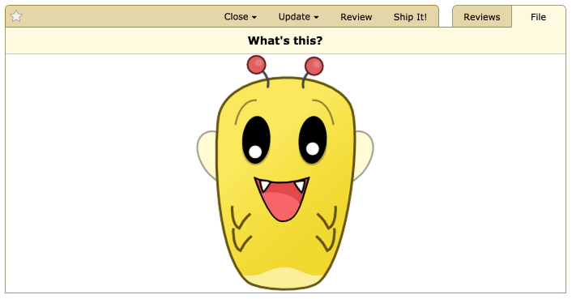

.. _reviewing-images:

================
Reviewing Images
================

Overview
========

Much like diffs, portions of images can be reviewed. This is useful
when presenting screenshots of a new dialog, for example, where the design
and layout of the dialog is as important as the code constructing it.

To begin reviewing an image file, just click the thumbnail for the file
attachment on the review request page.

Commenting on Regions
=====================

To place a new comment on part of the image, simply click and drag to select the
desired area. This will pop open a new comment dialog, just like in the diff
viewer.

.. image:: comment-box.png

Comments support rich text using the :term:`Markdown` language. See
:ref:`using-markdown` for more information.

The file attachment comment dialog supports issue tracking. See the section on
:ref:`issue-tracking` for more information.

Once you're done writing your comment in the text area, click :guilabel:`Save`
to save the comment.

A rectangle with a green number box will appear in the region you selected to
indicate that you have a comment in that area. Click the box to pop open the
comment box for your existing comment again.

Reading Existing Comments
=========================

When your mouse cursor is over the image, regions representing other comments
may appear with blue number boxes in the corner. Each of these is a comment
someone has made on another review.

If you move the mouse cursor over the region, a tooltip will appear showing a
summary of the comments made.

If you click on the region, the comment dialog will appear, along with a blue
side panel on the left showing those existing comments. You can still write new
comments in the green area of the comment box.

.. note:: It's important to note that this is **not** the place to reply to
          those comments. When you add a comment from the diff viewer, it's
          creating a new top-level review (akin to a new thread). If you want
          to reply to existing comments, you can do so from the
          :ref:`Reviews <review-replying>` page. The :guilabel:`Reply` link
          here is a shortcut to jump directly to the relevant comment on the
          Reviews page.

          The view here is meant to be used only as a reference to see if
          other people have already said what you plan to say.

Viewing Other Image Revisions
=============================

.. versionadded:: 2.5

As explained in :ref:`reviewing-file-attachments`, you can view and compare
revisions of an image file attachment. When viewing :term:`interdiffs`,
Review Board has several different methods of diffing images. The options to
select an image diffing method appear when you view an interdiff of two image
revisions.

Two-Up
------

Two-up diffing simply places the two revisions of the image beside each other.

Difference
----------

Difference diffing displays a new image where each pixel color is the RGB
(Revision X - Revision Y) difference of the two image revisions.

Split
-----

Split differing provides a horizontal slider to 'wipe' a vertical divider left
to right from one image revision to another. The first revision will be on the
right of the slider line, and the second revision will be on the left.

Onion Skin
----------

Onion Skinning uses a horizontal slider to 'fade' from one revision image to
another. When the slider is at the half way point, you will see a both
image revisions semi-transparently overlaid on top of each other. Moving in
a given direction will fade one image in and the other out.

.. _reviewing-images-zoom:

Zooming In and Out
==================

.. versionadded:: 3.0

For images that are too large or too small to display comfortably, you can
zoom in or out using the zoom menu to the top-right of the image's display
area. This offers 33%, 50%, 100%, and 200% zoom levels.

When viewing an image file that contains a ``@2x`` identifier in the filename
(common for high-DPI images for first-generation "Retina" displays), a 50%
zoom level will be chosen. Similarly, files with a ``@3x`` in the filename
will use a 33% zoom level.

If the image is too large to fit when viewing the page (even factoring in the
default zoom level for high-DPI images), a zoom level that best fits the image
on the page will be chosen automatically.
