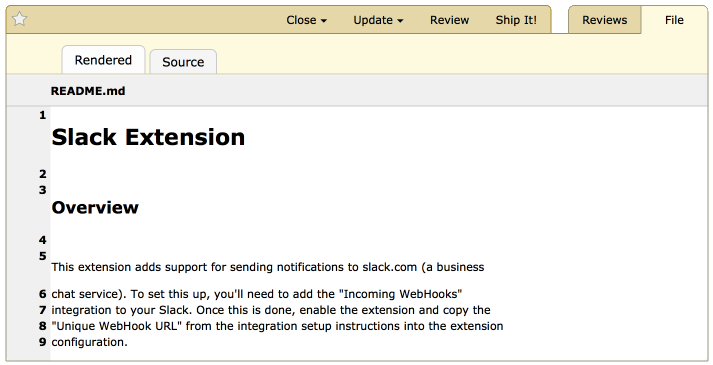

.. _reviewing-markdown:

========================
Reviewing Markdown Files
========================

Overview
========

When writing documentation using the :term:`Markdown` format, we often care
much less about the source file than the resulting rich text document.
Attaching a Markdown file (.md) to a review request will enable a special
review UI that will render the document.

To begin reviewing a Markdown file, click the thumbnail or the "Review" link
for the file attachment on the review request page.

The Markdown Review interface presents two tabs: :guilabel:`Rendered` and
:guilabel:`Source`. These let you switch between the rendered HTML and the
plain-text source, respectively. Comments can be added in either view.

Commenting on Blocks
====================

As you hover your mouse over parts of the document, top-level blocks will be
highlighted with a grey background. Clicking will pop open a new comment
dialog, just like in the diff viewer.

.. image:: comment-box.png

Comments support rich text using the :term:`Markdown` language. See
:ref:`using-markdown` for more information.

The file attachment comment dialog supports issue tracking. See the section on
:ref:`issue-tracking` for more information.

Once you're done writing your comment in the text area, click :guilabel:`Save`
to save the comment.

After saving a comment, a green comment flag will appear next to the block you
selected, indicating that you have an unpublished comment. If you want to edit
your comment, click the block or comment flag to pop open the comment box
again.

Reading Existing Comments
=========================

The Markdown review UI will show blue comment flags along the left-hand side of
the document. The number inside the comment flag indicates how many comments
were made on that block.

If you move the mouse cursor over the comment flag, a tooltip will appear
showing a summary of the comments made.

If you click on the block or the comment flag, the comment dialog will appear,
along with a blue side panel on the left showing those existing comments. You
can still write new comments in the green area of the comment box.

.. note:: It's important to note that this is **not** the place to reply to
          those comments. When you add a comment from the diff viewer, it's
          creating a new top-level review (akin to a new thread). If you want
          to reply to existing comments, you can do so from the
          :ref:`Reviews <review-replying>` page. The :guilabel:`Reply` link
          here is a shortcut to jump directly to the relevant comment on the
          Reviews page.

          The view here is meant to be used only as a reference to see if
          other people have already said what you plan to say.

Viewing Other Markdown Revisions
================================

.. versionadded:: 2.5

As explained in :ref:`reviewing-file-attachments`, you can view and compare
revisions of a markdown file attachment. When viewing :term:`interdiffs`,
Review Board will display the two file revisions side by side. Changing from
:guilabel:`Rendered` and :guilabel:`Source` will change both revisions at the
same time.
