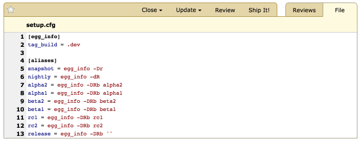

.. _reviewing-text-files:

====================
Reviewing Text Files
====================

Overview
========

Much like diffs, text files can be reviewed. This is useful for reviewing
out-of-band files such as documentation or notes, and can also be used to
review full source files (as opposed to changes to source files).

To begin reviewing a text file, just click the thumbnail for the file
attachment on the review request page.

Commenting on Lines
===================

To place a new comment, either click a line number, or click and drag over a
range of line numbers. This will pop open a new comment dialog, just like in
the diff viewer.

.. image:: comment-box.png

Comments support rich text using the :term:`Markdown` language. See
:ref:`using-markdown` for more information.

The file attachment comment dialog supports issue tracking. See the section on
:ref:`issue-tracking` for more information.

Once you're done writing your comment in the text area, click :guilabel:`Save`
to save the comment.

After saving a comment, a green comment flag will appear next to the first
line in your selection, indicating that you have an unpublished comment. Click
the line number or comment flag to pop open the comment box for your existing
comment again.

Reading Existing Comments
=========================

Any existing comments will show up as blue clickable comment flags along the
left-hand side of the text file. Each comment flag corresponds to a line
containing a comment.

If you move the mouse cursor over the comment flag, a tooltip will appear
showing a summary of the comments made.

If you click on the comment flag or line number, the comment dialog will
appear, along with a blue side panel on the left showing those existing
comments. You can still write new comments in the green area of the comment
box.

.. image:: full-comment-box.png

.. note:: It's important to note that this is **not** the place to reply to
          those comments. When you add a comment from the diff viewer, it's
          creating a new top-level review (akin to a new thread). If you want
          to reply to existing comments, you can do so from the
          :ref:`Reviews <review-replying>` page. The :guilabel:`Reply` link
          here is a shortcut to jump directly to the relevant comment on the
          Reviews page.

          The view here is meant to be used only as a reference to see if
          other people have already said what you plan to say.

Viewing Other Text Revisions
============================

.. versionadded:: 2.5

As explained in :ref:`reviewing-file-attachments`, you can view and compare
revisions of a text file attachment. When viewing :term:`interdiffs`, Review
Board will display the two file revisions side by side.
