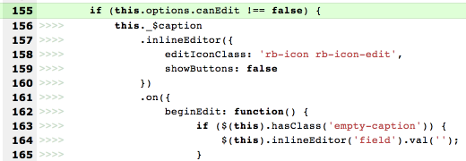
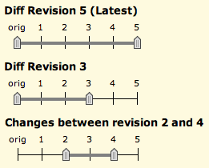
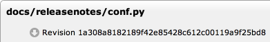
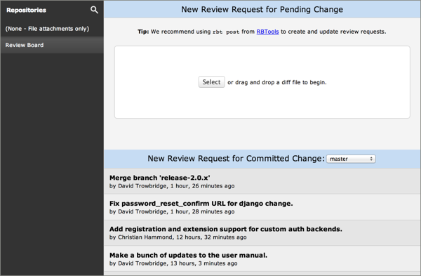
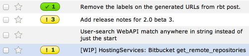
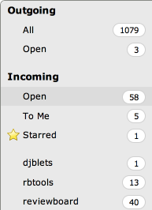
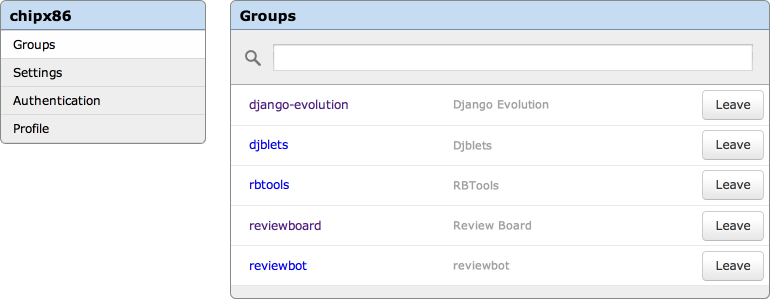

==============================
Review Board 2.0 Release Notes
==============================

**Release date:** May 19, 2014

This release contains all bug fixes and features found in Review Board version
:doc:`1.7.25 <1.7.25>`.

Security Improvements
=====================

* Added improved CSRF protection to all our forms.

A Note on ``ALLOWED_HOSTS``
---------------------------

As of Django 1.5.x, the ``ALLOWED_HOSTS`` setting is required. This setting is
used to work around a handful of host poisoning attacks.

By default, Review Board will set this to ``'*'``, which disables this security
check. We recommend setting this in your ``settings_local.py`` file (in your
site's conf directory). For more information, see `Django's ALLOWED_HOSTS
documentation
<https://docs.djangoproject.com/en/1.6/ref/settings/#std:setting-ALLOWED_HOSTS>`_.

Compatibility Changes
=====================

Server-Side and Deployment Changes
----------------------------------

* Django_ 1.6

  This is the first release to require Django 1.6. This release is not
  compatible with earlier versions of Django, or tested to be compatible with
  Django 1.7 or newer.

* Dropped Python 2.5 support.

  We no longer support Python 2.5 deployments. Python 2.6 or 2.7 is required
  both by Review Board 2.0 and Django 1.6.

  Theoretically this release is also compatible with Python 3.2+, but
  it has not been well tested, and many dependencies (such as SCM integrations)
  may not yet be available with Python 3.x.

* Haystack_ based full-text search.

  The old and often broken PyLucene search backend has been removed. It's been
  replaced with a new search using Haystack_ and Whoosh_. These are pure-Python
  and should make search much easier to set up.

  Note that an existing PyLucene install will no longer be used. The new search
  should work automatically, though, after doing a full re-index.

  Patch by Edward Lee.

* Added support for Pillow_.

  Pillow is a replacement for PIL. It's better maintained and easier to
  install. While not yet required, we recommend upgrading to it sooner
  rather than later. We may require it in a future release.

  You will need to uninstall PIL in order to install Pillow. See the
  `Pillow documentation`_ for more information.

* Subvertpy_ is now supported as an alternative to PySVN. This can often be
  easier to install than PySVN. We welcome any feedback and bug reports,
  as this is quite new.

  Patch by Mark Lee.

.. _Django: https://www.djangoproject.com/
.. _Haystack: http://haystacksearch.org/
.. _Whoosh: https://bitbucket.org/mchaput/whoosh/wiki/Home
.. _Pillow: http://pillow.readthedocs.org/en/latest/
.. _Pillow documentation: http://pillow.readthedocs.org/en/latest/
.. _Subvertpy: http://www.samba.org/~jelmer/subvertpy/

New User Features
=================

Diff Viewer
-----------

Indentation Markers in Diffs
~~~~~~~~~~~~~~~~~~~~~~~~~~~~

In order to simplify reviews, the diff viewer has traditionally treated
lines with only indentation changes as being equal. This was often helpful,
but it meant that it wasn't always obvious that a line's indentation had
changed.

The diff viewer now shows indentation changes, and differentiates between
spaces and tabs. The lines are still shown as equals, to keep the diffs
clean, but it's now easy to tell at a glance what indentation changes
were made to a file.

This is especially important for languages that use whitespace for blocks,
such as Python.

New File Index
~~~~~~~~~~~~~~

The index of files at the top of the diff viewer has been rebuilt from the
ground up. In addition to just giving a list of filenames and links to the
changed chunks, the new index shows:

* A graph on the left which shows the ratio of added/changed/deleted lines. The
  thickness of this graph indicates what percentage of the file has been
  altered.
* Whether files have been renamed, and the old filename if so.
* Indications for deleted or binary files.
* A list of clickable chunk dots, color-coded to represent add/change/delete.

.. image:: _static/images/2.0/2.0-diff-file-index.png

New Diff Revision Selector
~~~~~~~~~~~~~~~~~~~~~~~~~~

The interface for choosing which diff revision or set of interdiff revisions to
view has changed. The new design is more compact, and is much easier to
understand. The new revision selector allows viewing both individual revisions
(by selecting :guilabel:`orig` and the desired revision), and viewing
interdiffs (by selecting the two revisions to compare).

Reload-Free Navigation
~~~~~~~~~~~~~~~~~~~~~~

As part of the new revision selector, switching between diff revisions,
interdiffs, and across pages of a large diff will occur without reloading the
entire page.

Visual Design Refresh
~~~~~~~~~~~~~~~~~~~~~

We've refreshed the visual design of the diff viewer, tweaking many of the
colors to dramatically improve readability. In addition, several small bugs
with alignment and spacing of various pieces of the diff view have been fixed
across all major browsers.

Interdiff Improvements
~~~~~~~~~~~~~~~~~~~~~~

Interdiffs could become a mess after syncing a development tree and posting a
new diff. They would show changes from the sync that were unrelated to the
posted change.

The diff viewer will now do its best to filter out any changes that weren't
part of the uploaded diff files.

:bug:`311`

Moved-Lines Detection Improvements
~~~~~~~~~~~~~~~~~~~~~~~~~~~~~~~~~~

The algorithm for detecting moved lines within a diff file has been
dramatically improved. The new algorithm has several improvements:

* Blank lines are now included in the moved blocks, instead of treated as two
  separate moves.

* Adjacent but different move regions didn't work properly, showing only the
  first moved region (unless there was at least one line in between them). Now
  any regions anywhere work, in any order.

* Only insert/delete lines were considered for moves, which was a problem when
  moving some functions that resulted in replace lines (such as when one
  function was replaced by another). Now replace lines are factored in.

The flag indicating a moved block has also been redesigned to be cleaner and
easier to read. Instead of flagging each and every line, only the first line is
flagged, with a "flagpole" across the rest of the block.

Improved Rendering for New Files
~~~~~~~~~~~~~~~~~~~~~~~~~~~~~~~~

Newly-added files would show empty line number and code columns for the
left-hand side of the diff (where the original version of the file would
normally go). These have been removed, and new files now take up the entire
width of the box.

Easy File Downloads
~~~~~~~~~~~~~~~~~~~

Files shown in the diff viewer can now be downloaded in their raw, original
form. A download icon is shown alongside the revision of each file. This makes
it easy to fetch either the original or modified version of any file up for
review.

:bug:`1434`

Other Diff Viewer Features
~~~~~~~~~~~~~~~~~~~~~~~~~~

* Added a keyboard shortcut (:kbd:`r`/:kbd:`R`) to comment on the selected
  chunk in the diff viewer. (:bug:`44`)

  Patch by Edwin Zhang.

"New Review Request" UI
-----------------------

The "New Review Request" page has been completely re-done, with many new
features and capabilities.

Post-Commit Review Requests
~~~~~~~~~~~~~~~~~~~~~~~~~~~

One of the most requested features over the past few years has been the ability
to create review requests for committed changes from the web UI. Until now,
doing this has required using RBTools from the command-line.

For repositories which support it, the "New Review Request" page now has a list
of the committed changes, ordered from newest to oldest. This can be browsed by
branch. Clicking on a commit will download the diff and change description from
the repository and create a new review request.

This is currently implemented for GitHub and Subversion repositories. Support
for other services and repository types will be coming in future releases.

:bug:`100`

Simplified Pre-Commit Workflow
~~~~~~~~~~~~~~~~~~~~~~~~~~~~~~

The workflow for creating new pre-commit review requests through the web UI has
also been reworked and simplified. This will now guide users through the
process, asking for additional input only when necessary. In most cases, the
workflow is now as simple as dragging a diff file onto the page.

Repository Quick Search
~~~~~~~~~~~~~~~~~~~~~~~

The old repository selector (a drop-down box) has been replaced with a
sidebar which provides the capability to search for repository names. Simply
click the magnifying glass and then type in the box that appears. The list of
repositories will be filtered in real time as you type.

Better Validation and Errors
~~~~~~~~~~~~~~~~~~~~~~~~~~~~

When uploading diffs through the web UI, more checking is done to ensure
correctness before creating the review request. In particular, a common error
case with Git repositories and diffs with abbreviated indexes will now produce
a useful error message during review request creation instead of failing at the
diff display stage.

Review Requests
---------------

Visual Design Refresh
~~~~~~~~~~~~~~~~~~~~~

* The layout of the information for review requests has been redesigned. There
  are now two columns. The summary, description, and testing fields are on the
  left, and all the other information is on the right.

  This simplifies the view, shows more of the important information at a
  glance, fixes up some confusing nesting issues, and will allow extensions to
  add new fields.

* File attachment thumbnails no longer appear scattered. They have a consistent
  look and size. Long filenames and captions are ellipsized, and the delete and
  pencil icons are now in consistent places.

  The thumbnails now do a nicer job rendering the contents. Text files in
  particular now have a better preview. The text contents are
  syntax-highlighted in the thumbnail.

Markdown for Text Fields
~~~~~~~~~~~~~~~~~~~~~~~~

Many of the multi-line text fields in Review Board (review request description
and testing done, comments, replies, and close description) now support using
Markdown_. This allows you to add some structure and rich formatting to your
comments. The basic Markdown syntax is available, as well as a few extensions
such as GitHub's "fenced code blocks" and tables.

Most notably, it's now possible to embed syntax-highlighted code samples or
images into your comments. See the user manual for more information on how to
use Markdown.

See :ref:`rb2.0:using-markdown` for a primer on the supported syntax.

Based on work by Greg Wang. (:bug:`2093`, :bug:`2098`)

.. _Markdown: http://daringfireball.net/projects/markdown/

Detailed Change Descriptions
~~~~~~~~~~~~~~~~~~~~~~~~~~~~

The "review request changed" boxes provided only basic information on
what changed when publishing a draft of a review request. It wasn't very
helpful when uploading new file attachments or when changing a long
description.

This has been fully rewritten to be much more useful:

* The :guilabel:`Description` and :guilabel:`Testing Done` changes are now
  shown as a diff, making it very easy to see what parts of the text has
  changed.

  Any Markdown formatting is also rendered in the diff view.

  (:bug:`2045`)

  .. image:: _static/images/2.0/2.0-changedescs-diffed-text.png

* Added or removed file attachments are shown with their thumbnails.

  The thumbnails in the change description box include a :guilabel:`Review` or
  :guilabel:`New Comment` link, to allow jumping directly to the review UI
  without needing to find the matching thumbnail at the top of the page.

  This also helps when you want to see older file attachments that have since
  been removed.

  .. image:: _static/images/2.0/2.0-changedescs-attachments.png

* More information is shown about the contents of new diffs.

  The total number of added or removed lines are shown alongside the diff
  revision, making it easy to see just how big the change is.

  A file listing is also shown for the diff, along with the same icons now
  used in the diff viewer to show the complexity of the changes made to
  the files.

  .. image:: _static/images/2.0/2.0-changedescs-diffs.png

* The other fields, like :guilabel:`Branch` and :guilabel:`Depends On`, are
  shown in a way that makes it much easier to see what has changed.

  Some of the fields also show more information than they used to.
  :guilabel:`Depends On`, for example, now shows the summaries of the review
  requests.

Custom fields provided by extensions will benefit from these updates as well,
and can also take advantage of the new API to customize how the updates
are displayed.

Changing Issue Status
~~~~~~~~~~~~~~~~~~~~~

Issues can now be marked as fixed or dropped and reopened by the user who
created the comment, in addition to the owner of the review request.

Based on work by Niklas Hambuechen. (:bug:`2713`, :bug:`2888`)

Other Review Request Features
~~~~~~~~~~~~~~~~~~~~~~~~~~~~~

* Expand collapsed reviews when jumping to issues from the summary table.

  When clicking on issues in the issue table, if the containing review was
  collapsed, it will now be opened before jumping to it.

  Patches by Hiroki Gohara and Yazan Medanat. (:bug:`3770`)

* Added "Last Diff" timestamp to review requests.

  This change adds an additional timestamp to the top of the review request
  to show the timestamp of the most recent diff update.

  Patch by Vlad Safronov.

* The :guilabel:`Depends On` field now shows a strikethrough for
  dependencies that have been closed. (:bug:`3200`)

  Patch by Olessia Karpova.

* Interdiff link on the draft banner. (:bug:`3189`)

  When uploading a new diff to an existing review request, the draft banner
  will now show a :guilabel:`Show changes` link that will take you to an interdiff
  between the last published diff and the newly uploaded diff.

  Patch by Tomi Äijö.

Dashboard
---------

Bulk Close for Review Requests
~~~~~~~~~~~~~~~~~~~~~~~~~~~~~~

There's a new column available in the dashboard that provides a checkbox for
selecting rows of review requests. This allows for selecting one or more
review requests and closing them, right from the dashboard.

This is particularly useful for administrators, or users with close
privileges, to clean up review requests left open by other users.

You can find the new column by clicking the pencil icon on the upper-right of
the dashboard.

:bug:`579`

Better Issue and Ship-It Tracking
~~~~~~~~~~~~~~~~~~~~~~~~~~~~~~~~~

If there are any open issues remaining on a review request, they will be
shown in place of the Ship It count in the dashboard. Any Ship Its issued on
the review request will remain hidden until all issues are resolved.

This makes it easier to see what work still remains at a glance, and to give a
better idea if a Ship It really means Ship It.

Improved Dashboard Sidebar
~~~~~~~~~~~~~~~~~~~~~~~~~~

The dashboard sidebar is now better organized, neatly categorizing items under
:guilabel:`Incoming` and :guilabel:`Outgoing` sections. There's no longer a
bunch of bold items that double as links and sections.

The current dashboard view is also highlighted, making it easier to see what
you're looking at.

Other Dashboard Features
~~~~~~~~~~~~~~~~~~~~~~~~

* There's a better set of default dashboard columns for new users. These are,
  in order:

  * Select Rows
  * New Updates
  * Ship It!
  * My Comments
  * Summary
  * Submitter
  * Last Updated (Relative)

  Existing users won't see their columns change. If they want to use the new
  columns, they can click the pencil on the top-right of the dashboard and
  customize their columns.

* Added a :guilabel:`Diff Size` column to the dashboard, which shows the number
  of inserted and deleted lines in the uploaded patch. (:bug:`48`)

* Submitted review requests are now included in the :guilabel:`Starred Reviews`
  page of the Dashboard.

  Previously, any review requests that a user had starred would be removed from
  this page as soon as the request was closed. Submitted and discarded review
  requests are now included in this page along with open ones.

  Patch by Mary Elaine Malit. (:bug:`1075`)

* Discarded review requests are now shown in the All Review Requests page.
  (:bug:`576`)

* The dashboard frame now takes up the full page size, instead of fitting
  the content and possibly scrolling parts off the page.

Review UIs
----------

Generic Text Review
~~~~~~~~~~~~~~~~~~~

Text files attached to review requests can now be reviewed just like a diff.
Their contents will be syntax-highlighted when possible, allowing for
easier review of standalone snippets of code, SQL data dumps, XML files, or
anything else.

Comments can be made on single lines, or they can span multiple lines. Any
commented lines will appear along with the comment in the review.

:bug:`1702`

Markdown Review UI
~~~~~~~~~~~~~~~~~~

Markdown files uploaded as file attachments can now be reviewed in detail.
The uploaded file will display both the source text and the rendered HTML.
Comments can be added to either the source or rendered result, and the
corresponding lines will appear in the review.

Based on work by Aamir Mansoor.

Visual Design Refresh
~~~~~~~~~~~~~~~~~~~~~

Review UIs now look a lot cleaner and more compact. In previous releases, a
mostly empty review request box would appear above the review UI, taking up
valuable space. This has been removed, providing more focus on the text,
image, or `PDF <http://www.reviewboard.org/powerpack/>`_ being reviewed.

Reviews
-------

Better Issue and Ship-It Tracking
~~~~~~~~~~~~~~~~~~~~~~~~~~~~~~~~~

Similar to the changes to the "Ship it!" column in the dashboard, improvements
were also made for reviews. Now, if a reviewer marks Ship It and opens issues,
the "Ship It!" will be replaced by "Fix it, then Ship it!" until all the issues
are closed. Once the last issue is closed, it will update to "Ship It!"

Thumbnails in the Review Dialog
~~~~~~~~~~~~~~~~~~~~~~~~~~~~~~~

File attachment comment thumbnails (like image excerpts) are now shown in the
"Edit Review" dialog.

When opening the Review dialog (either through the top-level :guilabel:`Review`
action or the :guilabel:`Edit Review` button on the banner), any comments on
file attachments will show the comment thumbnail along with the comment text
(for example, the selected region of an image). This more closely mirrors what
the review will look like once published.

New "My Account" page
---------------------

The My Account page has been completely rewritten. The original was from the
very first few months of Review Board, and was long overdue due for a
replacement.

The new page makes it easy to search for groups and join them and to manage
your settings and your profile.

Extensions can add new sections to the My Account page, or add to existing
sections, in order to provide user customization of an extension.

Other User Features
-------------------

.. _2.0-approval:

* Review request "approval" state.

  Review Board tries hard not to dictate workflows for developers and
  companies, but to instead provide a solid platform for existing workflows.
  Many companies or individual teams have their own policies for when a review
  request is approved.

  We're now providing a way through the API and extensions to determine if a
  review request is approved. Approval logic can be provided by an extension,
  and then used in repository hooks or other scripts.

  By default, the logic marks a review request as approved if it has at least
  one Ship It!, and no open issues. This can be augmented or completely
  replaced.

  The Review Board web UI does not indicate approval or enforce any actions
  based on approval, so by default, nothing really changes. This is more for
  those companies that are adding their own deeper integration or policy
  enforcement.

  For more information on this, see the approval entries in the WebAPI and
  Extensions section of this document.

* High-DPI display support for icons, graphs, and thumbnails.

  Continuing our work on supporting high-DPI ("retina") screens such as phones,
  tablets, and some newer laptops, we've added high-resolution artwork for all
  the icons throughout the UI. In addition, the graphs in the admin site and
  thumbnails for uploaded image attachments will be shown in high resolution if
  appropriate.

* Visual design refresh of the login and registration pages.

  The user login and registration pages were looking pretty outdated. The
  redesign makes them much prettier, and extensible!

  We'll be announcing some new extensions in the future that take advantage of
  the redesign to allow for logging in with services like GitHub and Google.

* Public local sites can now be accessed by anonymous users.

* Improved the look of generated e-mails.

New Administration Features
===========================

Security Checklist
------------------

There's a new Security Checklist page under :guilabel:`System Information` on
the side of the administration UI. This will run through a series of tests and
see if there are any immediate problems you need to solve to tighten security
on your Review Board installation.

Over time, we'll add more checks to this. For now, it tests for your
``ALLOWED_HOSTS`` setting and for security problems with file attachments.

Patch by Allisa Schmidt.

New Manage Extensions Page
--------------------------

The Manage Extensions page has been rewritten with the following features:

* Provides visual hints for enabled, disabled, and broken extensions.

* Extensions can be dynamically enabled or disabled without reloading the
  page.

* A new :guilabel:`Scan for new extensions` button updates the list of known
  extensions.

* When an extension fails to load, the error and traceback are shown with
  the extension, to help with debugging.

``condensediffs`` Management Command
------------------------------------

A new management command has been introduced to squash duplicate diff data in
the database. This can often result in a 50% or greater reduction in the size
of the diff tables.

To run the command, type::

    $ rb-site manage /path/to/site condensediffs

This may take some time, but you can continue to use Review Board while this
is working. A maintenance window is not required. It may, however, slow down
access to the database while working.

Better Feedback on Admin Changes
--------------------------------

When saving or otherwise modifying a database entry, or performing some
other action in the administration UI, you will now see a message confirming
what you did.

Note that the first time you view the administration UI, you may see many
messages from previous actions prior to the upgrade. This will only happen
once, and can be ignored.

New LDAP Configuration UI
-------------------------

The LDAP configuration page was very confusing, using some unusual terms and
presenting things in strange orders. This has been rewritten to prevent many of
the issues that users encountered.

Patch by Stephen Gallagher.

:bug:`3004`

Admin Widget Reordering
-----------------------

The widgets in the administration dashboard can now be reordered through
drag-and-drop. This allows admins to choose which widgets they want to see
near the top of the page, and which they want to keep further down.

This is the first step toward customization of the administration UI. In
future releases, administrators will be able to add or remove widgets, and
extensions will be able to provide new widgets.

Patch by Stephanie Su.

Option to Disable Gravatars
---------------------------

The Gravatars shown in the top header bar, user infobox, and user page's
sidebar can now be disabled through a :guilabel:`Use Gravatar images` setting
in the General Settings page.

This is useful for environments that are locked down and don't allow access to
the Internet.

:bug:`3030`

Management Commands for Extensions
----------------------------------

Three new :command:`rb-site manage` commands have been added to manage the
list of enabled extensions: ``list-extensions``, ``enable-extension``, and
``disable-extension``.

``list-extensions`` will list all the extensions that Review Board currently
knows about, as well as their enabled states.

``enable-extension`` and ``disable-extension`` take an extension ID and can
enable or disable the given extension, which is helpful when an extension has
broken the installation.

Experimental Web Hooks
----------------------

We are testing new post-receive webhooks for Beanstalk_, BitBucket_, GitHub_,
and `Google Code`_, which we'll expand upon in upcoming releases.

This webhook can be used to close review requests referenced in pushed
commits. To use this, you'll need to add a webhook to your repository
at your hosting provider and provide a URL.

This URL is in the form of
:samp:`http://<server>/repos/<repo_id>/<service>/hooks/close-submitted/`,
where ``repo_id`` is the numeric ID of your repository (available in the
administration UI), and ``service`` is the ID of the hosting service
(``beanstalk``, ``bitbucket``, ``github``, or ``googlecode``).

(If you're using GitHub, make sure you choose to send a JSON payload.)

Note that this requires your server be reachable over the Internet by the
hosting provider's servers.

The hook will then look for all commits with a matching Commit ID field, as
well as commit messages that contain::

    Reviewed at http://<server>/r/<id>/

or::

    Review request #<id>

If found, the review request will be closed with a reference to the committed
revisions and branches.

For now, this feature is considered experimental, and is not referenced in the
documentation. Future versions will introduce hooks for additional services,
and improve the setup process.

Patches by Anselina Chia and Bhushan Ramnani.

.. _Beanstalk: http://beanstalkapp.com/
.. _BitBucket: https://bitbucket.org/
.. _GitHub: https://github.com/
.. _`Google Code`: https://code.google.com/

Other Administration Features
-----------------------------

* Added an option for choosing whether to set the
  ``Auto-Submitted: auto-generated`` e-mail header. (:bug:`2646`)

  Some mailing lists filter out e-mails that contain the
  ``Auto-Submitted: auto-generated`` header. This new setting allows the
  header to be disabled. By default, the header is included for e-mails.

  Patch by Anselina Chia.

* Review groups now allow setting multiple mailing lists, separated by
  commas. (:bug:`1661`)

* Simpler installs

  :command:`rb-site install` has a new stream-lined installation experience. It
  now asks fewer questions, focusing on handling common installations using
  Apache, mod_wsgi, and memcached. This reduces the number of questions you
  have to answer.

  Passing :option:`--advanced` will cause all original questions to be
  presented.

Web API Changes
===============

``visible`` Attribute For Repository Resources
----------------------------------------------

The :ref:`Repository resource <rb2.0:webapi2.0-repository-resource>` now
allows you to get and set the ``visible`` attribute on repositories, which
controls whether or not the repository is listed in the "New Review Request"
page.  Additionally, the :ref:`Repository List resource
<rb2.0:webapi2.0-repository-list-resource>` has a new parameter,
``show-invisible``, which can be set to ``1`` to get a list of all
repositories, including those which are not visible.

New ``Repository Branches`` and ``Repository Commits`` Resources
----------------------------------------------------------------

The :ref:`Repository Branches <rb2.0:webapi2.0-repository-branches-resource>`
and :ref:`Repository Commits <rb2.0:webapi2.0-repository-commits-resource>`
resources are special list resources that allow you to fetch a list of
branches or a commit log for supported repositories. These are used for the
post-commit review request UI.

Draft Diff Resources
--------------------

In order to make resources more consistent, diffs that are attached to a draft
now have a separate resource. This provides the same interface as the diff
resource, with the exception that there's always a maximum of a single diff
attached to a draft.

File Attachments For Diffs
--------------------------

As part of a continuing effort to support reviewing binary files as part of a
change, a new resource exists for associating file attachments with file diffs.

Diff Validation Resource
------------------------

A new resource has been added to verify diff files before creating review
requests. The new :ref:`Diff Validation resource
<rb2.0:webapi2.0-validate-diff-resource>` allows you to POST the same data
that you would to the :ref:`Review Request List resource
<rb2.0:webapi2.0-review-request-list-resource>`, but instead of creating a new
object, it will either return an OK or a detailed error message explaining
what is wrong with the posted diff.

Support for Markdown Fields
---------------------------

* Added support for forcing Markdown-capable text fields to show Markdown
  or plain text.

  Fields such as a review request's description or testing done may be
  in either Markdown or text format. Clients can now specify which they
  want to receive by passing ``?force-text-type=``. Valid arguments are
  ``markdown`` or ``plain``.

  When using ``markdown``, all Markdown-capable fields will be provided
  as valid Markdown, escaping the text if necessary.

  When using ``plain``, all Markdown-capable fields will be provided as
  plain text, unescaping if necessary. Any Markdown syntax (such as
  for links) will remain as-is.

* Added a ``text_type`` field for Markdown-capable resources.

  ``text_type`` shows the type of text used for all Markdown-capable
  fields in that resource. This will be either ``markdown`` or ``plain``.

  If using ``?force-text-type=``, this will reflect the type provided.

* Added a ``text.markdown`` capability.

  :ref:`rb2.0:webapi2.0-server-info-resource` now lists ``text.markdown: true``
  in the capabilities list, allowing clients to make smart decisions
  up-front about Markdown support.

.. _2.0-resource-extra-data:

Extra Data for Resources
------------------------

Added support for accessing and manipulating extra data for many resources.

Various resources now support attaching and accessing extra custom data
through the API. By setting ``extra_data.custom_key=custom_value`` in
a request, the caller can set a ``custom_key`` that can later be accessed
when retrieving the resource.

Extensions can also make use of this data.

The following resources support attaching extra data:

* :ref:`rb2.0:webapi2.0-diff-resource`
* :ref:`rb2.0:webapi2.0-review-diff-comment-resource`
* :ref:`rb2.0:webapi2.0-draft-file-diff-resource`
* :ref:`rb2.0:webapi2.0-review-file-attachment-comment-resource`
* :ref:`rb2.0:webapi2.0-review-group-resource`
* :ref:`rb2.0:webapi2.0-review-resource`
* :ref:`rb2.0:webapi2.0-review-reply-resource`
* :ref:`rb2.0:webapi2.0-review-reply-diff-comment-resource`
* :ref:`rb2.0:webapi2.0-review-reply-file-attachment-comment-resource`
* :ref:`rb2.0:webapi2.0-review-reply-screenshot-comment-resource`
* :ref:`rb2.0:webapi2.0-review-request-resource`
* :ref:`rb2.0:webapi2.0-review-request-draft-resource`
* :ref:`rb2.0:webapi2.0-review-screenshot-comment-resource`

Other Web API Changes
=====================

* Added an ``absolute_url`` field to various web API resources.

  This field contains an absolute URL to the user-facing page that the
  content represents.

  This is available for the various file attachment and screenshot resources,
  :ref:`rb2.0:webapi2.0-review-group-resource`, and
  :ref:`rb2.0:webapi2.0-review-request-resource`.

  Patch by Edward Lee.

* Added fields for indicating approval on a review request.

  :ref:`rb2.0:webapi2.0-review-request-resource` now has ``approved`` and
  ``approval_failure`` fields that indicate whether the review request has been
  approved and, if not, what the failure was, respectively.

  These can be used by scripts or repository hooks to, for example, display a
  list of changes that can be committed, or to prevent committing a change if
  it isn't approved.

  See the description on :ref:`approval <2.0-approval>` above for more
  information.

* Added fields for getting the issue counts and number of Ship Its on a
  review request.

  This provides ``issue_open_count``, ``issue_dropped_count``,
  ``issue_resolved_count``, and ``ship_it_count`` fields on
  :ref:`rb2.0:webapi2.0-review-request-resource`.

* Added querying for review requests based on issue counts and Ship Its.

  This supports a variety of new query arguments for finding review requests
  based on the number of open, dropped, or resolved issues. These are in
  the form of ``?issue-open-count=``, ``?issue-dropped-count=``,
  ``?issue-resolved-count=``, and ``?ship-it-count=``.

  It's also possible to query with ranges by appending ``-lt``, ``-lte``,
  ``-gt`` or ``-gte`` to the query parameter name.

  This only works for review requests that have otherwise been created or
  accessed since upgrading to this release, since the query counts are only
  generated on-demand.

* The root resource now provides the server information and capabilities.

  Clients can now check the :ref:`rb2.0:webapi2.0-root-resource` for this
  information, instead of having to access the
  :ref:`rb2.0:webapi2.0-server-info-resource`. Both resources provide the same
  data.

* Users can now add or remove themselves to or from review groups through the
  API.

  A user can POST or DELETE their own username to
  :ref:`rb2.0:webapi2.0-review-group-user-resource` in order to change their
  membership in the group. Previously, this ability was limited to
  administrators.

* :ref:`rb2.0:webapi2.0-file-diff-resource` now provides information on
  various stats for the diff, if the diff has been rendered at least once.
  These will appear in ``extra_data``.

  These include the raw insert/delete line counts from the patch file
  (``raw_insert_count``, ``raw_delete_count``), the processed
  insert/delete/replace/equal line counts from the processed file
  (``insert_count``, ``delete_count``, ``replace_count``, ``equal_count``),
  and the total number of lines in the file (``total_line_count``).

  The raw insert/delete counts will be there for any uploaded patch.

* :ref:`rb2.0:webapi2.0-diff-list-resource` no longer thinks it can create
  diffs on review request without a repository.

  Attempting to create a diff on an attachments-only review request would
  result in an HTTP 500. It now returns an Invalid Attribute error.

* Fixed a breakage when encountering errors looking up users in
  authentication backends.

  Patch by Crystal Lok Koo.

* Clarification of the ``issue_status`` field in the API when ``issue_opened``
  is False. (:bug:`2984`)

  When a comment was modified through the API to remove the ``issue_opened``
  bit, it would leave things in an inconsistent state where the
  ``issue_status`` was still set to ``open`` instead of ``null``.

Extensions
=============

Extension Static Media
----------------------

Extensions can now define a list of JavaScript and CSS/LESS files into one or
more bundles, listed in the extension class's :py:attr:`css_bundles` or
:py:attr:`js_bundles` attributes.

When running in a development environment, the files will be included directly
into the pages. When building a package, these bundles will be compiled and
minified.

Bundled static media will also be re-extracted when extensions are upgraded,
which prevents the need to disable and re-enable extensions when upgrading.

Per-Page Static Media Bundles
~~~~~~~~~~~~~~~~~~~~~~~~~~~~~

Static media bundles (defined by :py:attr:`css_bundles` and
:py:attr:`js_bundles` on an :py:class:`Extension`) can be applied to
specific pages by specifying an ``apply_to`` field in the bundle definition.
This field takes a list of URL names that the bundle should be loaded on.
It works like the ``default`` bundle in that the bundles don't have to be
manually loaded in a template.

Pre-Defined URL Name Lists
~~~~~~~~~~~~~~~~~~~~~~~~~~

There's now a few useful lists of URL names that an extension can import
that can be used for any ``apply_to`` fields, to help ensure hooks or
static media bundles apply to the necessary pages.

This includes :py:data:`diffviewer_url_names`, :py:data:`reviewable_url_names`
and :py:data:`review_request_url_names`, which can be imported from
:py:mod:`reviewboard.urls`.

LessCSS Files
~~~~~~~~~~~~~

* Built-in constants

  Any :file:`.less` file can now make use of ``@RB_MAJOR_VERSION``,
  ``@RB_MINOR_VERSION``, ``@RB_MICRO_VERSION``, ``@RB_PATCH_VERSION``,
  ``@RB_IS_RELEASED``, ``@DEBUG``, and ``@STATIC_ROOT`` macros.

  These are useful in LessCSS macro guards when you may need to alter a rule
  depending on the version of Review Board or whether it's a production
  install.

  Extensions can also use ``@STATIC_ROOT`` as the base path for loading in
  definition files provided by Review Board. For example,
  ``@{STATIC_ROOT}/rb/css/defs.less``.

  These apply to extensions when running in development mode and or when
  packaging the extension.

* Bundled definitions

  LessCSS files can now import ``@{STATIC_ROOT}/rb/css/defs.less``, which
  provides a number of definitions and macros to help match the style of Review
  Board.

Media Packaging
---------------

* Source media files (JavaScript, CSS, and LessCSS) can now be removed
  from built extension packages.

  This behavior can be triggered by adding the following to the package's
  :file:`setup.cfg`::

      [build_static_files]
      remove_source_files = 1

JavaScript Extensions
---------------------

Review Board 2.0 adds the beginning of JavaScript extensions, which are a
counterpart to standard Review Board extensions. They can be used to hook into
parts of the JavaScript codebase in a clean way to augment UI or react to
events.

JavaScript extensions are specified by defining a :py:class:`JSExtension`
subclass. :py:class:`JSExtension` contains attributes for
:py:attr:`model_class` (equivalent to the old :py:attr:`js_model_class`), and
:py:attr:`apply_to`, which allows the extension to be initialized only on the
pages with the given URL names.

One or more JavaScript extensions can be provided by setting the list of
subclasses in :py:attr:`Extension.js_extensions`.

Currently, there are two hooks: One for interfacing with the comment
dialog, and one for adding additional elements to comments in the review
dialog. More will come in future releases.

Sandboxing
----------

* Added sandboxing for several extension hook points.

  Many of the hook points Review Board offers now protect the rest of the
  application from crashing if an extension raises an exception. Currently,
  :ref:`rb2.0:review-request-approval-hook`, :ref:`rb2.0:navigation-bar-hook`,
  :ref:`rb2.0:comment-detail-display-hook`, :ref:`rb2.0:template-hook`, and
  the :ref:`rb2.0:action-hooks` are sandboxed.

  Patches by Edwin Zhang.

New Hooks
---------

AccountPagesHook and AccountPageFormsHook
~~~~~~~~~~~~~~~~~~~~~~~~~~~~~~~~~~~~~~~~~

Extensions can add to the new My Account page through the new
:ref:`rb2.0:account-pages-hook` and :ref:`rb2.0:account-page-forms-hook`.
These create new page sections in the My Account page and add to existing page
sections, respectively. See the documentation for more information on using
these.

AuthBackendHook
~~~~~~~~~~~~~~~

The new :ref:`rb2.0:auth-backend-hook` allows extensions to provide new
authentication backends. These will be available in the list of authentication
backends that the administrator can choose from. This is now the preferred way
of adding custom authentication backends, rather than using Python
entrypoints.

The auth backend will be registered when the extension is enabled, and
unregistered when disabled.

See the :ref:`documentation <rb2.0:auth-backend-hook>` for information on using
this.

DashboardColumnsHook
~~~~~~~~~~~~~~~~~~~~

Extensions can add new columns to the dashboard and to other datagrids
using the new :ref:`rb2.0:dashboard-columns-hook`. These can be used to display
custom information on each row of the dashboard, using, for example, custom
data stored on a review request by the extension.

DashboardSidebarItemsHook
~~~~~~~~~~~~~~~~~~~~~~~~~

The old :py:class:`DashboardHook` has been replaced by
:ref:`rb2.0:dashboard-sidebar-items-hook`, which offers an improved way of
adding content to the dashboard's sidebar.

Instead of only supporting links to URLs, this can support content of any type
by making use of extensible subclasses of
:py:class:`rb2.0:reviewboard.datagrids.sidebar.BaseSidebarItem`. We provide
built-in classes for named sections
(:py:class:`rb2.0:reviewboard.datagrids.sidebar.BaseSidebarSection`) and links
(:py:class:`rb2.0:reviewboard.datagrids.sidebar.SidebarNavItem`). New
subclasses can be written for rendering any custom template.

Field and FieldSets
~~~~~~~~~~~~~~~~~~~

Extensions can now add additional fields and groups of fields to review
requests through :ref:`rb2.0:review-request-fields-hook`
and :ref:`rb2.0:review-request-fieldsets-hook`.
See the documentation for more information on using these.

Custom fields will have their contents saved and published along with
drafts. They will also be shown in the "Review request changed" boxes.
Fields can provide custom rendering for their changed in these boxes
if they need to.

ReviewRequestApprovalHook
~~~~~~~~~~~~~~~~~~~~~~~~~

Companies that need to define their own :ref:`approval <2.0-approval>` logic
can subclass :ref:`rb2.0:review-request-approval-hook` and implement the
:py:meth:`is_approved` method to calculate if the provided review request is
approved. This value will be reflected in the API, and will be accessible to
any extensions that want to operate on approval.

SignalHook
~~~~~~~~~~

Extensions that need to listen to signals can now use :ref:`rb2.0:signal-hook`
instead of managing their own signal connections.

:py:class:`SignalHook` takes the signal and a callback as arguments, and
an optional ``sender``. It will then connect to that signal, and disconnect
when shutting down the extension.

Template Hooks for Login and Registration Pages
~~~~~~~~~~~~~~~~~~~~~~~~~~~~~~~~~~~~~~~~~~~~~~~

There are new ``before-login-form``, ``after-login-form``,
``before-register-form``, and ``after-register-form`` template hooks that
can be used to render content before or after the login or registration
forms.  This can be used to provide further instructions or other options.

UserPageSidebarItemsHook
~~~~~~~~~~~~~~~~~~~~~~~~

A new extension hook has been added for adding links to the sidebar on the user
page (``/users/<username>/``). :ref:`rb2.0:user-page-sidebar-items-hook` is
just like the new dashboard sidebar hooks listed above, but targeted for the
user page instead.

Authentication Backend Changes
------------------------------

Custom Login Instructions
~~~~~~~~~~~~~~~~~~~~~~~~~

Any custom authentication backend can now set ``login_instructions``
to the text to display on the login page. Installations that need
something beyond the default instructions can subclass their preferred
authentication backend and override these.

Populating Users on API Lookup
~~~~~~~~~~~~~~~~~~~~~~~~~~~~~~

An :py:meth:`AuthBackend.query_users` method was added, which can populate the
database based on a user lookup query.

This is called when querying :ref:`rb2.0:webapi2.0-user-list-resource` before
any results are returned from the database. This can be used to query a
backend server or database to fetch any matching users and store them in the
database.

Extensions can raise a :py:class:`UserQueryError` if this fails, which will be
reflected in the web API through :ref:`rb2.0:webapi2.0-error-226`.

Patches by Mark Côté.

Custom User Filtering
~~~~~~~~~~~~~~~~~~~~~

An :py:meth:`AuthBackend.search_users` method was added, which is called when
querying a list of users using the API. This function can override the query
to perform a lookup with the provided query string in whatever way is most
appropriate for the backend.

This can be used, for example, to filter out users not matching certain
criteria, or to change which fields are matched.

Patch by Mark Côté.

Other Extensibility Changes
---------------------------

New Initialize Method
~~~~~~~~~~~~~~~~~~~~~

Instead of overriding :py:meth:`Extension.__init__` and passing arguments
to the parent method, extensions can now simply override
:py:meth:`initialize`. This doesn't take any arguments, and there's no need to
call the parent method.

This means instead of this:

.. code-block:: python

    class MyExtension(Extension):
        def __init__(self, *args, **kwargs):
            super(MyExtension, self).__init__(*args, **kwargs)

            # Initialization here

You can just do this:

.. code-block:: python

    class MyExtension(Extension):
        def initialize(self):
            # Initialization here

New ``extra_data`` Fields
~~~~~~~~~~~~~~~~~~~~~~~~~

``extra_data`` fields have been added to :py:class:`DiffSet`,
:py:class:`DiffSetHistory`, :py:class:`FileDiff`, :py:class:`Group`,
:py:class:`Review`, :py:class:`ReviewRequest`, and
:py:class:`ReviewRequestDraft`.

These fields accept structured Python data and serialize it to JSON.
They accompany the existing ``extra_data`` fields on
:py:class:`Profile` and :py:class:`Repository`.

Extensions can now store state on any of these objects for later use.
The values can also be accessed and manipulated through the API. See
:ref:`2.0-resource-extra-data`.

New Signals
~~~~~~~~~~~

* There are two new signals that can be used by extensions to operate when
  settings have been changed.

  * ``site_settings_loaded signal`` (provided by
    :py:mod:`rb2.0:reviewboard.signals`) is emitted after Review Board loads
    its settings.

  * ``settings_saved`` (provided by
    :py:mod:`djblets.extensions.signals`) is emitted for an extension
    when its settings have been saved.

* Added ``review_request_publishing``, ``review_publishing``, and
  ``reply_publishing`` signals.

  These signals are emitted before the publishing process starts on review
  requests, reviews, and replies. Extensions can connect to these to
  perform pre-publish validation. They can raise a ``PublishError`` to abort
  the publish.

  The error message provided to ``PublishError`` will be reflected in the
  API's error message.

  Patch by Mark Côté.

Access to Extension Instances
~~~~~~~~~~~~~~~~~~~~~~~~~~~~~

Extension code often needed to access the instance of the extension, but that
instance wasn't always immediately available. That meant that they'd have to
jump through hoops, querying for the extension using the extension manager.

Extensions can now access an :py:attr:`instance` attribute on their
:py:class:`Extension` subclass, which will point to the running instance of
the extension. This will be ``None`` if the extension is not enabled.

SettingsForm.settings
~~~~~~~~~~~~~~~~~~~~~

Subclasses of :py:class:`SettingsForm` can now access a :py:attr:`settings`
attribute, which points to the extension's settings. This is useful for
custom :py:meth:`load` and :py:meth:`save` methods that need to access the
settings in some way.

Custom Context Processors
~~~~~~~~~~~~~~~~~~~~~~~~~

Extensions can now provide custom Django context processors, which will add
variables to all rendered templates. This is useful when you need to provide
data to pages not directly rendered by an extension, such as the login page.

Extra Context for TemplateHook
~~~~~~~~~~~~~~~~~~~~~~~~~~~~~~

:ref:`rb2.0:template-hook` now accepts an :py:data:`extra_context` argument
that can be used to populate the template with custom variables.

:py:class:`TemplateHook` subclasses can also implement
:py:meth:`get_extra_data` to dynamically generate data for the template.
Previously, they had to override :py:meth:`render_to_string` to provide any
custom data.

Improvements to Configuration Pages
~~~~~~~~~~~~~~~~~~~~~~~~~~~~~~~~~~~

Configuration pages for an extension can now use the Django admin widgets that
are normally reserved for forms in the Django administration UI. These contain
useful widgets such as ``SplitDateTimeWidget`` and the side-by-side,
filterable lists of items.

Miscellaneous Changes
~~~~~~~~~~~~~~~~~~~~~

* Moved the ``base-after-navbar`` template hook.

  This has now been moved to right after the navbar, instead of further
  down the page, allowing extensions to provide new UI immediately below
  the navbar.

* Custom middleware can now take an optional extension parameter.

Removed Features
================

* :command:`rb-site install` no longer provides a graphical interface when run
  on Linux desktops. This was removed to provide consistency and attention
  around the text-based install, and to reduce the maintenance and bug count.

Performance Improvements
========================

* Diff storage improvements

  Starting in Review Board 1.7, newly uploaded diffs of files would be stored
  in the database only once, saving storage space if that particular file was
  used repeatedly in parent diffs or remained unchanged across several
  iterations of a change.

  In Review Board 2.0, when older diffs are viewed, they will be migrated to
  the new format if necessary.

* Consolidated static media

  In order to speed up page loads, we've reduced the number of HTTP requests by
  consolidating stylesheets, JavaScript, and images into a smaller number of
  files.

* Streamlined the "Edit Review" dialog.

  The Edit Review dialog was previously completely rendered on the server side,
  which could cause long delays when the review was large. This is now shown
  immediately in the browser and comments are fetched incrementally from the
  server.

* Reduced the memory requirements on the review request and diff viewer pages.

* Sped up publishing and discarding reviews.

* Sped up creating, publishing, and discarding review request drafts.

* Reduced the completion time for all API requests through the web UI.

* Reduced the workload of some of our templates to slightly reduce memory
  usage and processing time.

* Optimized the rendering of diffs.

  A series of optimizations were made to improve render time. Some operations
  are twice as fast as they were before.

  In particular, changes have been made to optimize highlighting of changed
  characters in "replace" lines.

* Reduced the number of database queries when loading extensions.

* Improved query time of lists of review requests when one or more are
  private.

Usability Improvements
======================

* The target users auto-complete now has a better order for the results,
  prioritizing usernames ahead of real names. (:bug:`2107`)

* Review boxes containing draft replies are no longer auto-collapsed for the
  owner of the reply.

* Review boxes containing open issues are no longer auto-collapsed for the
  owner of the review request.

* The group links on the user page's sidebar are now cleaner and easier to
  read.

* All Markdown-capable fields include a link pointing to our Markdown syntax
  reference. (:bug:`3201`)

  Patch by Bhushan Ramnani.

* The name shown for the account menu in the top-right is now the username,
  and not the first name.

  This makes it easier to remember your own username, which is more useful
  than helping remember your first name.

* The list of columns on the Dashboard is now displayed in alphabetical
  order. (:bug:`3260`)

* Increased the size of the comment dialog.

  The comment dialog is now a bit larger, providing more room for writing
  comments and code samples.

* Added a red glow around opened but unfocused field editors on review
  requests. (:bug:`3242`)

  It was easy to miss that a field was open for edit but not saved, which
  could lead to lost data or warnings when leaving the page. There's now a
  red glow around these fields to help highlight what's still open.

* Added confirmation when discarding a review request. (:bug:`3117`)

  It was easy to accidentally close a review request as discarded instead of
  submitted, which then required re-publishing before closing again.

  Now, closing as discarded will first prompt for confirmation, in order
  to ensure it wasn't chosen by accident.

  Patch by Anselina Chia.

Internationalization
====================

Review Board 2.0 includes partial translations into Italian (``it_IT``) and
Traditional Chinese (``zh_TW``) locales. These can be activated by choosing
preferred languages in your web browser preferences.

Contributions by Po-Chien Lin and Alessandro Menti.

Bug Fixes
=========

General
-------

* Fixed the user info box to handle mouse motion better.

  The user info popup that shows up when hovering over a user's name wasn't
  very easy to use. It took too long to appear, and as soon as the mouse
  moved, it would disappear.

  It now appears quicker, stays open while the mouse is over it, and has a
  short delay before disappearing.

* Fixed the z-index of the user account drop-down. (:bug:`3088`)

  The user account menu at the top right of the page would sometimes overlap
  incorrectly with other elements, especially within the admin UI.

  Patch by Natasha Dalal.

* Fixed some other z-index issues throughout the UI.

* Pressing Enter in auto-complete fields now properly completes the selected
  entry. (:bug:`2779`)

  This applies to the reviewer fields, search, and any other field that can
  be auto-completed.

* Pressing Enter on an auto-completed item in the search field now navigates
  to that item. (:bug:`3032`)

  Patch by Mirai Akagawa.

* Right-click and pasting content into the comment dialogs now enables
  the :guilabel:`Save` button. (:bug:`2424`)

* The user information popup (shown when hovering over a username on the
  dashboard, review requests, or reviews) now wraps overly long e-mail
  addresses. (:bug:`3215`)

  Patch by Stephanie Su.

* Fixed various browser compatibility issues with Firefox.

  Patch by Matthew N.

* Diffs containing leading slashes are normalized to remove leading slashes,
  fixing lookups.

Installation
------------

* Fixed generating lighttpd configuration files using
  :command:`rb-site install` (:bug:`3263`)

* :command:`rb-site install` gracefully handles issues when failing to create
  a database, allowing the user to fix the issue and try again without
  recreating the whole site. (:bug:`2126`)

* Fixed Unicode errors with LDAP authentication when the user dn contains
  non-ASCII characters.

  Patch by Georgy Dyuldin.

* Fixed breakages in the administration UI when viewing review requests
  with unicode characters in the summary. (:bug:`3325`)

Diff Viewer
-----------

* When calculating function headers for PHP files, those functions with
  ``public``, ``private``, and ``protected`` keywords are now included.
  (:bug:`2951`)

* Fixed possible deadlock issues when generating side-by-side diffs.
  (:bug:`2247`)

* Fixed showing interdiffs for files that are reverted. (:bug:`1486`)

* The expand icon is no longer shown if the section cannot be expanded.

* Fixed a unicode issue when parsing files for interdiffs. (:bug:`3291`)

* Key-based navigation now skips chunks of code hidden when hiding
  whitespace-only chunks. (:bug:`3280`)

* Set the cwd of ``patch`` to be the tempdir. (:bug:`2065`)

  In some rare cases with older versions of ``patch``, the diff would fail to
  display because the target files could not be found. Setting the working
  directory fixes this problem in this cases.

Diff Parsing
------------

* Fixed a Git diff parsing issue where we would sometimes try to read past
  the end of a file's diff.

* Fixed parsing of Git diffs with binary changes.

  Git diffs with a binary file at the end of the diff would show that file as
  empty instead of binary. These are now parsed correctly.

Review Requests
---------------

* Disallow drag-and-drop uploads of non-files.

  The drag-and-drop support for uploading file attachments was too broad, and
  would accept drops of any type of data (for example, text from a word
  processor). This will now only accept file drops.

  Patch by Dave Druska.

* The bugs field on a review request no longer allows duplicates.
  (:bug:`3063`)

* Fixed regressions in storing and rendering changes to the Depends On field.
  (:bug:`3073`, :bug:`3139`)

* Thumbnails for file attachments can no longer overflow the container.

  Patch by Tami Forrester.

* Don't show :guilabel:`Show changes` when there's only one diff revision.
  (:bug:`2901`)

  It was previously possible to create a review request where the first
  revision of the diff was added after the initial publish. In this case, the
  change description box would include a link to "Show changes" between
  revisions 0 and 1, leading to a 404.

  Patch by Behzad Raeisfard.

Dashboard
---------

* Review request summaries can now wrap if they're getting too long.
  (:bug:`2125`)

* The pagination links can no longer overwrite the dashboard view states,
  such as the current page, column sorts, or Show/Hide filters. This
  also applies to the All Review Requests page, and other datagrid pages.
  (:bug:`1155`)

* Fixed cases where crafting a URL for sorting non-sortable fields could
  cause an HTTP 500 error. (:bug:`2565`)

* Review requests for inactive users are now shown on the All Review Requests
  page and the user page. (:bug:`1436`)

* Loading the ``/r/`` page before anything else would cause a profile lookup error.
  (:bug:`3083`)

  With a new user, if the first page they visited was the "All Review Requests"
  page (at ``/r/``), the user profile would fail to be found and cause a 500
  error. This has been fixed.

* The :guilabel:`Hide closed` link (previously :guilabel:`Hide submitted`) on the
  All Review Requests page no longer impacts the dashboard. (:bug:`3319`)

* Sorting on non-existing columns in the Dashboard no longer breaks.

Reviews
-------

* Trimming of extra whitespace around review comments. (:bug:`2933`)

  When writing comments, any blank lines at the beginning or end of the comment
  would be included in the page and e-mails. These are now stripped out.

  Patch by Edward Lee.

My Account Page
---------------

* The Groups list no longer shows any Local Sites you're a member of that
  don't have any review groups set up.

* Fixed some stylistic issues with checkboxes, labels, paragraphs,
  and e-mail fields.

Subversion
----------

* Filenames that contain a space are no longer cut off. This only applies
  to newly uploaded files. (:bug:`1533`)

ClearCase
---------

* Fix "Need more than 1 value to unpack" errors when uploading ClearCase diffs
  generated by hand. (:bug:`3305`)

  Patch by David Bodor.

CVS
---

* Diffs generated on Windows that use `nul:` for the "old filename" when
  generating a diff for a new file are now handled correctly. (:bug:`2294`)

* Fixed adding CVS repositories using versions older than 1.12 (:bug:`3343`)

LDAP
----

* Usernames, domains and passwords are now encoded to UTF-8 before sending
  them over LDAP. (:bug:`2978`)

* Usernames are now normalized, preventing issues when users log in with
  otherwise valid variations of a username. This converts to lowercase and
  strips special characters. (:bug:`1478`, :bug:`1674`, :bug:`2924`)

Active Directory
----------------

* Escape User and Group names when using Active Directory filters.
  (:bug:`2928`)

  If User or Group names include characters which are designated as special
  characters by LDAP, it would cause an authentication failure. These names are
  now escaped before trying to run filters against Active Directory.

System Administration
---------------------

* Review counts are now reset for users when deleting a repository.
  (:bug:`3192`)

* When creating a new site installation, the passwords the users confirm
  are now properly matched. (:bug:`3006`)

  Patch by Tami Forrester.

* The filter menu for the database browser is now shown in full, even
  when there are no or few entries in the list. (:bug:`3222`)

  Patch by Joonas Lindholm.

Extensions
----------

* If two extensions depend on the same third-party app, Review Board won't
  break if one of the extensions is disabled.

* The extension list API no longer breaks if an extension can't be loaded.

* Fixed leaking of variables between hook-provided templates.

Other Bug Fixes
---------------

* Logs containing timing operations weren't portraying microseconds correctly.
  This could lead to operations appearing to take longer than they really did.

* The :command:`rb-site manage` command once again allows running management
  commands from extensions.

* Added some bullet-proofing when failing to load settings from the
  database.

* Fixed some issues using the site (particularly the dashboard) when using a
  multi-threaded web server or loader such as Apache's mod_worker.

* Fixed permission lookups when creating repositories through the web API.
  (:bug:`3307`)

* Unicode values in GET query strings in the web API no longer cause HTTP 500
  errors.

Changes since 2.0 RC 3
======================

Bug Fixes
---------

* The Change Password form is no longer shown if the auth backend doesn't
  support it. (:bug:`3255`)

  Patch by Volodymyr Lyubinets.

* Fixed failures running the security checklist on very locked-down
  web servers. (:bug:`3341`)

* Fixed URL lookups when resetting passwords. (:bug:`3345`)

* Fixed decoding author and commit message strings from Subversion
  commits. (:bug:`3346`)

* Fixed a crash in the New Review Request page when working with commits
  that don't contain author information. (:bug:`3349`)

* Fixed fetching original and patched files in the web API.

* Fixed uploading file attachments without a browser-supplied mimetype.

* Fixed JavaScript errors on the Manual Updates pages.

* Fixed the styling of titles in the administration UI.

Contributors
============

* Aamir Mansoor
* Alessandro Menti
* Allisa Schmidt
* Anselina Chia
* Behzad Raeisifard
* Bhushan Ramnani
* Christian Hammond
* Crystal Lok Koo
* Dave Druska
* David Bodor
* David Trowbridge
* Edward Lee
* Edwin Zhang
* Emmanuel Gil Peyrot
* Georgy Dyuldin
* German Galkin
* Hiroki Gohara
* Joonas Lindholm
* Katherine Schramm
* Mark Côté
* Mark Lee
* Mary Elaine Malit
* Matthew N
* Mike Conley
* Mirai Akagawa
* Natasha Dalal
* Nicolas Dély
* Niklas Hambuechen
* Olessia Karpova
* Patrick Uiterwijk
* Po-Chien Lin
* Raja Venkataraman
* Stephanie Su
* Stephen Gallagher
* Steven MacLeod
* Tami Forrester
* Tomasz Moń
* Tomi Äijö
* Vlad Safronov
* Volodymyr Lyubinets
* Yazan Medanat
