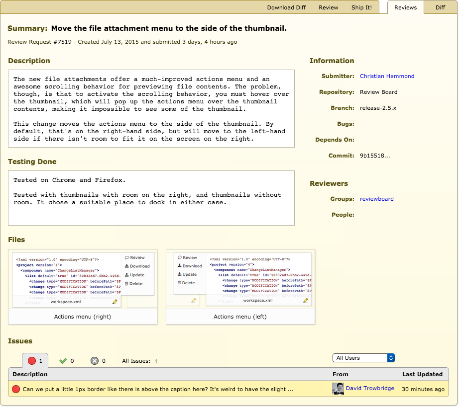
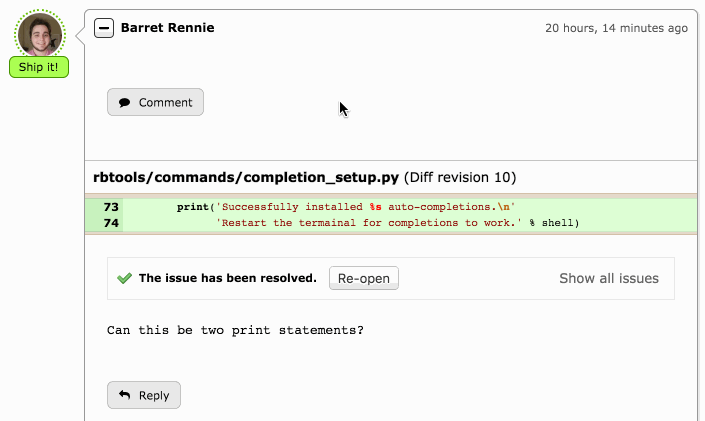
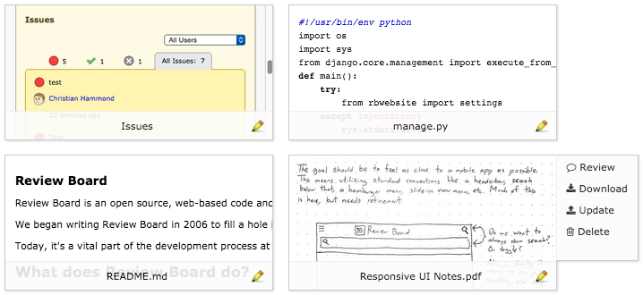
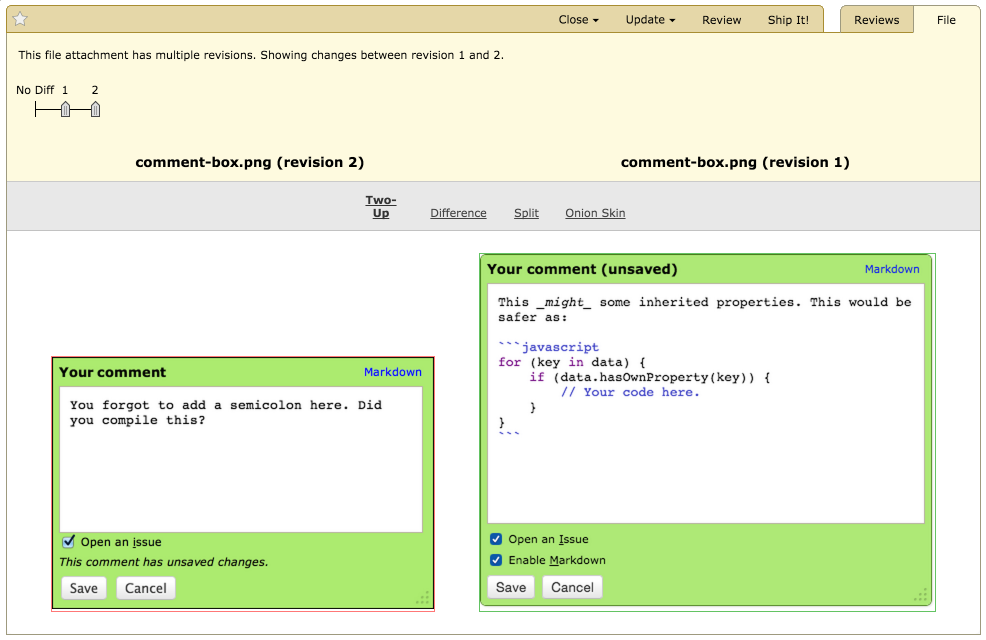

==============================
Review Board 2.5 Release Notes
==============================

**Release date:** October 28, 2015

This release contains all bug fixes and features found in Review Board version
:doc:`2.0.20 <2.0.20>`.


Upgrade Notes
=============

This release contains database schema changes to the following tables:

* ``attachments_fileattachment``
* ``diffviewer_filediffdata``
* ``diffviewer_filediff``
* ``reviews_group``
* ``reviews_reviewrequest``

This will take some time to migrate the database, particularly on large
installs. Please test the upgrade on a copy of your database first, to ensure
the upgrade is smooth and to time how long the upgrade takes.

Do **not** cancel the upgrade on a production system for any reason or you may
end up corrupting your database.


Compatibility Changes
=====================

* Upgraded to jQuery 1.11

  This release of jQuery offers performance and feature improvements that we
  rely on in the UI. If you're an extension author, you may need to check that
  your extension continues to work properly.


New User Features
=================

.. _2.5-design-update:

Design Update
-------------

Review Board's visual design was starting to get a little long in the tooth.

These features have significant updates:

* The dashboard
* Review requests and reviews
* The diff viewer
* The New Review Request page
* User pages

In addition to the large, obvious redesigns, several smaller pieces of UI have
been polished up:

* The highlighted chunk in the diff viewer now uses a highlight on either side
  of the view which doesn't cover up any content or cause the page to "jump".

* The comment dialog has been updated to soften the look a bit, increase the
  default size (so you have more room to write your comments), and prevent
  visual jumpiness.

* The old animated GIF spinners throughout the UI have been replaced with a
  modern icon-font based spinner that looks great on all screens.

* The issue summary table on review requests has some visual polish and offers
  a better way to filter statuses.




Mobile UI
---------

* Most of Review Board's UI has been updated to work better on small screens
  (such as those found on phones and tablets).

  The main navigation in Review Board is now accessible via a side menu,
  activated by tapping the hamburger icon. Through the mobile UI, you can read
  through your dashboard and participate in discussions on existing reviews
  while out and about.

  The diff viewer, review dialog, and attachment review experiences are not yet
  mobile-friendly. We'll be unveiling updates in the future that will make it
  easy to review code and attachments from your phone or tablet.

  Based on work by Jason Tseng.


Review Requests
---------------

E-mail Changes
~~~~~~~~~~~~~~

* Sending e-mail is now optional when publishing review requests.

  Users now have the option of preventing e-mail updates from being sent when
  publishing a review request. This can be used to avoid spamming your
  teammates when all you did was fix a typo or make another small change.

  Based on work by Jessica Qian.

* Added new headers for filtering review request e-mails.

  E-mails for reviews containing a Ship It! will include a
  ``X-ReviewBoard-ShipIt`` header. If the review doesn't contain any
  other content (for instance, if it's the result of the pressing the
  :guilabel:`Ship It!` button), it will also contain a
  ``X-ReviewBoard-ShipIt-Only`` header.

* The "Fix it, then Ship It!" state is now shown in e-mail notifications.
  (:bug:`3904`)

  Patch by Sherman Cheung.


Archive and Mute Review Requests
~~~~~~~~~~~~~~~~~~~~~~~~~~~~~~~~

Archive and Mute allow you to clean up your dashboard to show only the things
that require your immediate attention. Like many e-mail clients, "archiving" a
review request will hide it until there's new activity, and "muting" a review
request will hide it permanently.

Based on work by Chris Arnold.


Expandable Diff Fragments in Reviews
~~~~~~~~~~~~~~~~~~~~~~~~~~~~~~~~~~~~

Fragments of diffs shown in reviews can now be expanded and collapsed, just
like in the diff viewer. When hovering over the fragment, controls will be
shown for expanding by 20 lines, expanding all lines, or expanding to the
nearest function/class header.

:bug:`2041`




Improvements to the Review Dialog
~~~~~~~~~~~~~~~~~~~~~~~~~~~~~~~~~

* Fields are now instant-apply.

  The review dialog's fields are now instant-apply, meaning that you no longer
  need to save the draft after making changes. Instead, every field will
  save individually, just like fields on a review request.

  This helps to prevent data loss if the browser were to crash or the page
  were to close after making edits to the review, so long as any modified
  fields were saved after editing.

  The dialog no longer has individual :guilabel:`Save` and :guilabel:`Cancel`
  buttons. They have been replaced with a :guilabel:`Close` button.

* Added Markdown previews for text.

  The text fields behave much like those for review replies. They now
  show the rendered Markdown content, rather than the source text, by default.
  Clicking the field or its pencil icon will allow the field to be edited.

  This gives a much more accurate idea of how the review will look when
  published.


Deeper Bug Tracker Support
~~~~~~~~~~~~~~~~~~~~~~~~~~

This release adds the foundation for deeper bug tracker support. Currently,
this supports JIRA, GitHub, and modern versions of Bugzilla.

When a repository is configured to use a supported bug tracker, hovering
over a bug number will show an info box containing the bug's summary,
status, and description.

In upcoming releases, we'll be adding support for additional bug trackers, such
as Splat, our new friendly bug tracker service currently in development.

Based on work by Tomi Äijö.

:bug:`193`


Easier Diff Updating
~~~~~~~~~~~~~~~~~~~~

Updating a review request with a new diff through the Review Board UI has
become a lot easier. The Update Diff dialog has been redesigned to mirror the
abilities of the New Review Request page.

To upload a new diff, you can either drag-and-drop it onto the dialog, or
browse your file system. The diff will be automatically checked, showing any
errors or requesting additional information (such as a parent diff or
Subversion base path) if needed.


Markdown Improvements
~~~~~~~~~~~~~~~~~~~~~

* The Markdown editor now provides syntax highlighting support for:

  * CoffeeScript
  * CSS
  * Go
  * HTML
  * JavaScript
  * Perl
  * PHP
  * Python
  * ReStructuredText
  * Ruby
  * Shell scripts
  * SQL
  * XML
  * YAML

  This can be used by specifying the language when using fenced code blocks.
  For example::

      ```python
      class Foo(object):
          pass
      ```


Post-commit review request support for Bitbucket
~~~~~~~~~~~~~~~~~~~~~~~~~~~~~~~~~~~~~~~~~~~~~~~~

The New Review Request page now shows all branches and commits for repositories
hosted on Bitbucket_. Clicking a commit will post it for review, making it easy
to review changes made prior to using Review Board or to review changes sitting
on another branch.

.. _Bitbucket: https://bitbucket.org/


Diff Viewer
-----------

* Smarter detection of file types for syntax highlighting. (:bug:`337`)

  The diff viewer now displays more accurate syntax highlighting for files,
  based on the contents of the files, rather than simply making a
  determination based off the file extension. This means smarter highlighting
  for specialized XML files, HTML templates, Objective C++, and more.

* Allow double-click to create a comment.

  Double-clicking anywhere on a line in the diff viewer will now create a
  comment on that line. You can still click-and-drag the line numbers to select
  multiple lines, but for a quick one-line comment, a double-click may be
  faster. It's also more familiar to those coming from services like GitHub or
  Bugzilla Splinter.

  Patch by Mike Conley.

* Comment bubble tooltips now show rendered Markdown.

  The comment bubbles on the line numbers have always had a tooltip to preview
  the comment text. These tooltips now contain the rendered Markdown text
  rather than raw Markdown, showing how your comment will look when published.

  Patch by Wu Di.


File Attachments
----------------

"Live HD" Thumbnails
~~~~~~~~~~~~~~~~~~~~

In an era of high-resolution screens, the old postage-stamp size file
attachment thumbnails with lots of knobs and buttons looked pretty outdated.

File attachment thumbnails are now shown as large, clean images. These
thumbnails will show some UI options when hovering the mouse over them, and
will also scroll to reveal more of the image.




.. _2.5-revisioned-file-attachments:

Revisioned File Attachments
~~~~~~~~~~~~~~~~~~~~~~~~~~~

File attachments on a review request can now be replaced without having to
delete the old attachment before uploading the new one. Simply hover over an
attachment thumbnail and click :guilabel:`Update` to replace the attachment.
The new attachment will take the place of the old one.

Reviewers can view every revision of an attachment, and can diff between these
attachments.

Deleting a file attachment removes all revisions from that review request.

Based on patches by Ryan Done and Vlodymyr Lyubinets.

:bug:`800`


Diffs for Image Attachments
~~~~~~~~~~~~~~~~~~~~~~~~~~~

As mentioned, you can now diff between file attachments. This includes images!
You can compare any two revisions of an image and leave comments on the
comparison.

There are four comparison modes available:

* **Difference:** Color differences between the two images will be shown.
  Every pixel that's the same between the images will be shown in black.
  Added pixels are shown in their original color. Differences in pixel values
  are also shown.

* **Onion skinning:** By using a transparency slider, you can see subtle
  changes made between the images. The slider will change the transparency
  of the modified image. This helps to see if any pixels move, disappear,
  or otherwise change.

* **Split:** The images will overlap, and a horizontal slider will control
  how much of each image you're seeing, allowing you to compare the images
  incrementally.

* **Two-Up:** The images will be displayed side-by-side, unaltered. You will
  only be able to select regions to comment on the modified file, but that
  same area for both will be shown in the review.




Diffs for Text Attachments
~~~~~~~~~~~~~~~~~~~~~~~~~~

Text-based file attachments with multiple revisions can be compared as a diff.
This includes showing diffs of Markdown file attachments (for both the source
and rendered output).

Working with text-based diffs is very similar to using the diff viewer. You can
leave comments across multiple lines, see indentation-only changes or moved
blocks of lines, and more.


Movable/Resizable Image Comments
~~~~~~~~~~~~~~~~~~~~~~~~~~~~~~~~

You can already leave a comment on a region of an image, or a PDF file (if
using `Power Pack`_). Now, you can move or resize that comment before you
publish it. This makes it much easier if you want to edit a comment to cover a
different area of the image.

Patch by Stanley Yeo.

.. _`Power Pack`: https://www.reviewboard.org/powerpack/


Miscellaneous User Features
---------------------------

* See all reviews by a user at a glance.

  The user page now has a tab for showing all reviews of a change that were
  posted by the user.

  Patch by Tami Forrester.

* Smarter pagination for lists of users. (:bug:`829`)

  The "Users" page, which displays a list of all users on the server, now has a
  smarter alphabetical paginator. This makes it much easier to jump to users
  whose usernames start with a specific letter, number, or symbol.

  Patch by Ryan Done.

* Improved support for trophies.

  There's now a permanent record of all trophies received by each person. It's
  also possible for extensions to create new types of trophies. We're planning
  to add support for viewing all of your trophies in a future release.

* The display name for a group is now shown on the group page. (:bug:`3945`)

  Patch by Kristina Vandergulik.


New Administration Features
===========================

.. _2.5-webhooks-feature:

Webhooks
--------

Review Board now has support for configuring webhooks_.

Review Board can be set to post review request information to specified URLs
when publishing review requests, closing them, or reopening them.

It also supports sending review API payloads for publishing a review or a reply
to a review. The payload will include all comments filed on the review.

The payloads can be sent in JSON, XML, or HTTP form data formats. They can also
be completely replaced by a :ref:`custom template
<rb2.5:webhook-custom-payloads>`, powered by a subset of Django's templating
language. This can make use of the original payload's contents as variables,
allowing any custom payload format to be sent.

The HTTP requests will contain a ``X-ReviewBoard-Event`` header that lists the
event name, and a standard ``X-Hub-Signature`` header which contains a HMAC
signaure of the payload. If the webhook is configured with a "secret," that
secret will be used as the key for the HMAC digest.

Webhooks can be configured to be global across all repositories, tied to
specific repositories, or to review requests/reviews not associated with a
repository. They can also be tied to any number of events.

See the :ref:`documentation <rb2.5:webhooks>` for more details.

.. _webhooks: http://en.wikipedia.org/wiki/Webhook


Support for Review Board Gateway
--------------------------------

Review Board Gateway is our upcoming standalone service that wraps your Git
repositories with a fully-featured API, making it easier to integrate them
with Review Board. Git repositories backed by Review Board Gateway include
full support for browsing and posting commits in the New Review Request page.
Future releases will provide even deeper integration, making it easy to
manage all your repositories.

Review Board Gateway is not yet released. We'll make an announcement as soon
as it's ready.

Patch by Jessica Yuen.


Support for Assembla
--------------------

Assembla_ is a repository hosting and project management service that supports
Git, Subversion, and Perforce repositories.

Review Board now supports configuring Subversion and Perforce repositories
hosted on Assembla. Git is not supported, though, due to missing API features.

.. _Assembla: https://www.assembla.com/


Miscellaneous Admin Features
----------------------------

* Widgets on the administrator dashboard can now be added or removed.

  This allows the dashboard to contain only the information useful to the
  administrator. To remove a widget, simply click the :guilabel:`X`. To add,
  click the :guilabel:`Add Small Widgets` or :guilabel:`Add Large Widgets` link
  in the desired column.

  Patch by Stephanie Su.

* New options for targeting e-mails to groups.

  E-mail updates from review requests can now be sent both to the configured
  mailing list of a review group *and* to all members of that review group,
  instead of just one or the other. This can be configured separately for each
  review group.

* Added support for `OpenStack Swift`_ for file storage.

  Swift is an alternative to Amazon S3 for private clouds. When configured, all
  new file attachments will be uploaded to Swift instead of on the Review Board
  server. This helps when scaling Review Board out to multiple servers, and
  reduces load on the Review Board server.

  Patch by Omar Ali.

* Add new users to groups by default.

  Groups have a new setting to add new users by default. Turning this on will
  cause newly-registered users to be automatically added to the group.

  Patch by Stanley Yeo.

.. _`OpenStack Swift`: http://swift.openstack.org/


Performance Improvements
========================

* Reduced the amount of work needed to compute settings on each request,
  speeding up responses.

* Reduced storage and processing requirements for stored diffs.

  We've changed the storage mode used for diffs, reducing their storage
  requirements by an average of 80%, and reducing both diff generation and
  uploading times. This will also help reduce database upgrade times in the
  future.

  Existing diffs will be converted on-the-fly when accessed. Running ``rb-site
  manage /path/to/site condensediffs`` will convert all stored diffs to the new
  format. Newly-uploaded diffs will be stored in the new format, and visiting
  existing diffs will automatically convert them to the new format as well.


Usability Improvements
======================

This release contains numerous usability improvements for both desktop and
mobile devices as part of the new visual redesign. See the
:ref:`Design Update <2.5-design-update>` section above.

* The username in the navigation bar at the top of the page now links
  to the user's profile page instead of the preferences page.

  Patch by Jessica Qian.


Web API
=======

API Tokens
----------

Users can now configure multiple API tokens, which are a more secure way
of authenticating with the web API. API tokens don't require the user's
password, and can be easily revoked at any time.

Tokens can restrict the client's access to the API. Through a simple
drop-down menu, an API token can be set to allow full read/write access to
the API, read-only access, or a :ref:`custom policy
<rb2.5:api-token-policies>`.

Custom API token policies allow for very fine-grained access to the API,
limiting what methods can be performed on exactly which resources, even
down to the resource ID level.

To add API tokens, simply open the My Account page, click
:guilabel:`API Tokens`, and then :guilabel:`Generate a new API token`.
That token can then be configured and used immediately.

See the :ref:`API authentication <rb2.5:2.0-authenticating>` documentation for
instructions on using API tokens with the API.

RBTools 0.6.3 and higher support authenticating with API tokens.


Other API Features
------------------

* Added support for returning only certain fields or links in the API.

  API resources now support a couple new query arguments for limiting the
  results in a payload, in order to reduce database queries and payload
  sizes.

  The ``?only-fields=`` query argument limits the returned fields in the
  payload to the comma-separated list of field names. If the value is
  blank, then no fields will be returned, leaving only links.

  Likewise, the ``?only-links=`` query argument limits the returned links in
  the payload. It behaves exactly like ``?only-fields=``.

* Added :ref:`rb2.5:webapi2.0-hosting-service-list-resource` for accessing
  information on registered hosting services.

  This resource exposes information on each hosting service that can be
  used with Review Board. Right now, the information is pretty basic,
  but it will be used down the road to provide access to information
  and functionality on the hosting services.

  It also links to all associated hosting service accounts and local
  configured repositories.

  Note that this resource's payload data is not yet considered stable, and is
  subject to change in future releases.

* Added :ref:`rb2.5:webapi2.0-remote-repository-list-resource` for listing all
  available remote repositories on a hosting service.

  Repositories can be filtered by the owner, type of owner (organization or
  user), and service-specific filters.

  Note that this resource isn't available for all hosting services, and the
  API is not yet considered stable.

* :ref:`rb2.5:webapi2.0-hosting-service-account-list-resource` now allows for
  filtering by username or hosting service ID.

  The list resource now takes ``?username=`` and ``?service=`` arguments for
  filtering the resulting list by the username and/or service ID.

* Added :ref:`rb2.5:webapi2.0-api-token-list-resource` for working with your
  user's list of API tokens.

  This resource makes it easy to fetch your user's list of API tokens,
  to create new tokens, update existing tokens, and delete tokens.

  This resource is only accessible if using a username and password for
  authentication, and cannot be accessed if using an API token. This is to
  prevent a client with a valid read-only token to fetch the list of tokens
  and swap out the one used for authentication.

* The :ref:`rb2.5:webapi2.0-file-attachment-resource` now contains a
  ``revision`` field. This is used for :ref:`2.5-revisioned-file-attachments`.

* The :ref:`rb2.5:webapi2.0-repository-resource` now contains a ``bug_tracker``
  field.

  Patch by Halvor Lund.

* In the :ref:`rb2.5:webapi2.0-review-request-resource`, the ``depends_on`` and
  ``blocks`` fields now include the ID of the review requests being linked to.
  (:bug:`3863`).

* Added a :ref:`rb2.5:webapi2.0-web-hook-resource` for managing webhooks. See
  :ref:`Webhooks <2.5-webhooks-feature>` for more information on this new
  feature.

* Added a ``review_requests.trivial_publish`` API capability.

  Clients can use this to determine if they can publish review requests and
  reviews without sending e-mail.


Extensions
==========

New Hooks
---------

* Added a hook for creating widgets in the administration dashboard.

  :ref:`rb2.5:admin-widget-hook` allows extensions to register widgets to be
  shown in the administration UI. These hooks will be available for
  administrators to add to the dashboard. Widgets are automatically removed
  when the extension is disabled.

  Patch by Justin Maillet.

* Added a hook for adding capability flags to the Web API.

  :ref:`rb2.5:webapi-capabilities-hook` allows extensions to register custom
  capability flags to show in the API's :ref:`rb2.5:webapi2.0-root-resource`.
  This helps clients of the API that support the extension to query its
  capabilities without loading a custom resource.

  Patch by Justin Maillet.

* Added new extension hooks for manipulating the recipient list for review
  and review request e-mails.

  The new :ref:`rb2.5:email-hook` allows an extension to designate new lists
  of recipients for all the review/review request e-mails that Review Board
  sends. They can update both the To and CC lists for any e-mail.

  These take lists of signals the hook should listen to for the various events
  (such as
  :py:data:`~rb2.5:reviewboard.reviews.signals.review_request_published`).
  As a convenience, callers can make use of one of the subclasses for specific
  events:

  * :ref:`rb2.5:review-request-published-email-hook`
  * :ref:`rb2.5:review-request-closed-email-hook`
  * :ref:`rb2.5:review-published-email-hook`
  * :ref:`rb2.5:review-reply-published-email-hook`


Extension Web APIs
------------------

* API resources provided by extensions can now add specialized serialization
  of links.

  Subclasses of :py:class:`~rb2.5:reviewboard.webapi.base.WebAPIResource` can
  implement a :samp:`serialize_<linkname>_link()` function to provide the
  desired information for the link. This is useful for links that need to
  contain additional metadata about the link that would be helpful to the
  consumer.


Bug Fixes
=========

Dashboard
---------

* Fixed the "Submitter" column to not wrap lines when usernames contain
  wrappable characters such as hyphens.


Diff viewer
-----------

* Fixed some problems with interdiffs resulting from rebased changes.

* Fixed displaying trophies on the diff viewer page.

* Fixed caching issues with interdiffs.


E-mail
------

* Fixed Unicode errors when sending e-mails with UTF-8 content.
  (:bug:`3926`, :bug:`3943`)

* Image comments now contain absolute URLs, instead of relative URLs.
  (:bug:`3944`)

  Patch by Daniel Arteaga.

* Fixed an issue with the "Get e-mail notifications for my own activity."
  (:bug:`3895`)

  This setting was not working when posting a change against both a target
  group of which the user is a member and another target user, and then
  posting a review on that review request.


File Attachments
----------------

* Fixed commenting on text-based file attachments.

* Fixed sensitivity of the "Upload" button on the file attachment form when no
  file had been selected. (:bug:`3829`)

  Patch by Vincent Le.


Repositories
------------

* Fixed an error when invoking a repository hook for closing review requests
  when the referenced review request was not yet published.


Review Requests
---------------

* Fixed some syntax highlighting issues with entering Markdown in text
  fields.

* The issue summaries on a review request no longer show raw Markdown
  source.

  Patch by Teresa Fan.

* Fixed downloading raw diffs with commas in their filenames on Chrome.
  (:bug:`3704`)

  Patch by Chester Li.

* Opening and closing editors no longer results in review request or
  review drafts.

* Fixed the review reply draft banner sticking around in memory and listening
  for events after publishing a reply.

* Fixed the review request update bubble appearing below other elements on
  the page.

* Discarded review requests in the "Depends On" field are now shown with a
  strikethrough. (:bug:`3758`)

  This previously worked for submitted review requests, and has been expanded
  to all closed review requests.

  Patch by Yorie Nakayama.


New Review Request
------------------

* Default reviewers are now added when posting commits for review using the
  web UI. (:bug:`3900`)

  Patch by Xutong Liu.

* Fixed posting commits from GitLab for review when the commits were lacking a
  commit message.


Web API
-------

* Fixed links in the :ref:`rb2.5:webapi2.0-hosting-service-account-resource`
  when using local sites.


CVS
---

* Fixed Unicode errors when normalizing keywords in CVS diffs. (:bug:`3931`)


Subversion
----------

* Fixed Unicode errors when parsing SVN diffs containing accented characters
  in the revision strings.

  Patch by Maxime Besson.


SSH
---

* Repository paths containing invalid ports no longer generate cryptic
  error messages. (:bug:`3891`)

  Patch by Justin Wu.


Contributors
============

* Barret Rennie
* Brett Kochendorfer
* Chester Li
* Chris Arnold
* Christian Hammond
* Chronicle Yu
* Daniel Arteaga
* David Trowbridge
* Halvor Lund
* Jason Tseng
* Jessica Qian
* Jessica Yuen
* Justin Maillet
* Justin Wu
* Kristina Vandergulik
* Mark Russell
* Maxime Besson
* Mike Conley
* Olessia Karpova
* Omar Ali
* Ryan Done
* Sherman Cheung
* Stanley Yeo
* Stephanie Su
* Tami Forrester
* Teresa Fan
* Tomi Äijö
* Vincent Le
* Volodymyr Lyubinets
* Wu Di
* Xutong Liu
* Yorie Nakayama
