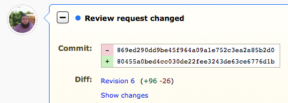
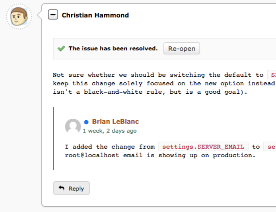
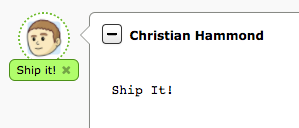
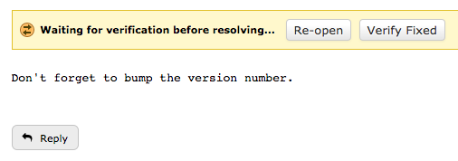
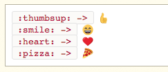
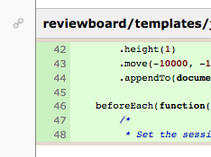

=====================================
Review Board 3.0 Beta 2 Release Notes
=====================================

**Release date**: October 5, 2017

This release contains all bug fixes and features from Review Board version
:doc:`2.5.16 <2.5.16>`.

Installation
============

To install this release, run the following::

    $ sudo pip install \
        -f https://downloads.reviewboard.org/releases/Djblets/0.10/ \
        -f https://downloads.reviewboard.org/releases/ReviewBoard/3.0/ \
        -f https://downloads.reviewboard.org/releases/rbintegrations/0.5/ \
        --pre -U ReviewBoard

Or::

    $ sudo easy_install \
        -f https://downloads.reviewboard.org/releases/Djblets/0.10/ \
        -f https://downloads.reviewboard.org/releases/ReviewBoard/3.0/ \
        -f https://downloads.reviewboard.org/releases/rbintegrations/0.5/ \
        -U ReviewBoard

We **do not** recommend upgrading a production server with this version of
Review Board. It's best to install on a test server, with a copy of your
production database, in case there are any major problems.

Upgrade Notes
=============

This release contains database schema changes to the following tables:

* ``reviews_reviewrequest``
* ``reviews_reviewrequestdraft``

Packaging
=========

* Added a new dependency on pymdown-extensions >= 3.4, < 4.0.

* Updated the Python-Markdown dependency to >= 2.6.8, < 2.7.

New Features
============

New Discussion Highlighting
---------------------------

Any new updates, reviews, and replies made to a review request since last
viewing the page are now highlighted, making it easy to see what discussion
you need to catch up on.

New entries on the page (such as changes to a review request or new reviews)
show up with a blue border around the entire entry and a blue dot icon in the
summary, providing a quick visual that it's fresh and new.

New replies on reviews are also specially highlighted, with a blue dot beside
the user's name and a thick blue border to the left of the comment, which
helps it stand out when scanning for new discussions you want to catch up on.

Revoke Ship-Its
---------------

The "Ship It" label on reviews now has a little "X" button that, when clicked
and confirmed, will revoke that Ship It. This can be clicked by either the
reviewer or the owner of the review request. It's handy when you realize your
Ship It was premature, or no longer applies to the review request as it is.

Issue Verification
------------------

When opening an issue for a comment, the issue can now be set to "require
verification." The author of a change can still mark an issue as Fixed or
Dropped, but it won't enter that state until the reviewer verifies the
resolution. This helps give the reviewer confidence that the author won't
either accidentally fail to address the issue or close it and then land the
change without addressing the feedback.

Emoji Shortcodes
----------------

Users can now use Emoji shortcodes (like ``:smile:``) in any text field with
Markdown enabled and they'll be turned into Emojis when viewed. These have an
advantage over Unicode-based Emojis in that they'll work regardless of the
database settings (MySQL databases by default do not support Unicode-based
Emojis unless using some very specific encodings, table formats, and settings,
none of which are default).

Easy Links to Reviews and Comments
----------------------------------

It's now easy to link to reviews, updates, and comments on the review request
page. The timestamp fields for the page entries now work as links to that
entry, and hovering over comments or replies will show a link icon to the left
that can be used for linking to that specific comment or reply.

OAuth2 Provider
---------------

Review Board now works as an OAuth2 Provider, allowing third-party services
and applications to interact with Review Board's API on behalf of a user in a
safe way without exposing user credentials.

When requesting authorization, services/applications will direct the user to a
special page on the Review Board server where they can see the exact
permissions needed by the service and can approve/deny access. The service
will then receive a token that can be used until revoked by the user.

In practice, this works similarly to API Tokens, which were introduced in
Review Board 2.5 to allow scripts and services to communicate on behalf of a
user, optionally with a limited permission set. Unlike API tokens, the
authorization process can be initiated by the service and more clearly managed
by the user.

New Dashboard Visuals and Features
----------------------------------

* Restyled the New Updates, Ship It, and Open Issue icons in the Dashboard.

  We've switched to a new blue dot icon across the product for representing
  updates to a review request or discussion. In the Dashboard, this replaces
  the old comment bubble icon.

  For Ship Its, we've switched to a new "thumbs up" icon, replacing the old
  checkmark (which was also used for issue tracking).

  The Open Issues icon remains largely the same, but is a lot sharper and more
  clear.

  The review request counts in the sidebar are now a shade of blue instead of
  red, based on feedback from some users that the red suggested something was
  wrong.

  .. image:: _static/images/3.0/3.0-new-icons.png

* Added an infobox when hovering over review requests in the Dashboard.

  This infobox shows the current state of the review request, the summary and
  description, relevant bugs, number of open issues and reviews, and more.
  This can help users prioritize the review requests they'll be looking at.

  .. image:: _static/images/3.0/3.0-review-request-infobox.png

  Based on work by Sharleen Fisher.

Search Improvements
-------------------

* Added on-the-fly search indexing.

  When using the Elasticsearch backend, Review Board can now automatically
  update the search index in response to changes and discussions on review
  requests. This keeps the search index up-to-date at all times.

* The search field's autocomplete now uses the search index when available.

  The autocomplete (or "Quick Search") used to translate queries into a few
  specific database queries. Now, if a search index is enabled, it will be
  used for the results instead.

Other Improvements
------------------

* Added rate limiting to the login form.

  Attackers can no longer attempt to log in via the login form from the same
  IP more than a handful of times per minute. By default, this is 5 times per
  minute, but that can be changed by setting ``DEFAULT_LOGIN_LIMIT_RATE`` in
  :file:`conf/settings_local.py` to a value in the form of
  :samp:`{num_attempts}/{period}`, where ``period`` is ``s`` for seconds,
  ``m`` for minutes, ``h`` for hours, or ``d`` for days.

  Patch by Raman Dhatt.

* Added avatars to the Submitter column in the All Review Requests, Group's
  Review Requests and User's Review Requests pages.

* Redesigned the bug infobox.

  The new infobox is more polished, providing more consistent visuals and
  better information on a bug. It's able to work with plain text, HTML, or
  Markdown formatting for bug descriptions, and allows for scrolling to show
  more of the bug description.

Usability Improvements
======================

* Improved organization of the My Account page.

  The My Account page now has fewer categories on the left, opting to group
  more related settings together into fewer pages. There's now only four
  pages: Profile (name, e-mail address, avatar, etc.), Settings (general
  settings and notifications), Groups, and Authentication (password, API
  Tokens, OAuth2 Tokens).

* Status updates (used for automated code review) now dynamically update on
  the page.

  In beta 1, posting a new review request would show each status update in a
  "pending" state, requiring reloads to see if that state has changed. Now the
  page checks for this automatically and reloads the entry when there's an
  update.

Performance Improvements
========================

* Improved load times for the New Review Request page when using lots of
  repositories.

  The page used to load the information on some types of repositories when
  loading the New Review Request Page in order to get access to certain state.
  We've changed how things were done, removing the requirement to talk to any
  repositories in order to load the page.

* Hovering over the diff context shown for comments on reviews no longer
  forces constant redraws of the page.

  Instead of expanding the controls down, causing the diff context to grow and
  push the page contents, the box now expands outward in both directions,
  leaving no impact on the rest of the page. This is a lot faster to interact
  with and reduces stress on the browser.

* Loading the diff context fragments for comments is now faster, uses less
  bandwidth, and reduces the workload for the browser.

* Reduced queries required for the review request page and the review dialog.

Extensions
==========

* Added extension-provided entries on the review request page.

  The entries on the review request page (such as reviews and change
  descriptions) are now pluggable, allowing extensions to provide additional
  types of entries. This might include discussions from a chat system, metrics
  from an internal reporting tool, or just useful bits of UI.

  Entries specify the type of data they want from the database through a
  series of flags, along with information on the template, timestamp, and
  placement on the page. Each type of entry has a Python and a JavaScript
  side, and can be dynamically updated without reloading the page.

  Documentation for this feature is still pending.

* Added improved support for creating custom review request fields.

  Previous versions of Review Board had basic support for custom fields on a
  review request, but this was pretty limited, only really offering text
  fields and raw HTML. This has been completely redone to provide a solid
  foundation for creating any kind of custom field, allowing for a lot of
  control on the JavaScript side.

  This also comes with base classes for a number of types of built-in fields:
  Single-line text fields (supporting autocomplete), Multi-line text fields
  (supporting Markdown), comma-separated value fields, checkbox fields,
  dropdown menu fields, and date fields.

  Documentation for this feature is still pending.

* Added JavaScript-side support for creating custom infoboxes.

  Infoboxes, like those shown for the bugs and review requests, can now be
  created by extensions for custom use. They can simply subclass
  :js:class:`RB.BaseInfoboxView` and interface it with the
  :js:class:`RB.InfoboxManagerView` (reachable by a call to
  :js:func:`RB.InfoboxManagerView.getInstance()`). A number of CSS classes are
  provided for styling.

  Documentation for this feature is still pending.

* Added :py:data:`~reviewboard.reviews.signals.review_ship_it_revoking` and
  :py:data:`~reviewboard.reviews.signals.review_ship_it_revoked` signals for
  listening to and optionally blocking the revocation of a Ship It.

  Extensions listening to this signal can choose to raise a
  :py:class:`~reviewboard.reviews.errors.RevokeShipItError` in order to block
  that Ship It from being revoked.

* :py:class:`~reviewboard.extensions.hooks.ReviewPublishedEmailHook` now
  accepts a ``to_submitter_only`` option.

  This can be used to provide different :mailheader:`To`/:mailheader:`CC`
  headers based on whether the e-mail was intended only for the submitter of
  the change.

* The ``type`` argument to the
  :py:data:`~reviewboard.reviews.signals.review_request_closing` and
  :py:data:`~reviewboard.reviews.signals.review_request_closed` signals is
  deprecated.

  The ``close_type`` argument should be used instead. ``type`` will still
  work, but will emit a deprecation warning.

* Errors during the installation of extension media are now logged, and no
  longer cause a page crash.

* Fixed a regression in beta 1 where the cache of Python modules provided by
  an extension wasn't cleared when enabling/disabling an extension, causing
  a series of failures.

Web API
=======

* Added :ref:`webapi2.0-oauth-application-resource` for managing a user's
  OAuth2 applications.

* Added :ref:`webapi2.0-oauth-token-resource` for managing a user's OAuth2
  tokens.

* Added an ``extra_data`` key indicating if a review's Ship It has been
  revoked.

  If a Ship It on a review has been revoked, ``extra_data`` on
  :ref:`webapi2.0-review-resource` will contain a ``revoked_ship_it`` value
  set to ``true``.

* Added rate limiting for API requests.

  The API is now rate-limited, preventing a client from making too many
  requests from the same IP. This helps prevent attacks from malicious users
  and from overly-aggressive clients. By default, anonymous IPs are allowed
  1,000 API requests per hour, and authenticated users are allowed 10,000
  requests per hour. These can be customized by setting
  ``API_ANONYMOUS_LIMIT_RATE`` and ``API_AUTHENTICATED_LIMIT_RATE``,
  respectively, in :file:`conf/settings_local.py`.

  Attackers can no longer attempt to log into the API from the same IP more
  than a handful of times per minute. By default, this is 5 times per minute,
  but that can be changed by setting ``DEFAULT_LOGIN_LIMIT_RATE`` in
  :file:`conf/settings_local.py` to a value in the form of
  :samp:`{num_attempts}/{period}`, where ``period`` is ``s`` for seconds,
  ``m`` for minutes, ``h`` for hours, or ``d`` for days.

  Patch by Raman Dhatt.

Bug Fixes
=========

Avatars
-------

* Fixed a crash when using avatars backed by uploaded files.

* Fixed a performance problem causing the site configuration to be repeatedly
  reloaded when looking up avatar backends.

Dashboard
---------

* Fixed a performance regression caused by too many SQL queries when loading
  avatar information for the Submitter column.

* Fixed bugs where the review request counters could end up with incorrect
  values in rare situations.

Diff Viewer
-----------

* Fixed an error generating URLs to patch error bundles when failing to
  generate a diff.

* Fixed a regression with linking to the diff viewer's file index.

* Fixed discarding unsaved draft comments when clicking on other line numbers.
  (:bug:`4434`)

  Patch by Giulia Mattia.

Review Requests
---------------

* Fixed performance regressions on the review request page caused by too
  many SQL queries when loading information on status updates and avatars.

* Fixed styling issues with diffing code blocks from text fields in the change
  entries.

* Fixed styling regressions with showing entries in mobile mode.

  The avatar was positioned incorrectly and the callout arrow (normally
  pointing to the avatar in desktop mode) was still being shown in mobile
  mode.

* Fixed notifying only the owner of a review request when publishing a draft
  review using the "Publish to Submitter Only" button on the draft banner.

* Fixed ordering of comments in the issue summary table.

  The issue summary table now properly lists issues for general comments
  first, then for file attachment comments, legacy screenshot comments (for
  very old review requests), and then for diff comments.

* Fixed bugs where the issue counters could end up with incorrect values in
  rare situations.

Review Dialog
-------------

* Fixed a double-confirmation when deleting comments.

* Fixed ordering of comments in the review dialog.

  The review dialog now properly lists general comments first, then file
  attachment comments, legacy screenshot comments (for very old review
  requests), and then diff comments.

* The :guilabel:`Add comment` button no longer places the new comment
  off-screen.

  The dialog will now scroll to the location of the new comment.

Administration
--------------

* The Status Update database page now uses raw ID fields for relation fields,
  preventing performance problems on large servers.

Contributors
============

* Barret Rennie
* Christian Hammond
* David Trowbridge
* Giulia Mattia
* Raman Dhatt
* Sharleen Fisher
