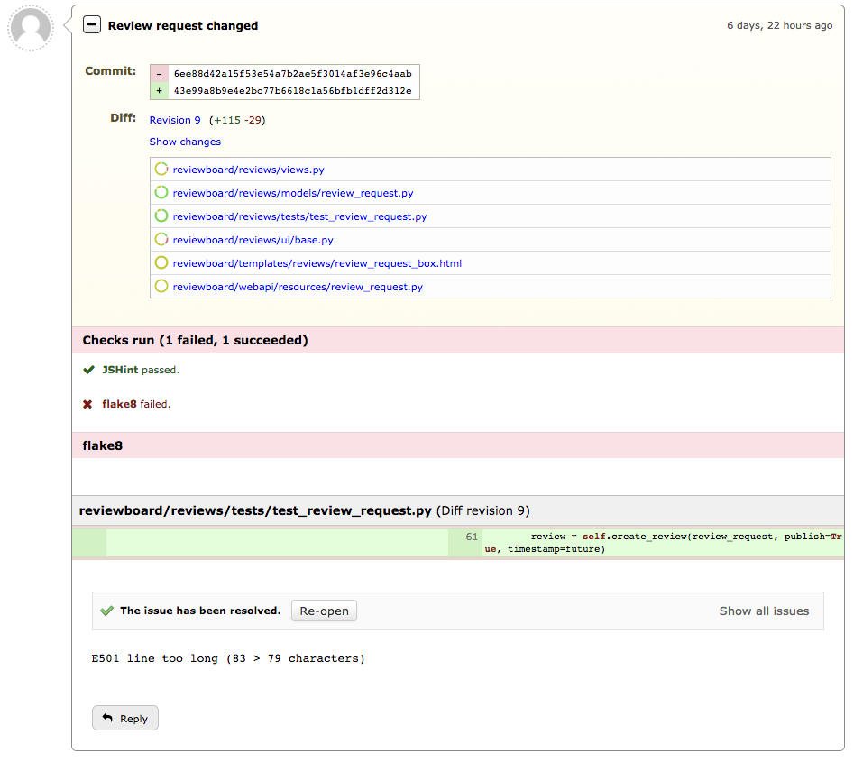
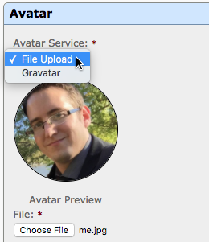
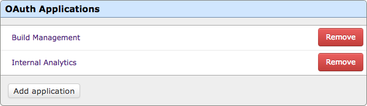

.. default-intersphinx:: djblets1.0 rb3.0

==============================
Review Board 3.0 Release Notes
==============================

**Release date**: November 20, 2017

This release contains all bug fixes and features from Review Board version
:doc:`2.5.16 <2.5.16>`.

Upgrade Notes
=============

This release contains database schema changes to the following tables:

* ``accounts_profile``
* ``attachments_fileattachment``
* ``changedescs_changedescription``
* ``reviews_review``
* ``reviews_reviewrequest``
* ``reviews_reviewrequestdraft``
* ``scmtools_repository``
* ``site_localsite``

This will take some time to migrate the database, particularly on large
installs. Please test the upgrade on a copy of your database first, to ensure
the upgrade is smooth and to time how long the upgrade takes.

Before performing the upgrade, make sure to perform a **full backup** of your
database and site directory in case you have any problems.

Do **not** cancel the upgrade on a production system for any reason.

Packaging/Compatibility
=======================

* Review Board 3.0 requires Python 2.7.

  If you're still running Python 2.6, you will need to stay on Review Board
  2.5 until you're able to upgrade your web server to use Python 2.7.

* Added a new dependency on pymdown-extensions_ >= 3.4, < 4.0.

* Updated the Markdown_ dependency to >= 2.6.8, < 2.7.

* Added a new dependency on the rbintegrations_ package.

.. _pymdown-extensions: https://pypi.python.org/pypi/pymdown-extensions
.. _Markdown: https://pypi.python.org/pypi/Markdown
.. _rbintegrations: https://pypi.python.org/pypi/rbintegrations

New Features
============

Integrations
------------

Review Board can now work more closely with other third-party services, such
as chat/collaboration services (like Slack_, Stride_, `I Done This`_), task
trackers (Asana_, Trello_), continuous integration services (`Travis CI`_,
CircleCI_), and more through the new Integrations framework.

Slack, Travis-CI, and CircleCI integrations are currently provided. We will
soon be launching integrations for Stride, Asana, Trello, and I Done This
will be coming soon. These are provided by the rbintegrations_ package, which
we'll be updating independently of Review Board.

Each integration can have any number of different configurations active at
once. For instance, multiple teams at a company could each have their own
unique Slack configurations that notify their own channels when review
requests are posted to their groups, or could have their own build
configurations for Travis CI.

.. image:: _static/images/3.0/3.0-integrations.png

New integrations can be provided by :ref:`custom extensions
<writing-extensions>`, for use in connecting to your own services. See
:ref:`integration-hook` and :ref:`writing-integrations` for more information.

.. _Asana: https://asana.com/
.. _CircleCI: https://circleci.com/
.. _I Done This: https://idonethis.com/
.. _Slack: https://slack.com/
.. _Stride: https://www.stride.com/
.. _Travis CI: https://travis-ci.com/
.. _Trello: https://trello.com/

Status Updates for Automated Reviews
------------------------------------

Status Updates are a new feature built to enable feedback on review requests
from automated code review tools. Status updates can show the status of the
automated check (such as "pending", "success", or "failure"), and, if
completed, can provide a review full of comments indicating issues that need
to be fixed.

These are used by `Travis CI`_ and CircleCI_, and can also be used by in-house
scripts or extensions in place of filing a normal review. If you've already
built your own automated code review functionality, it will be easy to migrate
to using status updates.

In the coming months, we will be releasing `Review Bot`_ 1.0, which will make
it easy to begin using automated code review in-house, taking advantage of
various static analysis tools to automatically report issues in your code.

Based on work by Shuai Shao.

:ref:`Learn more <automated-code-review>`

.. _Review Bot: https://github.com/reviewboard/ReviewBot/

General Comments
----------------

Review Board has traditionally supported comments on actual content, such as
lines of code or file attachments. It's common to also want to make more
general comments on a review request as a whole (for example, if a major
refactor is required, it probably doesn't make sense to add that comment on an
individual line of code). Users have traditionally used the review header
and/or footer for these, but that did not allow tracking issues.

You can now click :guilabel:`Add General Comment` in the review request or
review dialog to add a general comment, including opening an issue.

Based on work by Yanjia Xin.

:ref:`Learn more <general-comments>`

New Discussion Highlighting
---------------------------

Any new updates, reviews, and replies made to a review request since last
viewing the page are now highlighted, making it easy to see what discussion
you need to catch up on.

New entries on the page (such as changes to a review request or new reviews)
show up with a blue border around the entire entry and a blue dot icon in the
summary, providing a quick visual that it's fresh and new.

.. image:: _static/images/3.0/3.0-new-entries.png

New replies on reviews are also specially highlighted, with a blue dot beside
the user's name and a thick blue border to the left of the comment, which
helps it stand out when scanning for new discussions you want to catch up on.

.. image:: _static/images/3.0/3.0-new-replies.png

Revoking Ship-Its
-----------------

The "Ship It" label on reviews now has a little :guilabel:`X` button that,
when clicked and confirmed, will revoke that Ship It, removing it from your
review.

.. image:: _static/images/3.0/3.0-revoke-ship-it.png

This can be clicked by either the reviewer or the owner of the review request.
It's handy when you realize your Ship It was premature, or no longer applies
to the review request.

:ref:`Learn more <revoking-ship-it>`

Issue Verification
------------------

When opening an issue for a comment, the issue can now be set to require
verification. The author of a change can still mark an issue as Fixed or
Dropped, but it won't enter that state until the reviewer verifies the
resolution.

.. image:: _static/images/3.0/3.0-issue-verification.png

This helps give the reviewer confidence that the author won't either
accidentally fail to address the issue or close it and then land the change
without addressing the feedback.

:ref:`Learn more <issue-verification>`

Emoji Shortcodes
----------------

Users can now use Emoji shortcodes (like ``:smile:``) in any text field with
Markdown enabled and they'll be turned into Emojis when viewed.

.. image:: _static/images/3.0/3.0-emoji.png

These have an advantage over Unicode-based Emojis in that they'll work
regardless of the database settings (MySQL databases by default do not support
Unicode-based Emojis unless using some very specific encodings, table formats,
and settings, none of which are default).

:ref:`Learn more <emoji>`

Custom Avatars
--------------

In previous releases, we made use of Gravatars_ to represent users in
discussions and other parts of the UI. In 3.0, we added additional support for
uploading custom avatar images. This can be controlled per-user, and
administrators can set the default backend for all users.

Extension authors can also :ref:`write new avatar backends <avatar-guides>`,
integrating with any in-house photo databases they may already have.

:ref:`Learn more <account-settings-avatar>`

.. _Gravatars: https://gravatar.com

Link to Reviews and Comments
----------------------------

It's now easy to link to reviews, updates, and comments on the review request
page. The timestamp fields for the page entries now work as links to that
entry, and hovering over comments or replies will show a link icon to the left
that can be used for linking to that specific comment or reply.

.. image:: _static/images/3.0/3.0-entry-linking.png

OAuth2 Provider
---------------

Review Board now works as an OAuth2 Provider, allowing third-party services
and applications to interact with Review Board's API on behalf of a user in a
safe way without exposing user credentials.

When requesting authorization, services/applications will direct the user to a
special page on the Review Board server where they can see the exact
permissions needed by the service and can approve/deny access. The service
will then receive a token that can be used until revoked by the user.

In practice, this works similarly to :ref:`API Tokens <webapi2.0-api-tokens>`,
which were introduced in Review Board 2.5 to allow scripts and services to
communicate on behalf of a user, optionally with a limited permission set.
Unlike API tokens, the authorization process can be initiated by the service
and more clearly managed by the user.

:ref:`Learn more <oauth2>`

Reassign Review Request Ownership
---------------------------------

The ownership of a review request can now be changed by either the review
request's current owner (i.e. the submitter) or an administrator. This allows
review requests to be transferred from one user to another if they've been
abandoned or the work has been handed off.

For users who have the right permission, the :guilabel:`Owner` field under a
review request's :guilabel:`Information` section can now be edited. If a
regular user is making the change, they can give away ownership but cannot
reclaim it later (that is, it must be reassigned back by the new owner).

Patch by Chenxi Ni.

:ref:`Learn more <review-request-field-owner>`

Upload Images to Text Fields
----------------------------

When using Markdown in text fields (such as the review request description or
comment text), you can now drag-and-drop an image file into the text box
(while in edit mode) to upload it and show it inline with your text. This
allows easy sharing of mock-ups or annotations within your discussions.

Based on work by David Kus.

:ref:`Learn more <markdown-upload-images>`

New Dashboard Visuals and Features
----------------------------------

* Restyled the New Updates, Ship It, and Open Issue icons in the Dashboard.

  We've switched to a new blue dot icon across the product for representing
  updates to a review request or discussion. In the Dashboard, this replaces
  the old comment bubble icon.

  For Ship Its, we've switched to a new "thumbs up" icon, replacing the old
  checkmark (which was also used for issue tracking).

  The Open Issues icon remains largely the same, but is a lot sharper and more
  clear.

  The review request counts in the sidebar are now a shade of blue instead of
  red, based on feedback from some users that the red suggested something was
  wrong.

  .. image:: _static/images/3.0/3.0-new-icons.png

* Added an infobox when hovering over review requests in the Dashboard.

  This infobox shows the current state of the review request, the summary and
  description, relevant bugs, number of open issues and reviews, and more.
  This can help users prioritize the review requests they'll be looking at.

  .. image:: _static/images/3.0/3.0-review-request-infobox.png

  Based on work by Sharleen Fisher.

Search Improvements
-------------------

* Support for Elasticsearch_ as a search backend.

  Elasticsearch is a fast, scalable search engine used by companies of all
  sizes. We now support using an Elasticsearch server as a search backend.
  This will offer both performance and feature improvements over Whoosh (the
  previous and still default search engine).

  Note that you will currently need Elasticsearch 2.x for this feature.
  Versions 5.0 and higher will not work. This is due to compatibility issues
  with Haystack_, the third-party package we use to interface with search
  backends.

  :ref:`Learn more <search-indexing>`

* On-the-fly search indexing.

  When using the Elasticsearch backend, Review Board can now automatically
  update the search index in response to changes and discussions on review
  requests. This keeps the search index up-to-date at all times.

  :ref:`Learn more <search-indexing-methods>`

* The search field's suggestions now uses the search index when available.

  When using Elasticsearch with on-the-fly search indexing, the search field's
  drop-down list of suggestions will now be based off the search index,
  providing better results.

.. _Elasticsearch: https://www.elastic.co/
.. _Haystack: https://github.com/django-haystack/django-haystack

Review Improvements
-------------------

* Send review e-mails only to the owner of the review request.

  In large teams, the amount of e-mail traffic generated by code reviews can be
  significant. Sometimes, the contents of a code review can be trivial or
  direct enough that it's really not worth notifying everybody about the
  change. In this case, you can now select to publish the review
  :guilabel:`and only e-mail the owner`. This will still show up in the web UI
  and update on people's dashboards, but nobody else will receive the e-mail.

  :ref:`Learn more <publish-review-owner-only>`

* Delete comments from the "Edit Review" dialog.

  The review dialog now displays a delete icon next to the edit icon for each
  comment. This allows diff comments, file attachment comments, and general
  comments to be removed without finding the original comment flag or
  discarding the entire review.

  :ref:`Learn more <review-dialog-delete-comments>`

Diff Viewer Improvements
------------------------

* View the content of deleted files.

  Deleted files have typically just been listed as deleted with the content
  hidden. You can now choose to see the content of these files.

  Patch by Adriano Arce.

  :ref:`Learn more <diffviewer-deleted-files>`

* Improved display for patch errors.

  If a patch fails to apply correctly (either due to a bad patch or a problem
  with the configured repository), Review Board would show a pretty terrible
  error message and leave debugging files in a temporary directory on the
  server which was only accessible by the administrator. Review Board will now
  allow you to view the rejects inline, and makes it easy to download a bundle
  containing the original file, patch file, and the rejects.

  Based on work by Tien Vu.

* Added support for tracking symlinks to files in Git diffs.

  Symlink changes in diffs are now specially flagged, showing up in the diff
  viewer as a file modification with "symlink" text beside the file.

  Patch by Erik Johansson.

File Attachment Improvements
----------------------------

* Cycle through file attachments.

  When reviewing multiple file attachments, it's common to go through every
  attached file in turn. Doing so was kind of annoying because it required
  navigating back to the main review request page (or opening every attachment
  in a different tab).

  We've now added "next" and "previous" attachment buttons on the file
  attachment view. These ordinarily keep out of the way, but will slide out
  from the left or right when hovered over with the mouse.

  :ref:`Learn more <switching-file-attachments>`

* Zoom in and out when reviewing images.

  With the advent of high-DPI screens, it's common for screenshots or image
  assets to have a 2x or 3x ratio between display pixels and virtual pixels.
  In order to facilitate review of these files, the image review UI now allows
  selecting a zoom level (either 33.3%, 50%, 100%, or 200%). These presets
  allow easily viewing 2x or 3x assets at their natural size.

  If the image attachment filename includes "@2x" or "@3x", the correct zoom
  level will be preselected when opening the file. Otherwise, the image will be
  zoomed such that it attempts to fit within the browser window.

  :ref:`Learn more <reviewing-images-zoom>`

* Scroll oversized images.

  When reviewing very large image file attachments (such as whole-screen
  screenshots), they would previously overflow the bounds of the containing
  box. These will now be contained entirely within the review box and can be
  scrolled.

Administration Features
-----------------------

* Opt-in feature checks.

  This release lays the groundwork for a new "feature check" system, which
  we'll be using going forward to help test experimental new features. Feature
  checks allow us to produce new features or to change existing features
  without impacting existing installations. Administrators who want to help
  test these changes will be able to opt in to the features, and opt back out
  if they introduce problems.

  Extension authors can also make use of the feature system to help test new
  experimental support in production without affecting all the users on a
  system or requiring a test server to be set up.

  :ref:`Learn more <feature-checks-guides>`

* Optionally send an e-mail when a user's password has changed.

  The administator can now configure Review Board to notify users via e-mail if
  their password has been changed. This defaults to disabled.

* Support for Splat_ as a bug tracker.

  Splat is a new bug tracker service we currently have in development,
  designed to be flexible in its usage and to tie into other project
  management tools.  It's being used to track bugs and features for Review
  Board, and will in time be available for others to use.

.. _Splat: https://hellosplat.com/

Other New Features
------------------

* Added rate limiting to the login form.

  Attackers can no longer attempt to log in via the login form from the same
  IP more than a handful of times per minute. By default, this is 5 times per
  minute, but that can be changed by setting ``DEFAULT_LOGIN_LIMIT_RATE`` in
  :file:`conf/settings_local.py` to a value in the form of
  :samp:`{num_attempts}/{period}`, where ``period`` is ``s`` for seconds,
  ``m`` for minutes, ``h`` for hours, or ``d`` for days.

  Patch by Raman Dhatt.

* Review Request metadata for social media sites and chat services.

  Services like Facebook, Twitter, Slack, and others can make use of metadata
  on a page to show a more useful preview. Review Board now includes this
  metadata on review requests.

* Support for desktop notifications.

  Review Board can now pop up notifications on your desktop when a review
  request is open in the browser. This can be enabled in the user account
  settings.

  Patch by Kristina Vandergulik.

* Enabled auto-complete for the "Depends On" field.

  When adding items to the "Depends On" field in a review request, you can now
  type in review request numbers or text from the summary field and
  auto-complete the results.

  Patch by Connor Yoshimoto.

* Added a :guilabel:`Show inactive` toggle to the users list page.

  The users grid now allows toggling to show or hide inactive users.

  Patch by Raman Dhatt.

.. _Gravatar: https://en.gravatar.com/
.. _Splat: https://hellosplat.com/

Usability Improvements
======================

Smart Collapsing of Reviews/Changes
-----------------------------------

The default collapsed states for entries on the review request page have
been improved, attempting to expand only if the entry is new or has new
content that the user might want to see. Anything previously there when the
user last visited the page defaults to being collapsed. The goal of this is
to better help users focus on new discussions and new updates to review
requests.

We might tweak this further based on feedback. Please report any odd
behavior you might encounter.

Improved High-DPI Support
-------------------------

Review Board no longer temporarily loads low-resolution icons on modern
browsers when using a high-DPI (such as a "Retina") display, opting instead
for higher-resolution graphics. When using screens that can make use of
"@3x" graphics (such as some newer mobile phone screens and tablets), SVGs
will be used to ensure crisp graphics.

Reorganized My Account Page
---------------------------

The :ref:`My Account page <account-settings>` now has fewer categories on
the left, opting to group more related settings together into fewer pages.
There's now only four pages: Profile (name, e-mail address, avatar, etc.),
Settings (general settings and notifications), Groups, and Authentication
(password, API Tokens, OAuth2 Tokens).

Other Usability Changes
-----------------------

* Changed "Submitter" labels to "Owner" throughout the UI.

  As review request ownership can now change, these labels have been updated
  to better standardize on the term "owner" instead of "submitter." This
  mainly affects the display of Dashboard columns, review request fields, and
  condition rules.

* Removed dead space causing issues selecting columns in the datagrid column
  customization menus.

Performance Improvements
========================

* Improved load times for the New Review Request page when using lots of
  repositories.

  The page used to load the information on some types of repositories when
  loading the New Review Request Page in order to get access to certain state.
  We've changed how things were done, removing the requirement to talk to any
  repositories in order to load the page.

* Hovering over the diff context shown for comments on reviews no longer
  forces constant redraws of the page.

  Instead of expanding the controls down, causing the diff context to grow and
  push the page contents, the box now expands outward in both directions,
  leaving no impact on the rest of the page. This is a lot faster to interact
  with and reduces stress on the browser.

* Loading the diff context fragments for comments is now faster, uses less
  bandwidth, and reduces the workload for the browser.

* Reduced queries required for the review request page and the review dialog.

* Improved performance when calculating highlighted regions in diffs.

* Improved performance when rendering custom actions, navigating bar entries,
  and additional comment information from extensions.

Extensions
==========

Access Control for extra_data
-----------------------------

Many objects in the database provide an ``extra_data`` field, which is
useful for extensions and API users to store additional information
associated with that object. Until now, everything within this field was
exposed via the API.

Extensions can now make keys private by prefixing with a double underscore
(``__``). They can also implement read-only and private access modes through
extensions.

:ref:`Learn more <webapi2.0-extra-data-access-restrictions>`

Better Custom Field Support
---------------------------

Previous versions of Review Board had basic support for custom fields on a
review request, but this was pretty limited, only really offering text
fields and raw HTML. This has been completely redone to provide a solid
foundation for creating any kind of custom field, allowing for a lot of
control on the JavaScript side.

This also comes with base classes for a number of types of built-in fields:
Single-line text fields (supporting autocomplete), Multi-line text fields
(supporting Markdown), comma-separated value fields, checkbox fields,
dropdown menu fields, and date fields.

:ref:`Learn more <extension-review-request-fields>`

Custom Entries on the Review Request Page
-----------------------------------------

The entries on the review request page (such as reviews and change
descriptions) are now pluggable, allowing extensions to provide additional
types of entries. This might include discussions from a chat system, metrics
from an internal reporting tool, or just useful bits of UI.

Entries specify the type of data they want from the database through a
series of flags, along with information on the template, timestamp, and
placement on the page. Each type of entry has a Python and a JavaScript
side, and can be dynamically updated without reloading the page.

Right now, this is in the early stages, and an extension hook is not provided.
Those wanting to experiment can read through
:py:mod:`reviewboard.reviews.detail`.

Extensible User Infoboxes
-------------------------

Extensions can now add information to the box which pops up when hovering the
mouse over a user's name. You can populate the infobox with information from
internal services or data gathered from an extension.

:ref:`Learn more <user-infobox-hook>`

Other Extension Changes
-----------------------

* Many changes to the CSS for pages.

  We've made some significant changes and cleanups to the HTML markup and CSS
  for the main review request page. If you've created an extension that uses
  ID or class selectors, or a user stylesheet, you'll need to update it for
  those changes. Many of these changes have been documented `on our wiki
  <https://www.notion.so/reviewboard/Review-Request-page-changes-for-3-0-8d27aac9e3ed4f81ac1e849ebb6127fe>`_.

* Added JavaScript-side support for creating custom infoboxes.

  Infoboxes, like those shown for the bugs and review requests, can now be
  created by extensions for custom use. They can simply subclass
  :js:class:`RB.BaseInfoboxView` and interface it with the
  :js:class:`RB.InfoboxManagerView` (reachable by a call to
  :js:func:`RB.InfoboxManagerView.getInstance()`). A number of CSS classes are
  provided for styling.

  Documentation for this feature is still pending.

* Added :py:data:`~reviewboard.reviews.signals.review_ship_it_revoking` and
  :py:data:`~reviewboard.reviews.signals.review_ship_it_revoked` signals for
  listening to and optionally blocking the revocation of a Ship It.

  Extensions listening to this signal can choose to raise a
  :py:class:`~reviewboard.reviews.errors.RevokeShipItError` in order to block
  that Ship It from being revoked.

* :py:class:`~reviewboard.extensions.hooks.ReviewPublishedEmailHook` now
  accepts a ``to_submitter_only`` option.

  This can be used to provide different :mailheader:`To`/:mailheader:`CC`
  headers based on whether the e-mail was intended only for the submitter of
  the change.

* The ``type`` argument to the
  :py:data:`~reviewboard.reviews.signals.review_request_closing` and
  :py:data:`~reviewboard.reviews.signals.review_request_closed` signals is
  deprecated.

  The ``close_type`` argument should be used instead. ``type`` will still
  work, but will emit a deprecation warning.

* Errors during the installation of extension media are now logged, and no
  longer cause a page crash.

Web API
=======

Rate Limiting
-------------

The API is now rate-limited, preventing a client from making too many
requests from the same IP. This helps prevent attacks from malicious users
and from overly-aggressive clients. By default, anonymous IPs are allowed
1,000 API requests per hour, and authenticated users are allowed 10,000
requests per hour. These can be customized by setting
``API_ANONYMOUS_LIMIT_RATE`` and ``API_AUTHENTICATED_LIMIT_RATE``,
respectively, in :file:`conf/settings_local.py`.

Attackers can no longer attempt to log into the API from the same IP more
than a handful of times per minute. By default, this is 5 times per minute,
but that can be changed by setting ``DEFAULT_LOGIN_LIMIT_RATE`` in
:file:`conf/settings_local.py` to a value in the form of
:samp:`{num_attempts}/{period}`, where ``period`` is ``s`` for seconds,
``m`` for minutes, ``h`` for hours, or ``d`` for days.

Patch by Raman Dhatt.

Better JSON modification in extra_data
--------------------------------------

Clients that need to modify ``extra_data`` on a resource can now set or
modify structured data by making use of JSON Merge Patches or JSON Patches.

`JSON Merge Patches`_ are a simple way of setting structured data by passing
``extra_data:json=<json data>``, which will merge the new data into
``extra_data``, adding any new dictionary values, overriding any lists, and
deleting anything set to ``null``.

`JSON Patches`_ are a more complex way of running a set of operations on
``extra_data``, which can add, delete, replace, move, or copy data.

Both of these support private keys and any API access restrictions set by
extensions.

:ref:`Learn more <webapi2.0-extra-data>`

Other API Changes
-----------------

* Added :ref:`webapi2.0-oauth-application-resource` for managing a user's
  OAuth2 applications.

* Added :ref:`webapi2.0-oauth-token-resource` for managing a user's OAuth2
  tokens.

* Added an ``extra_data`` key indicating if a review's Ship It has been
  revoked.

  If a Ship It on a review has been revoked, ``extra_data`` on
  :ref:`webapi2.0-review-resource` will contain a ``revoked_ship_it`` value
  set to ``true``.

* Allow users with the ``submit_as`` permission to see unpublished review
  requests.

  If users are allowed to submit or update review requests on behalf of other
  users, they were not able to use :command:`rbt post -u` to update review
  requests which had not yet been made public. Previously, only administrators
  could list unpublished review requests.

  Patch by Halvor Lund.

* Added an ``absolute_url`` field to the
  :ref:`rb3.0:webapi2.0-review-resource` payload.

  This field contains the URL to view the review within the web UI.

.. _JSON Merge Patches: https://tools.ietf.org/html/rfc7386
.. _JSON Patches: http://jsonpatch.com/

Bug Fixes
=========

Dashboard
---------

* Fixed a performance regression caused by too many SQL queries when loading
  avatar information for the Submitter column.

* Fixed bugs where the review request counters could end up with incorrect
  values in rare situations.

Review Requests
---------------

* Fixed blank "Files" list when loading a review request. (:bug:`4468`)

  When initially loading a review request that has file attachments, the
  "Files:" label would appear with a blank box below it, and then the file
  attachments would appear after a short wait. We've added a loading indicator
  so it looks less broken.

  Patch by Anni Cao.

* Fixed styling issues with diffing code blocks from text fields in the change
  entries.

* Fixed bugs where the issue counters could end up with incorrect values in
  rare situations.

* Fixed showing the draft banner when changing file attachment captions.

* Fixed a bug where space for a reply draft banner was still taken up after
  the banner was removed.

Diff Viewer
-----------

* Fixed discarding unsaved draft comments when clicking on other line numbers.
  (:bug:`4434`)

  Patch by Giulia Mattia.

Image Review
------------

* Fixed the order of captions within the image review UI.

  When reviewing a diff between two revisions of an image, if the revisions had
  different captions, those captions would be shown in the wrong order.

Administration UI
-----------------

* Fixed the display of "pop up" pages in the admin UI.

  The database section of the admin UI occasionally pops up a new window, to
  select or create related objects. These pages were intended to be simple
  content, but they included the header and sidebar. This has been fixed.

LDAP
----

* Fixed a crash when a user's full name doesn't include whitespace.
  (:bug:`4489`)

  Patch by Riley Creaghan.

Changes Since 3.0 RC 1
======================

Review Requests
---------------

* Fixed regressions with wrapping long content in fields. (:bug:`4603`)

* Fixed wrapping problems with replies to comments filed as part of
  status updates.

* Fixed publishing changes to file attachment captions.

* Fixed showing the draft banner when changing file attachment captions.

* Fixed a bug where space for a reply draft banner was still taken up after
  the banner was removed.

* Fixed overzealously hiding the reply draft banner after deleting any draft
  reply on a review, even if it wasn't the last.

Diff Viewer
-----------

* Fixed updating the file index when changing pages or revisions.
  (:bug:`4606`)

File Attachment Review
----------------------

* Increased spacing between navigation buttons and file attachment content
  when reviewing files.

Extensions
----------

* Disabled the new-style action registration, which was available in prior
  betas. We're planning to replace it in a 3.0.x release.

* Fixed a regression where actions weren't unregistering when extensions were
  disabled.

* Fixed a regression with the configuration forms of some extensions.

Contributors
============

* Adriano Arce
* Anni Cao
* Barret Rennie
* Chenxi Ni
* Christian Hammond
* Connor Yoshimoto
* David Kus
* David Trowbridge
* Erik Johansson
* Giulia Mattia
* Halvor Lund
* Kristina Vandergulik
* Raman Dhatt
* Riley Creaghan
* Sharleen Fisher
* Shuai Shao
* Tien Vu
* Yanjia Xin
