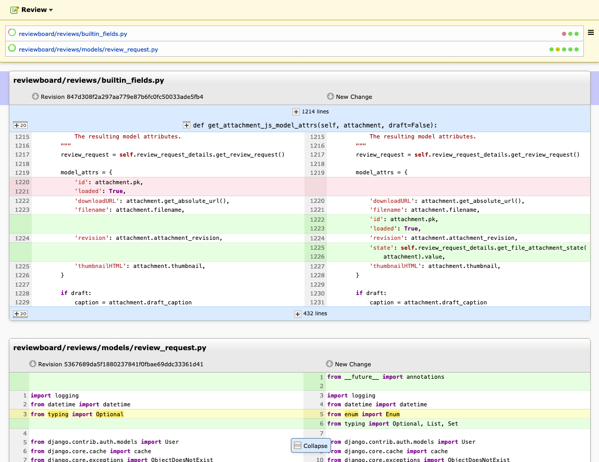
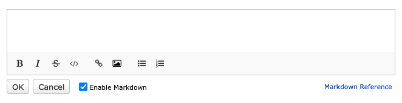
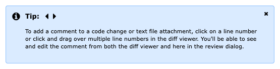

.. default-intersphinx:: djblets4.x rb6.x

==============================
Review Board 6.0 Release Notes
==============================

**Release date**: October 17, 2023

This release contains all bug fixes and features from Review Board version
:doc:`5.0.6 <5.0.6>`.

Installation/Upgrade
====================

Review Board 6.0 is compatible with Python 3.8 - 3.12.

Follow our :ref:`installation guide <installing-reviewboard-toc>` to prepare
your system for Review Board or to upgrade your existing install.

To install this release, run:

.. code-block:: console

    $ pip3 install ReviewBoard==6.0

To learn more, see:

* :ref:`Documentation <reviewboard-docs>`
* :ref:`Installing Review Board on Docker <installation-docker>`
* `Power Pack for Review Board <https://www.reviewboard.org/powerpack/>`_
* :pypi:`Review Board on PyPI <reviewboard>`
* `Review Board on GitHub <https://github.com/reviewboard/reviewboard>`_

For assistance with your server, `talk to us about support <Review Board
Support_>`_.

.. _Review Board Support: https://www.reviewboard.org/support/

Upgrade Notes
=============

* This release contains database schema changes to the following tables:

  * ``attachments_fileattachment``

  This will take a small amount of time to migrate the database. Please test
  the upgrade on a copy of your database first, to ensure the upgrade is smooth
  and to time how long the upgrade takes.

  .. important::

     Do **not** cancel the upgrade on a production system for **any reason**.
     Doing so will corrupt your database, requiring a backup or our repair
     service.

Packaging
=========

* Review Board 6.0 supports Python 3.8 - 3.12.

  Support for Python 3.7 has been dropped, and Python 3.12 has been added.

* :pypi:`Djblets` 4.0 is required.

New Features
============

A more polished look
--------------------

         colors and better interaction controls.
   :sources: 2x _static/images/6.0/6.0-new-diff-visuals@2x.png

We've been improving the look and feel of the product, softening the
visuals, giving content some breathing room, sanding rough edges, and
reworking the color palette and font size to make diffs easier to review.

This is a step toward a larger UI refresh planned for Review Board 7.

The new Unified Review Banner
-----------------------------

In past versions of Review Board, your draft review requests, reviews, and
replies were all managed separately, each with their own green draft banner.

Review Board 6 now includes a new :ref:`Unified Review Banner
<review-banner>`, which summarizes every draft that still needs to be
published on a review request.

This banner allows you to:

* See all your drafts in one place

* Publish all your drafts together with fewer e-mails, or publish them
  independently as before

* Create new reviews on a review request

This banner is always visible on the screen, and will help guide you through
the review process.

The old :guilabel:`Review`, :guilabel:`Add Comment`, and  :guilabel:`Ship It!`
buttons on the review request's action bar have been moved to a new
:guilabel:`Review` menu on the banner, helping you create, manage, and publish
your reviews from anywhere on a review request.

Markdown formatting toolbar
---------------------------

         with buttons for Bold, Italic, Strike-through, Code Literal, Insert
         Link, Insert Image, Insert Bullet List, Insert Numeric List.
   :sources: 2x _static/images/6.0/6.0-formatting-toolbar@2x.png

The new toolbar can help you format your text (bold, italic, strike-through,
or code literals), create lists (numeric or bullet point), insert links, or
upload images.

It's shown any time you're writing Markdown content, such as when leaving
a comment, replying to a review, or filling out a review request field.

This was based on work by Hannah Lin.

Easier diff navigation
----------------------

When reviewing diffs, the current file is now shown at the top of the page.

This can not only help you remember what file you're looking at, but can be
used to quickly jump to any other file in the diff.

Better file attachment management
---------------------------------

When adding, updating, or deleting file attachments, a label is now placed
on the thumbnail showing its status:

* :guilabel:`New`:
  The file attachment was newly-added in this draft.

* :guilabel:`New Revision`:
  A new, updated revision of a file attachment was added in this draft.

* :guilabel:`Pending Deletion`:
  The file attachment will be deleted when the draft is published.

* :guilabel:`Draft`:
  The file attachment's caption has been updated in the draft.

If a file attachment is pending deletion, you can now restore it by clicking
:guilabel:`Undo Delete` in the file attachment's actions menu.

Helpful tips for composing reviews
----------------------------------

         to a code change or text file attachment, click on a line number or
         click and drag over multiple line numbers in the diff viewer. You'll
         be able to see and edit the comment from both the diff viewer and
         here in the review dialog."
   :sources: 2x _static/images/6.0/6.0-review-tips@2x.png

Now, when creating or editing a review, the Review Dialog will show a
slideshow of useful tips on reviewing in Review Board. This will teach you
how to leave multi-line comments, comment on regions of images, publish
drafts, and more.

Review your own drafts
----------------------

Until now, Review Board has not allowed you to create comments on unpublished
diffs or file attachments, because updating that data would end up deleting
comments from the reviews.

This has now been changed so you can add review comments for drafts before
those drafts are published. The resulting review request and review can then
be published together using the :ref:`Unified Review Banner <review-banner>`.

This was tracked as :bug:`831`.

A better dashboard overview
---------------------------

Review Board 4.0 introduced the "Overview" tab for the dashboard, which
effectively combines the incoming and outgoing views together (showing both
things which are assigned to you as well as your own changes).

This is now the default view when opening the dashboard.

New Single Sign-On options
--------------------------

Users can now configure the ``NameID`` format and user attribute names for
SAML-based Single Sign-On, helping them match the configuration in their
Identity Providers.

Patches by Anes Mukhametov.

Service health checks
---------------------

Review Board's service health can now be monitored via the ``/health/``
endpoint.

This can be used by monitoring servers, Kubernetes, Docker, etc. to verify
that Review Board is up and running and can access its necessary services.

Only permitted IP addresses can access the health check URL. These can be set
in ``HEALTHCHECK_IPS`` in your site directory's
:file:`conf/settings_local.py`.

:ref:`Learn more about health checks <health-checks>`.

Plus...
-------

* Our Docker images have been updated for Ubuntu 22.04 LTS, Python 3.11,
  and now support ARM64 architectures.

* Newly-generated Apache configurations support HTTP/2 by default.

  We *strongly* recommend updating your Apache or Nginx configuration for
  HTTP/2.

* Logging is enabled by default on new installs.

* The list of commits on a review request and the diff viewer now show the
  commit IDs.

* Repository lists in the administration UI now show more information on the
  repository backends.

Removed Features
================

* Dropped support for :pypi:`subvertpy` for Subversion repositories.

  Subvertpy hasn't been maintained in a long time, and suffered from many
  compatibility and installation issues.

  We now require PySVN for Subversion. See the :ref:`installation instructions
  <installing-svn>` for details on installing PySVN.

Extensions
==========

Server-Side Python Extensions
-----------------------------

* Reworked support for adding actions.

  Review Board's extension framework has had a concept of actions for a long
  time, for adding your custom features to review requests or to the
  navigation bar on each page. The implementations for these were spread out
  among several different extension hooks with varying levels of
  functionality. These have all been replaced with a new generic framework.

  Extensions can now define their own :ref:`actions <action-hooks>` to attach
  to various hook points on the page (for example, the header, the review
  request, or the review banner).

  Actions can be placed into menus, such as in the new :guilabel:`Review`
  menu or user menu at the top of the page. Menu items can be reordered.
  Separators can be added to visually distinguish between groups of actions.

  Actions can be explicitly hidden using :ref:`HideActionHook
  <hide-action-hook>`, making it easier to disable existing features or
  replace them with your own custom implementations.

* Added experimental support for pytest_-based unit tests.

  :ref:`rbext-test` can now use pytest as the test runner with the
  ``--pytest`` argument. Pytest is a modern unit test runner with a large
  ecosystem of plugins, and is the go-to choice for many Python codebases.

  This will become the default in Review Board 7.

* Running :ref:`rbext <rbext>` without any parameters will now output helpful
  instructions.

* Custom :py:class:`SCMTools <reviewboard.scmtools.core.SCMTool>` (repository
  implementations) can now store ``extra_data`` on a draft review request when
  parsing a changeset.

  This allows additional data about a changeset to be stored for later use.

* Switched our extension support to use modern Python packaging support.

  Tools for working with Python packages have changed significantly in the
  past few years. We've updated all of Review Board to move from the legacy
  tooling to modern tooling.

  This is a large behind-the-scenes change, but it shouldn't have any
  noticeable change in functionality. If your extension package no longer
  works, please `reach out to support <Review Board Support_>`_.

* Improved Python type hinting.

  We're continually adding Python type hints to the Review Board codebase,
  helping you develop Python extension code in your IDE. Each release brings
  us closer to 100% type hint coverage.

  If you maintain extensions, you may want to consider integrating tools such
  as mypy_ or pyright_ into your workflow.

.. _mypy: https://www.mypy-lang.org/
.. _pyright: https://github.com/microsoft/pyright
.. _pytest: https://pytest.org/

Client-Side JavaScript Extensions
---------------------------------

* TypeScript, ES Modules, and Spina support for JavaScript extensions.

  TypeScript is now available to extension authors, helping you write
  type-safe, maintainable code. Review Board 6 currently supports
  TypeScript 4.9, though you can include newer versions in your codebase.

  Extensions can also make use of JavaScript Modules to export and import
  code. This is available automatically when writing JavaScript files with
  ``.es6.js`` extensions, or when writing TypeScript files.

  We've also introduced Spina_, a modern, TypeScript-first replacement for
  Backbone.js_. You can use Spina to help write your extension-related
  classes. We're in the process of moving all of Review Board's client code
  to Spina.

* Added :ref:`FileAttachmentThumbnailContainerHook
  <js-file-attachment-thumbnail-container-hook>` for adding file attachment
  thumbnail menu items.

  This can be used to place new items in a file attachment thumbnail's pop-out
  menu, giving extensions the ability to perform operations on a file
  attachment.

.. _Backbone.js: https://backbonejs.org
.. _Spina: https://github.com/beanbaginc/spina

Web API
=======

* All API errors now include string-based error codes.

  These complement the numeric error codes, and are available as
  ``response['err']['type']``.

  Some errors may also include subtypes in ``response['err']['subtype']``.

* File attachments pending deletion in a draft can now be restored.

  This is done by performing a HTTP PUT on the
  :ref:`webapi2.0-draft-file-attachment-resource` and passing
  ``pending_deletion=false`` in the body.

Performance Improvements
========================

* More immediate automated code review results.

  Review Board now checks for automated code review results from tools like
  `Review Bot`_ more frequently, helping you get faster feedback on your
  code review.

* Better caching for API responses.

  To work around some issues, previous versions of Review Board disabled
  HTTP caching for many API resources.

  These limitations have been removed, and repeated fetching of nearly all API
  endpoints can now take much better advantage of client-side caching.

* Reduced publishing overhead.

  We've reworked the logic behind publishing review requests, reducing the
  number of database queries and some of the more expensive logic, to help
  make it faster to publish.

* Faster batch actions on the dashboard.

  Closing or changing the archive/mute state of multiple review requests using
  the checkboxes on the dashboard now performs everything in a single step
  instead of making separate API requests for each item. This can speed up
  batch operations from the dashboard significantly.

* Moved more of the UI to browser-driven layout.

  We've updated more of our codebase to take advantage of modern browser-based
  layout, removing legacy JavaScript layout code in the process. This means a
  faster UI with less overhead on most pages.

.. _Review Bot: https://www.reviewboard.org/downloads/reviewbot/

Usability Improvements
======================

* Enhanced mobile UI support.

  We've refined various parts of the UI on mobile, including:

  * The comment dialog
  * The login page
  * The list of commits on review requests
  * The issue summary table
  * Touchscreen controls throughout the UI.

  Further improvements will be rolling out in Review Board 6.x and 7.0.

* Enhanced accessibility throughout the UI.

  We've continued to make progress on improving Review Board's compatibility
  with accessibility features in browsers, enabling better support for screen
  readers, alternative input devices, and more.

  The review request fields box, action bar, text editors, the new
  :ref:`Unified Review Banner <review-banner>`, and many other components in
  Review Board have been updated to provide accessibility hints.

* Changed :guilabel:`Close -> Submitted` to :guilabel:`Close -> Completed`.

  The word "submitted" throughout the Review Board UI was a holdover from the
  very earliest days of the tool, and we had followed the Perforce naming
  convention for when changes were pushed to a central repository. This has
  long been a source of confusion, so we've renamed this state to "completed".

  The API still uses ``submitted`` for the review request state in order to
  maintain compatibility.

* Clicking a text field on a review request now positions the cursor where
  you click.

  Previously, it would position the cursor at the start of the field.

* The diff revision slider now uses a splash of color to show it can be
  interacted with.

* When expanding parts of a diff, the collapse button is now better
  positioned and labeled.

* Most dialogs can now be closed or canceled via the keyboard using the Escape
  key.

Bug Fixes
=========

Administration
--------------

* Fixed the sort order when selecting items in conditions for integrations.

Dashboard
---------

* Fixed the appearance of the pencil icon for editing dashboard columns.

Diff Viewer
-----------

* Fixed showing the content of deleted files in diffs.

* Fixed a bug copying content from diffs to the clipboard.

* Red borders around unexpected syntax in files have been removed.

  While not technically a bug, it led to more confusion than anything, and
  was never really intended as a true feature. We now show the diff without
  these indicators.

File Attachments
----------------

* Deleting a draft file attachment will now delete the thumbnails or other
  related files as well.

* Discarding a draft review request with new file attachments will now delete
  those file attachments.

* Fixed some browser caching bugs where stale file attachment data could be
  shown in the review request.

* Fixed a visual glitch when setting empty captions on file attachments.

* Attempting to make a comment on a file attachment that's deleted now
  displays a helpful message.

Privacy
-------

* Fixed a crash that could occur when calculating privacy consent options.

  This did not impact privacy in any way. It's purely a bug that could
  lead to a crash when web servers were starting up new threads, due to a
  race condition.

Repositories
------------

* Remote Git repositories can no longer be configured without a Raw File URL
  for accessing file contents.

  Git doesn't provide any way to remotely fetch the contents of files across a
  network, meaning we require a hosting service (such as GitHub, GitLab, or
  `RB Gateway`_). We work around that with a "Raw File URL", which
  is a URL to a GitWeb-like service for fetching the contents of a file.

  We now require the Raw File URL for all remote Git repositories.

* Improved GitHub error handling when encountering a connection/networking
  error.

* Subversion repositories configured with a filesystem path are no longer
  allowed.

  URLs are required for Subversion. We now require ``file://`` if using a
  filesystem path.

* Fixed reporting errors with Bazaar/Breezy when Python modules are missing.

* Fixed crashes when failing to load hosting service backends.

  This could occur if disabling an extension that provided the hosting service
  backend. Now, more suitable error messages should be displayed.

.. _RB Gateway: https://www.reviewboard.org/downloads/rbgateway/

Review Requests
---------------

* Opening and closing the editor for the change description field no longer
  causes a visual jump in the page layout.

* Fixed issues when interacting with a review request across multiple
  browser tabs or windows.

  We've had a long-standing bug where if a review was discarded from one tab,
  attempts to create or edit comments on that review from another tab would
  result in errors. This bug became easier to hit in Review Board 6.

  Now, when discarding or publishing a review in one, other tabs within the
  same browser/device will be forced to reload.

  In the future, we plan to synchronize state instead of prompting to reload.
  For now, this helps avoid these long-standing bugs and keep your reviews
  in a good state.

* Very long commit messages in the diff viewer commits table no longer affect
  the width of the page. (:bug:`4891`).

  Patch by Sandy Saji.

* Fixed a small visual glitch when hovering over the edit icon for review
  request descriptions.

* Fixed an issue where a click could sometimes be ignored on a review request
  text field.

  This could happen if the mouse cursor position moves slightly when clicking,
  indicating a possible drag.

* Fixed repeated reloads of the Issue Summary Table while automated code
  reviews are running.

* The :guilabel:`Commits` section on a review request is now hidden if it
  would otherwise be empty.

Single Sign-On
--------------

* When redirected to the login page, logging in with SSO would end up loading
  the dashboard instead of the intended page.

  The redirect URL is now properly loaded after the SSO flow.

Contributors
============

* Anes Mukhametov
* Christian Hammond
* David Trowbridge
* Hannah Lin
* Michelle Aubin
* Sandy Saji
