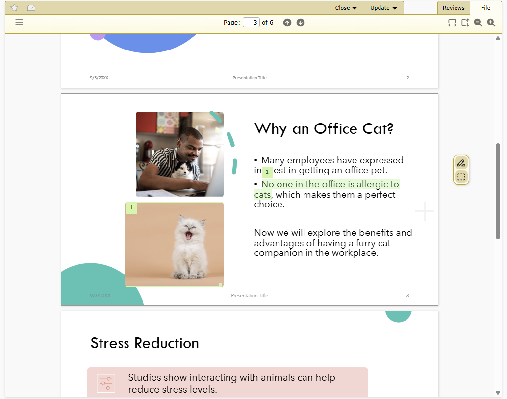
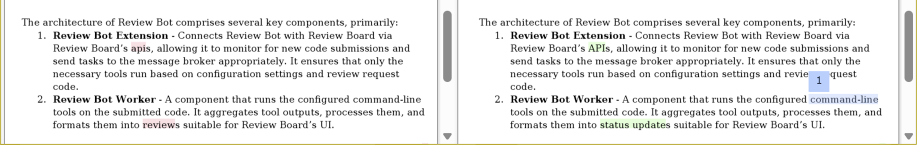
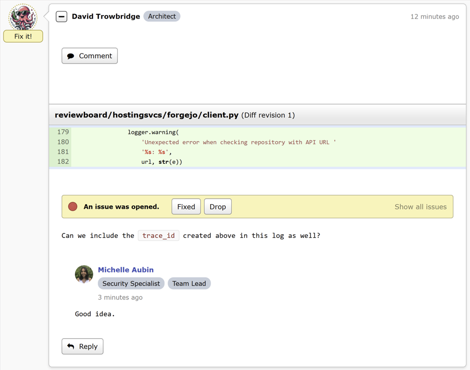
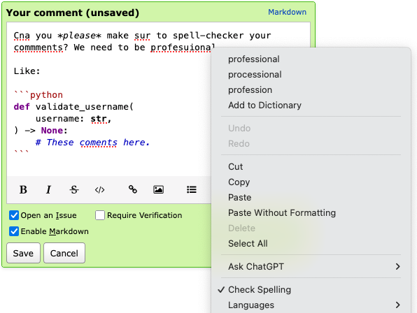

.. default-intersphinx:: djblets6.x powerpack rb8.x

==============================
Review Board 8.0 Release Notes
==============================

**Release date**: TBD

This release contains all bug fixes and features from Review Board version
:doc:`7.0.6 <7.0.6>`.

Installation/Upgrade
====================

Review Board 8 is compatible with Python 3.8 - 3.13.

These are the same requirements as Review Board 7, making upgrades to 8 easy.

Follow our :ref:`installation guide <installing-reviewboard-toc>` to prepare
your system for Review Board or to upgrade your existing install.

To install this release, run:

.. code-block:: console

    $ pip3 install ReviewBoard==8.0

To learn more, see:

* :ref:`Documentation <reviewboard-docs>`
* :ref:`Installing Review Board on Docker <installation-docker>`
* :pypi:`Review Board on PyPI <reviewboard>`
* `Review Board on GitHub <https://github.com/reviewboard/reviewboard>`_

New Subscription Plans
======================

You can now `choose one of three plans <get-rb_>`_ for Review Board:

* **Review Board Community Edition**

  The same open source Review Board you've always used, with support managed
  by your own team.

  Review Board remains committed to open source.

* **Review Board Plus**

  Review Board with Basic Support included, and the following additional
  features:

  * Document review and diffs for Microsoft Office, Google Docs,
    LibreOffice, and PDF files
  * Code review reports
  * User role management and automation rules
  * Integration with :rbintegration:`Azure DevOps <azure-devops-services>`,
    :rbintegration:`Bitbucket Data Center <bitbucket-data-center>`,
    :rbintegration:`ClearCase <clearcase>`,
    :rbintegration:`GitHub Enterprise <github-enterprise>`, and
    :rbintegration:`Keysight SOS <keysight-sos>`
  * Database import/export for spin-offs, acquisitions, and mergers
  * Improved server scalability

  Basic Support includes:

  * Next-business-day response
  * Support for the latest version of Review Board and companion products
  * Installation and troubleshooting assistance

  All for $12 USD/user/month (with annual billing).

* **Review Board Enterprise**

  All the features of Review Board Plus, but with Premium Support for
  installs that are critical to your business.

  Premium Support includes:

  * Same-day (usually same-hour) response guarantees, 7 days a week
  * Priority fixes for bugs
  * Support for any version of our products
  * Maintained custom builds
  * Emergency repairs, 24/7/365
  * Help with internal development of Review Board extensions and tools
  * Large-scale deployment analysis and assistance
  * Video and telephone-based support (by appointment)

  All for $15 USD/user/month (with annual billing).

When you upgrade to Review Board 8, you'll be asked whether you want to stay
on your self-supported **Review Board Community Edition** or upgrade to
**Review Board Plus** or **Enterprise** with support for your server.

Monthly and annual payment options are available. Cancel any time. Multi-year
discounts are available upon request (contact sales@beanbaginc.com).

All subscription licenses can be managed in your Review Board administration
dashboard under :guilabel:`Administration UI -> Licenses`.

.. note::

   This replaces our old add-on model for support contracts and `Power Pack`_
   licenses. If you're on an older version of Review Board, those options
   are still available.

   If you're an existing paying customer, you can stay on your current
   plan. Contact us before you upgrade to Review Board 8 so we can issue
   you a license for your server.

.. important::

   Once you upgrade to Review Board Plus or Enterprise, you will need to
   assign existing users to your license through :guilabel:`Admin UI ->
   Per-User Licenses`.

   You can :guilabel:`Import users` to populate your license with your
   existing users.

   New users will be added to your license automatically.

.. _get-rb: https://www.reviewboard.org/get/
.. _Power Pack: https://www.reviewboard.org/powerpack/

New Features
============

Office Document Review
----------------------

Review Board can now be used to review documents, presentations, and more,
whether those documents are files you've uploaded or they're part of your
diff.

The following documents are supported:

* Microsoft Office
* Google Docs
* LibreOffice/OpenOffice
* All PDF documents

         cat. In the header bar above the document are navigation and zoom
         controls. Floating on the right of the document is a toolbar for
         commenting controls. There are two draft comments in the document, a
         region and a text selection comment.
   :sources: 2x _static/images/8.x/8.0-document-viewer@2x.png

Comments can be made by selecting text or by drawing a box over a region of
the document and leaving a comment.

Reviewers can see a diff between each update of a document, showing a
side-by-side view that highlights all of the text changes.

         text in bullet points.
   :width: 917
   :height: 145
   :sources: 2x _static/images/8.x/8.0-document-diffs@2x.png

:ref:`Learn more about using Document Review <powerpack-doc-review>`.

.. note::

   Document Review is part of a `Review Board Plus and Enterprise
   <https://www.reviewboard.org/get/>`_ subscription.

   To use Document Review, you will need to :ref:`install a microservice
   and message broker <powerpack-office-doc>` to handle document processing.
   This is available as a container for Docker and compatible services.

User Roles and Badges
---------------------

User Roles are a flexible way to identify a user's responsibilities and
position in an organization, and help craft policy and automation rules.

         reply from a user who has Security Specialist and Team Lead roles.
   :sources: 2x _static/images/8.x/8.0-user-roles@2x.png

Administrators can create roles and assign them to any number of licensed
users. These can be used when configuring :ref:`integrations <integrations>`
or writing :ref:`custom approval hooks <review-request-approval-hook>`.
They'll optionally appear as badges alongside the user throughout the UI.

:ref:`Learn more about User Roles <user-roles>`.

.. note::

   User Roles are part of a `Review Board Plus and Enterprise
   <https://www.reviewboard.org/get/>`_ subscription.

Writing Assistance -- Spell Checking, Dictation, AI
---------------------------------------------------

You can now use your browser's built-in writing assistance features,
including spell checking, voice dictation, AI rewriting, and any other
capabilities you would normally have available to help write text.

This is available when writing a comment, a review request description, or
any other text field in a review or review request.

         a code sample. The text says "Can you please make sure to spell-check
         your comments? We need to be professional," except with typos all
         throughout. Squiggly red lines highlight the typos. The browser's
         pop-up menu is shown for the misspelled word "professional", offering
         spelling suggestions and native writing assistance features.
   :sources: 2x _static/images/8.x/8.0-writing-assistance@2x.png

This feature is dependent on your browser, and is experimental. To enable it:

1. Go to :guilabel:`My Account -> Settings`.
2. Set :guilabel:`Enable writing assistance for Markdown text fields`.

:ref:`Learn more about Writing Assistance <my-account-settings-text-editing>`.

Quick Access Actions for Reviews
--------------------------------

You can now pin your most frequently-used review-related actions to your
:ref:`Review Banner <review-banner>`.

.. image:: _static/images/8.x/8.0-review-banner-quick-access.png
   :alt: The review banner showing "Add General Comment" and "Ship It!"
         Quick Access buttons to the right of the "Review" menu. The gear
         menu for pinning actions is open, showing a "Pinned Actions"
         header followed by "Create Review" and "Edit Review" (which are
         both unpinned) and "Add General Comment" and "Ship It!" (which are
         both pinned).
   :width: 525
   :height: 225
   :sources: 2x _static/images/8.x/8.0-review-banner-quick-access@2x.png

The following Quick Access actions can be pinned:

* :guilabel:`Create Review`
* :guilabel:`Edit Review`
* :guilabel:`Add General Comment`
* :guilabel:`Ship It!`

These will be readily available on your review banner at the top of the
window.

:ref:`Learn more about Quick Access actions
<review-banner-quick-access-actions>`.

Ship It! Confirmation
---------------------

Users can now control whether to prompt for confirmation when clicking
:ref:`Ship It! <ship-it>`.

To change this setting:

1. Go to :guilabel:`My Account -> Settings`.
2. Change :guilabel:`Prompt to confirm when publishing Ship It! reviews`.

:ref:`Learn more about your account settings <account-settings>`.

Enhanced Interdiff Filtering
----------------------------

Review Board has supported :term:`interdiffs` since Review Board 1.0, and
has also supported filtering out of upstream changes made in-between two
diff uploads.

Review Board 8 introduces the all-new version 3 of our algorithm for filtering
out upstream changes, featuring:

* Better filtering out of upstream changes, letting you focus on just the
  changes you need to see.

* A new approach that's no longer sensitive to how the uploaded diffs might
  be generated.

If you encounter any issues with interdiffs going forward, please contact
us at support@beanbaginc.com.

New Integrations
================

Forgejo
-------

Review Board now supports reviewing code on Forgejo_.

Forgejo is an open source code hosting platform similar to GitHub and GitLab,
available for free in your own network.

You can use Review Board to review your code on Forgejo, right alongside your
code reviews for GitHub or any other supported service.

:ref:`Learn more about hosting with Forgejo <repository-hosting-forgejo>`.

.. _Forgejo: https://forgejo.org/

RB Gateway 2.0
--------------

Review Board can work with self-hosted Git repositories using the all-new
`RB Gateway 2.0 <https://www.reviewboard.org/downloads/rbgateway/>`_.

This is a microservice that provides a Review Board-compatible API for your
on-prem Git infrastructure, letting you post and manage review requests,
browse for commits, and auto-close review requests on push.

`Learn more about RB Gateway
<https://www.reviewboard.org/docs/rbgateway/latest/>`_.

GitLab CI
---------

You can now connect Review Board to your :ref:`GitLab CI
<integrations-gitlab-ci>`, triggering a build whenever a review request is
posted.

GitLab CI builds can be run automatically, or can be set to run only when
clicking a :guilabel:`Run` button.

Based on work by André Klitzing.

:ref:`Learn more about integrating with GitLab CI <integrations-gitlab-ci>`.

New Administrative Features
===========================

Control over Ship It!
---------------------

Administrators can now prevent users from assigning a :ref:`Ship It!
<ship-it>` to their own review requests.

This is off by default so that there are no surprises, but administrators
are encouraged to turn this on.

:ref:`Learn more about Review Workflow settings <review-workflow-settings>`.

SSL/TLS Certificate Storage
---------------------------

In-house source code repositories and authentication backends can now store
and use self-signed SSL certificates in your :term:`site directory`'s
:file:`data/` directory. This can be used instead of installing these
certificates system-wide.

Currently, installation of new certificates or bundles requires placing them
in a specific location. Future versions will add a configuration page for
managing your certificates.

:ref:`Learn more about certificate management <ssl-certificates>`.

CIDR Subnets for Health Checks
------------------------------

The ``/health/`` URL can be used to monitor the health of your Review Board
server. This is restricted to the monitoring IP addresses you have specified.

Now you can include CIDR blocks as well as individual IP addresses. This
is particularly useful for Kubernetes and other scaled-out deployments.

:ref:`Learn more about configuring health check access
<health-checks-configure-access>`.

Performance Improvements
========================

* Greatly reduced the time needed to perform a full search index.

* Reduced the number of database queries used when showing a review request.

* Improved performance with checking for starred review requests and groups
  on the dashboard and review requests.

* Performance-related issues are now identified and logged when communicating
  with source code repositories, e-mail servers, integrations, and other
  external services.

* Improved hints to search crawlers to reduce the set of pages that are
  indexed.

Usability Improvements
======================

* Review Board now automatically matches the system's Light and Dark Mode
  themes for all users.

  Users can explicitly choose Light or Dark Mode through their
  :ref:`Appearance settings <my-account-appearance>`.

* Added Dark Mode throughout the rest of the product.

* Improved touch screen interaction with drop-down menus.

* Modernized and standardized the look and presentation of most of our
  dialogs.

Bug Fixes
=========

Automated Reviews
-----------------

* Fixed the owner of a review request not being able to manually run an
  automated review.

* The manual :guilabel:`Run` button is no longer present if the user doesn't
  have permission to run an automated review.

Diff Viewer
-----------

* Fixed a bug showing reverted binary files in :term:`interdiffs`.

* Fixed a crash when trying to download newly-added empty files.

* Fixed an incorrect display when showing new files with the same name as
  one that was deleted in a parent diff.

Search
------

* Fixed navigating to the last page of search results.

Administration UI
-----------------

* Fixed being able to archive repositories that were no longer accessible.

* Sending a test e-mail on the E-mail Settings page now respects all the
  server's e-mail settings.

Web API
=======

* Added a ``sha256_checksum`` field on
  :ref:`webapi2.0-file-attachment-resource` representing the SHA256 checksum
  of the uploaded file.

* Added ``orig_sha256`` and ``patched_sha256`` fields on
  :ref:`webapi2.0-file-diff-resource` representing the SHA256 checksums of
  the original and patched files.

  This applies to both text and binary files.

Extensions
==========

Review Board 8 builds upon Django 4.2 and Djblets 6.

See the `Djblets 6 release notes`_ for a list of changes useful to extension
authors.

.. _Djblets 6 release notes:
   https://www.reviewboard.org/docs/releasenotes/djblets/6.0/

Modern Python packaging
-----------------------

Extensions can now use modern :ref:`pyproject.toml` files for their packaging.

To support this, add the following to your file:

.. code-block:: toml

   [build-system]
   requires = [
       'reviewboard~=<version>',
       'reviewboard[extension-packaging]',
   ]
   build-backend = 'reviewboard.extensions.packaging.backend'

:program:`rbext create` will create this automatically for you if making a
new extension.

If you have an existing :file:`setup.py`, it will continue to work as-is.

:ref:`Learn more about packaging extensions <extension-distribution>`.

Modern default extensions with rbext
------------------------------------

The :ref:`rbext <rbext>` command is used to create and test your extensions.

:ref:`rbext-create` has been updated to create a better boilerplate
extension for you to customize.

Improved action framework for UI customization
----------------------------------------------

Review Board provides an Actions framework for customizing parts of the UI,
allowing extensions to include new buttons and menus for navigation and
interacting with review requests.

We've made significant improvements, including:

* A new model for creating and rendering actions on the page, letting one
  action be used in multiple places (including as both buttons and menu items).

* Creation of Quick Access actions that appear on the banner that's shown when
  reviewing changes.

* Actions that customize the administration UI sidebar.

:ref:`Learn more about creating actions <extension-actions>`.

Simple custom columns for the Dashboard
---------------------------------------

It's now easier than ever to create custom columns for the Dashboard.

Creating a column used to require carefully overriding the column's
constructor and passing a series of arguments to the parent. Now, they can
be set right on the class as attributes.

:ref:`Learn more about creating Dashboard columns
<extension-dashboard-columns>`.

Custom choices for condition rules
----------------------------------

Extensions can provide choices to add to any condition rules, such as those
used to configure :ref:`integrations <integrations>`. These can be used to
trigger automation rules such as Continuous Integration builds or Slack
notifications.

:ref:`Learn more about creating condition choices
<extension-review-request-conditions>`.

Custom page banners
-------------------

Extensions can now provide custom banners at the top of the page in a
standard style. These can be used for important notices you want to
communicate to all the users on your server.

:ref:`Learn more about creating page banners <extension-page-banners>`.

New signals for reviews
-----------------------

The new :py:data:`reviewboard.reviews.signals.comment_issue_status_updated`
signal will be emitted whenever someone resolves, drops, or re-opens an issue
on a comment.

Contributors
============

* André Klitzing
* Christian Hammond
* Daniel Casares-Iglesias
* David Trowbridge
* Michelle Aubin
