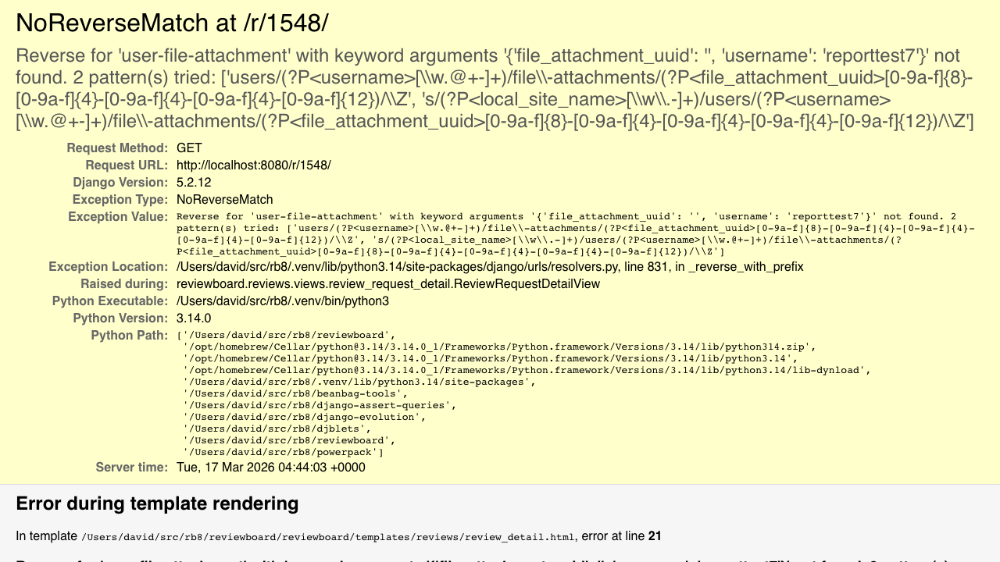
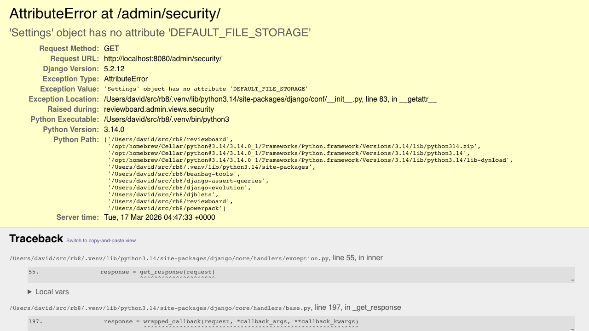
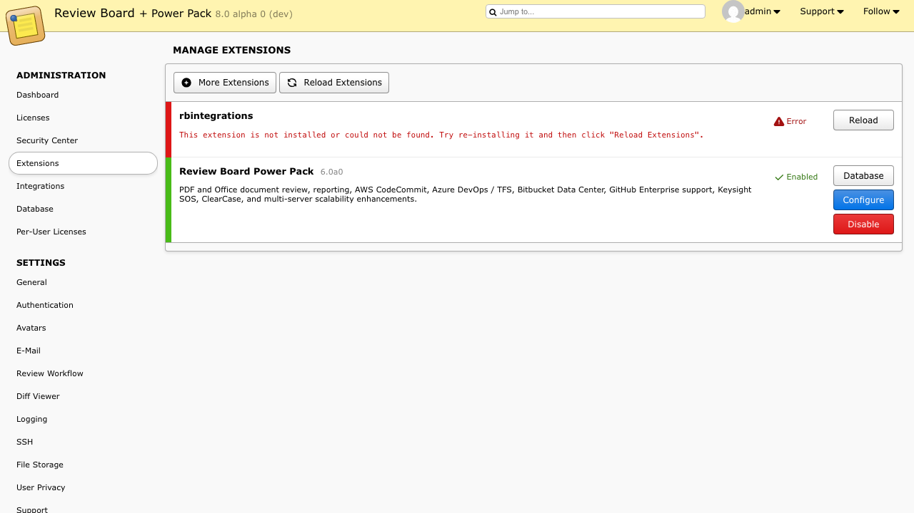
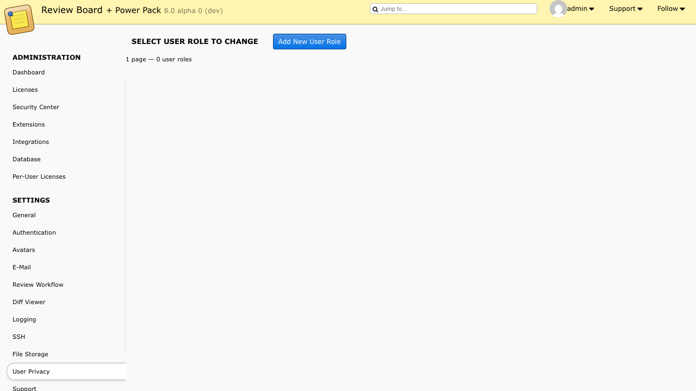

# Dogfood Report: Review Board

| Field | Value |
|-------|-------|
| **Date** | 2026-03-16 |
| **App URL** | http://localhost:8080 |
| **Session** | localhost-8080 |
| **Scope** | Full app |

## Summary

| Severity | Count |
|----------|-------|
| Critical | 0 |
| High | 0 |
| Medium | 0 |
| Low | 0 |
| **Total** | **0** |

## Issues

### ISSUE-001: NoReverseMatch crash on all review request detail pages

| Field | Value |
|-------|-------|
| **Severity** | critical |
| **Category** | functional |
| **URL** | http://localhost:8080/r/1548/ |
| **Repro Video** | N/A |

**Description**

Every review request detail page crashes with a Django `NoReverseMatch` error. The error is: `Reverse for 'user-file-attachment' with keyword arguments {'file_attachment_uuid': '', 'username': 'reporttest7'}' not found.` The `file_attachment_uuid` is empty, causing the URL pattern match to fail. This completely blocks viewing any review request.

Tested on `/r/1548/` and `/r/1540/` -- both produce the same error. This appears to affect all review requests.

**Repro Steps**

1. Log in and navigate to All Review Requests, then click any review request.
   

---

### ISSUE-002: Security Center crashes with AttributeError on DEFAULT_FILE_STORAGE

| Field | Value |
|-------|-------|
| **Severity** | high |
| **Category** | functional |
| **URL** | http://localhost:8080/admin/security/ |
| **Repro Video** | N/A |

**Description**

The Admin Security Center page crashes with `AttributeError: 'Settings' object has no attribute 'DEFAULT_FILE_STORAGE'`. This is likely a Django 5.x compatibility issue -- `DEFAULT_FILE_STORAGE` was deprecated in Django 4.2 and removed in Django 5.1 in favor of `STORAGES["default"]`. The error originates from `reviewboard.admin.views.security`.

**Repro Steps**

1. Log in as admin, navigate to Admin > Security Center (`/admin/security/`).
   

---

### ISSUE-003: rbintegrations extension shows error state on Extensions page

| Field | Value |
|-------|-------|
| **Severity** | medium |
| **Category** | functional |
| **URL** | http://localhost:8080/admin/extensions/ |
| **Repro Video** | N/A |

**Description**

The Extensions page shows `rbintegrations` in an error state with the message: "This extension is not installed or could not be found. Try re-installing it and then click 'Reload Extensions'." This means integrations (Slack, CI, etc.) are unavailable. The Power Pack extension is working fine.

**Repro Steps**

1. Log in as admin, navigate to Admin > Extensions (`/admin/extensions/`).
   

---

### ISSUE-004: Licenses page renders completely blank

| Field | Value |
|-------|-------|
| **Severity** | high |
| **Category** | functional |
| **URL** | http://localhost:8080/admin/licenses/ |
| **Repro Video** | N/A |

**Description**

The Admin Licenses page (`/admin/licenses/`) renders as a completely blank white page with no content at all -- no header, no sidebar, no page title (the browser tab title is empty too). The DOM contains only a bare `document` node. No console errors are shown; the page simply renders nothing.

**Repro Steps**

1. Log in as admin, navigate to Admin > Licenses (`/admin/licenses/`).
   

---

### ISSUE-005: JavaScript errors on User Roles admin page

| Field | Value |
|-------|-------|
| **Severity** | medium |
| **Category** | console |
| **URL** | http://localhost:8080/admin/db/accounts/role/ |
| **Repro Video** | N/A |

**Description**

The User Roles page in the admin panel throws two JavaScript errors on load:
- `Cannot read properties of undefined (reading 'rows')`
- `Cannot read properties of undefined (reading 'resizeToFit')`

The page renders but the datagrid component fails to initialize properly. The role list area is empty (showing "1 page -- 0 user roles") but the missing datagrid functionality may prevent the table from working correctly when roles exist.

**Repro Steps**

1. Log in as admin, navigate to Admin > User Roles.
   

---

